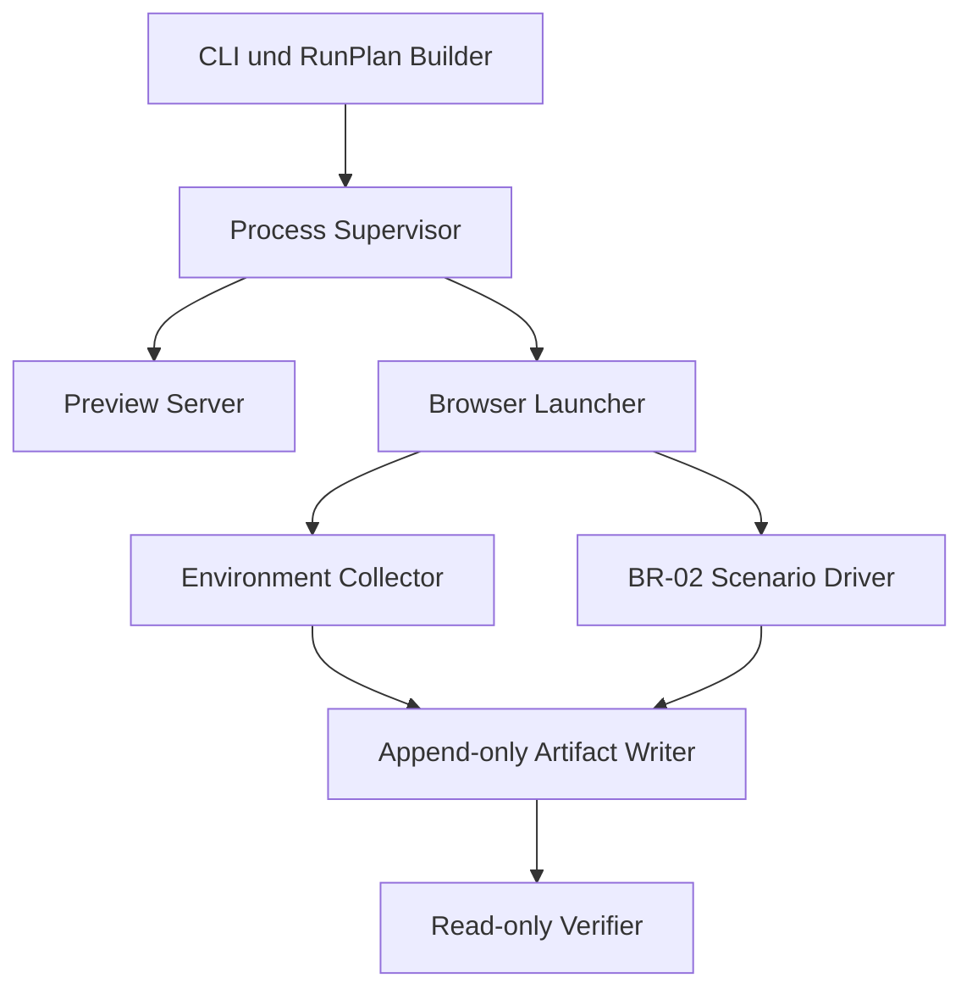

# BR-03 Abschlussbericht: Playwright/CDP Benchmark Runner Contract

**Projekt:** WELTRAUM / Hestia Voxel Kernel Lab  
**Arbeitspaket:** BR-03  
**Berichtsdatum:** 2026-08-12  
**Untersuchter Repository-Stand:** `BenjaminHornung/hestia-voxel-kernel-lab@d95992df05952ac4be6221ca1809c1c9e3c0ac9d`  
**Abschlussstatus:** `READY_FOR_LATER_IMPLEMENTATION`

## 1. Kurzentscheidung

BR-03 ist als Implementierungsspezifikation abgeschlossen. Der spätere Benchmark Runner soll als dedizierte Node-CLI auf Basis der bereits vorhandenen Playwright-Bibliothek umgesetzt werden. Er soll nicht den Retry-, Worker- oder Browser-Lebenszyklus von Playwright Test als Benchmark-Orchestrator verwenden.

Der Vertrag legt fest:

- einen deterministischen, kanonisch serialisierten Run-Plan mit explizitem Seed,
- balancierte Ausführungsreihenfolgen für zwei sowie drei oder mehr Kandidaten,
- einen neuen Browserprozess mit eindeutigem temporärem Profil für jede isolierte Prozesseinheit,
- streng getrennte Cold-, Warmup-, Measurement-, Stress-, Trace- und Leak-Phasen,
- browser-, host-, GPU-, Display-, Energie- und Laufzeitprovenienz mit explizitem Umgang mit unbekannten Werten,
- eine ausfallsichere Klassifikation in Infrastrukturfehler, Kandidatenfehler, Umgebungsinvalidierung und nicht unterstützte Konfiguration,
- unveränderliche Rohartefakte und vollständige Invalidierungsgründe,
- eine CLI- und Testoberfläche, die ohne automatische Wiederholungen arbeitet,
- eine Hardwareprofil-Parametrisierung, die H1, H2 und H3 nicht erfindet und bis zur Owner-Bindung blockiert.

Die Spezifikation ist noch keine Freigabe für echte Performance-Gates. Vor Implementierungsbeginn müssen WP04, BR-01 und BR-02 akzeptiert und integriert sein. Vor einer gate-fähigen Messung muss der Owner außerdem konkrete H1-, H2- und H3-Bindings festlegen.

## 2. Ausführungs- und Evidenzgrenzen

### 2.1 In dieser Arbeit ausgeführt

- Pflichtquellen und Forschungsberichte wurden gelesen und abgeglichen.
- Der genannte Repository-Stand wurde read-only geprüft.
- Offizielle Playwright-, Chrome DevTools Protocol-, Node-, W3C- und Khronos-Dokumentation wurde zur Vertragsbildung herangezogen.
- Architektur, Verträge, Datenformen, CLI, Fehlerverhalten, Testmatrix und Übergabe wurden spezifiziert.

### 2.2 Bewusst nicht ausgeführt

- keine Änderung am Repository,
- keine Installation von Abhängigkeiten,
- kein Build,
- kein Testlauf,
- kein Browserstart,
- kein CDP-Aufruf gegen einen laufenden Browser,
- kein Benchmark,
- keine Messung oder statistische Auswertung,
- keine Mutation bestehender Evidenz.

Damit enthält dieser Bericht keine Behauptung über einen erfolgreichen Build, grüne Tests, erreichbare Performance oder eine beobachtete Laufzeitumgebung.

### 2.3 Evidenzklassen

Jede Aussage gehört zu einer der folgenden Klassen:

1. **Projektfakt:** durch die bereitgestellten Projektunterlagen oder den geprüften Repository-Stand belegt.
2. **Externe Primärquelle:** durch offizielle Dokumentation oder einen normativen Standard belegt.
3. **Spezifikationsentscheidung:** in BR-03 aus den Projektanforderungen abgeleiteter Vertrag.
4. **Annahme:** notwendig, weil BR-01 oder BR-02 noch nicht als akzeptierter Implementierungsstand vorlag.
5. **Unbekannt oder Owner-Entscheidung:** darf nicht durch einen plausibel wirkenden Ersatzwert geschlossen werden.

## 3. Geprüfter Ist-Stand

### 3.1 Projektfakten aus den Unterlagen

- WELTRAUM ist browser- und Chromium-first ausgerichtet.
- CPU-Zellen bleiben die autoritative Weltrepräsentation.
- BR-01 bis BR-04 wurden nach akzeptiertem WP04 und vor WP05 in die Reihenfolge eingefügt.
- Benchmark Protocol v1 verlangt Rohsamples, Provenienz, getrennte Phasen und Gegenbalancierung.
- Cold-, Warm-, Measurement-, Stress-, Trace- und Leak-Daten dürfen nicht still zu einer gemeinsamen Population vermischt werden.
- Für H1, H2 und H3 existieren noch keine autoritativen, konkreten Hardwaredefinitionen.
- Eine Produktintegration ist vor WP12 nicht zulässig.

### 3.2 Repository-Fakten am festgelegten SHA

Der geprüfte Commit ist `d95992df05952ac4be6221ca1809c1c9e3c0ac9d` mit der Commit-Beschreibung `#VOXEL-LAB-003 Add deterministic greedy meshing comparison`.

Relevante Beobachtungen:

- `package.json` pinnt `@playwright/test` auf `1.62.1` und enthält bereits Playwright-basierte E2E- und Evidenzskripte.
- `playwright.config.ts` setzt `fullyParallel: false`, `retries: 0`, den Browserkanal `chrome`, einen Viewport von `1920x1080`, Device Scale Factor 1 und `reuseExistingServer: false`.
- Der vorhandene Playwright-Webserver baut und startet die Vite-Preview auf Port 4173.
- `tests/e2e/support.ts` erfasst Konsolenfehler, Page Errors, fehlgeschlagene Requests und HTTP-Status ab 400 als getrennte Signale.
- Vorhandene E2E-Tests lesen HUD-Werte und vorhandene Evidenztests schreiben projektbezogene Evidenz. Diese Daten sind keine BR-03-Benchmarkdaten.
- `src/diagnostics/telemetry.ts` arbeitet unter anderem mit einem rollierenden Fenster von 120 Frames und einfachen Dauerzusammenfassungen. Diese Diagnosewerte sind kein Ersatz für den in BR-01 und BR-02 definierten Rohdatenvertrag.
- Es existiert am geprüften SHA keine globale, akzeptierte BR-02-TestBridge, auf die BR-03 schon verbindlich importieren könnte.
- `.gitignore` ignoriert Playwright-Berichte und Testergebnisse, aber noch kein vorgesehenes `benchmark-results/` oder Runner-Buildverzeichnis.
- Die vorhandene WP03-Evidenz enthält diagnostische Timings. Sie darf nicht in eine Performance-Baseline umgedeutet werden.

### 3.3 Externe Fakten mit Vertragswirkung

- Playwright unterstützt benannte Browserkanäle wie `chrome`, `chrome-beta`, `chrome-dev`, `chrome-canary` und Edge-Kanäle. Kanal und tatsächlich beobachteter Browserbuild sind getrennt zu speichern. [Playwright: Browsers](https://playwright.dev/docs/browsers)
- `launchPersistentContext(userDataDir)` startet einen persistenten Kontext. Mehrere Instanzen dürfen nicht dasselbe Profilverzeichnis verwenden. Ein reguläres Chrome-Standardprofil soll dafür nicht genutzt werden. [Playwright: launchPersistentContext](https://playwright.dev/docs/api/class-browsertype#browser-type-launch-persistent-context)
- Playwright-Test-Retries verwerfen bei einem Fehler Worker und Browser und starten einen neuen Worker. Genau dieser Mechanismus würde den Benchmark-Lebenszyklus verdecken. [Playwright: Retries](https://playwright.dev/docs/test-retries)
- Chromium erlaubt über Playwright browserweite CDP-Sessions. [Playwright: newBrowserCDPSession](https://playwright.dev/docs/api/class-browser#browser-new-browser-cdp-session)
- Das CDP Tip-of-Tree-Protokoll kann sich ohne Rückwärtskompatibilitätsgarantie ändern. Deshalb müssen `protocolVersion`, Browserbuild und Rohantworten erhalten bleiben. [Chrome DevTools Protocol](https://chromedevtools.github.io/devtools-protocol/)
- `Browser.getVersion` liefert unter anderem Protokollversion, Produkt, Revision, User Agent und JavaScript-Version. `Browser.getBrowserCommandLine` ist experimentell und an `--enable-automation` gebunden. [CDP Browser Domain](https://chromedevtools.github.io/devtools-protocol/tot/Browser/)
- Die gesamte `SystemInfo`-Domain ist experimentell. GPU-Felder und opaque Attribute sind daher als browsergebundene Provenienz, nicht als dauerhaft stabiles Schema, zu behandeln. [CDP SystemInfo Domain](https://chromedevtools.github.io/devtools-protocol/tot/SystemInfo/)
- `Performance.getMetrics` liefert eine generische Liste aus Namen und Zahlen. BR-03 darf diese Werte roh erfassen, aber nicht ohne BR-01-Definition als Gate-Metrik interpretieren. [CDP Performance Domain](https://chromedevtools.github.io/devtools-protocol/tot/Performance/)
- CDP-Tracing kann als Stream zurückgegeben werden und meldet möglichen Datenverlust. Tracing bleibt deshalb ein eigener, nicht gate-fähiger Lauf. [CDP Tracing Domain](https://chromedevtools.github.io/devtools-protocol/tot/Tracing/)
- Die CDP-Memory-Domain ist experimentell. `prepareForLeakDetection` verändert den Prozesszustand durch Worker-Terminierung, Cache-Drops und Garbage Collection. Sie darf nicht im regulären Messfenster aufgerufen werden. [CDP Memory Domain](https://chromedevtools.github.io/devtools-protocol/tot/Memory/)
- Seit Chrome 136 werden Remote-Debugging-Schalter für das Standarddatenverzeichnis eingeschränkt. Ein separates, nicht standardmäßiges `--user-data-dir` ist auch deshalb zwingend. [Chrome: Remote debugging changes](https://developer.chrome.com/blog/remote-debugging-port)
- `os.cpus()` beschreibt logische CPUs und kann leer sein. Die physische Kernzahl darf daraus nicht erfunden werden. [Node.js OS API](https://nodejs.org/api/os.html)
- Die Battery Status API darf aus Datenschutzgründen neutrale, wie voll geladen und angeschlossen wirkende Werte liefern. Sie beweist allein keinen Netzbetrieb. [W3C Battery Status API](https://www.w3.org/TR/battery-status/)
- Sichtbarkeit und Fokus sind getrennte Zustände. Der Runner muss beide beobachten. [WHATWG HTML: Page visibility](https://html.spec.whatwg.org/multipage/interaction.html#page-visibility)
- Playwright unterscheidet Request-Fehler von erfolgreichen HTTP-Transaktionen mit Fehlerstatus. Beide Pfade müssen separat erfasst werden. [Playwright: Page events](https://playwright.dev/docs/api/class-page)

## 4. Integrationsannahmen für BR-01 und BR-02

Am Prüftag lagen BR-01 und BR-02 in den verfügbaren Unterlagen als Aufgabenbeschreibung, nicht als akzeptierter Implementierungsbericht mit importierbaren Symbolen vor. BR-03 darf deshalb keine Dateinamen oder Funktionsnamen als bereits existent behaupten.

Die spätere Implementierung muss die folgenden Integrationsannahmen am akzeptierten BR-02-SHA auflösen:

| Kennung | Annahme | Pflichtverhalten bei Abweichung |
|---|---|---|
| A-01 | BR-01 exportiert versionierte Schemas für Run, Prozess, Sample, Provenienz, Manifest und Invalidierung. | Die tatsächlichen Exporte importieren, keine parallelen BR-03-Schemas anlegen. |
| A-02 | BR-01 definiert kanonische JSON-Serialisierung und SHA-256-Digests. | Diese Implementierung wiederverwenden und Golden Tests gegen sie schreiben. |
| A-03 | BR-01 definiert zulässige Status- und Fehlercodes. | BR-03-Codes daran anpassen und als Erweiterung begründen, nicht duplizieren. |
| A-04 | BR-02 stellt einen versionierten Browser-Testvertrag bereit, der App-Ready, Szenarioaufbau, Iterationsstart, Iterationsende, Rohsample-Export und Fehlerzustände abbildet. | Vor Runner-Code den realen Vertrag inventarisieren und Adapter nur an einer Grenze vorsehen. |
| A-05 | BR-02 liefert rohe, pro Iteration getrennte Messwerte. | Wenn nur Aggregationen verfügbar sind, BR-03 stoppen und BR-02 korrigieren lassen. |
| A-06 | BR-02 exponiert Kontextverlust oder Device-Loss, soweit WebGL oder WebGPU dies zulassen. | Fehlende Pflichtsignale als Integrationsblocker dokumentieren. |
| A-07 | BR-02 besitzt deterministische Szenario-, Fixture- und Input-Seeds. | Keine Zeit-, DOM- oder Prozesszufallswerte als Ersatz verwenden. |
| A-08 | BR-01 oder BR-02 legt die erlaubten Kandidaten-IDs und Szenario-IDs fest. | IDs importieren oder aus einer versionierten Registry lesen. |

Vor dem ersten Implementierungspatch ist ein kurzes Integrationsprotokoll zu erstellen, das für jede Annahme den tatsächlichen Exportpfad, die Symbolnamen und die Schema-Version nennt. Wird eine Annahme nicht erfüllt, ist sie kein Anlass für eine lokale Schattenimplementierung.

## 5. Zielarchitektur und Verantwortungsgrenzen

### 5.1 Architekturentscheidung

Der Runner wird als dedizierte Node-CLI implementiert und verwendet die Playwright-Library direkt. Playwright Test bleibt für normale E2E- und Contract-Tests verfügbar, steuert aber keine Benchmarkreihenfolge und keine automatische Wiederholung.



### 5.2 Komponenten

| Komponente | Verantwortung | Darf nicht |
|---|---|---|
| `RunPlanBuilder` | Eingabe normalisieren, Reihenfolge ableiten, Plan kanonisch serialisieren und digestsichern. | Uhrzeit, PID, zufällige UUID oder Runtimewerte in den deterministischen Plankern schreiben. |
| `InvocationController` | Eindeutige Invocation anlegen, Preflight und Exitcode steuern. | Einen fehlgeschlagenen Kandidaten automatisch erneut ausführen. |
| `PreviewServerSupervisor` | Bereits gebauten Produktionsstand auf exklusivem Port starten, Health und Exit überwachen, am Ende beenden. | Einen zufällig vorhandenen Server wiederverwenden oder im Messlauf neu bauen. |
| `BrowserProcessSupervisor` | Pro Prozesseinheit eindeutiges Profil anlegen, Browser starten, Prozessende beweisen und Profil sicher entfernen. | Profile teilen oder Prozesse anhand breiter Namensmuster beenden. |
| `EnvironmentCollector` | Host-, Browser-, CDP-, GPU-, Display-, Energie- und Runtimeprovenienz sammeln. | Unbekannte Werte durch 0, leere Strings oder geschätzte Werte ersetzen. |
| `ScenarioDriver` | Den akzeptierten BR-02-Vertrag bedienen, Ready-Zustand, deterministische Eingaben und Iterationen kontrollieren. | Messdaten aus HUD-Text oder ungeprüften DOM-Anzeigen rekonstruieren. |
| `RawSampleCollector` | Rohsamples verlustfrei und pro Iteration getrennt an den Artefaktschreiber geben. | Median, Mittelwert oder Ausreißerfilter als gespeicherte Primärdaten verwenden. |
| `ArtifactWriter` | Write-once-Artefakte außerhalb von `evidence/` schreiben, digestsichern und Invalidierungen erhalten. | Bestehende Artefakte überschreiben oder Evidenzpfade beschreiben. |
| `RunValidator` | Planvollständigkeit, Provenienz, Phase, Digests, Status und Artefaktlayout read-only prüfen. | fehlende Daten ergänzen oder Ergebnisse statistisch schönrechnen. |
| `CleanupGuard` | Server, Browser, Sessions, Streams und Profile eng begrenzt aufräumen. | unbewiesene PIDs, globale Browserprozesse oder breite Verzeichnisse löschen. |

### 5.3 Vorgeschlagene Dateigrenzen

Die endgültigen Pfade werden am akzeptierten BR-02-SHA angepasst. Eine plausible Struktur ist:

```text
src/benchmark/runner/
  cli.ts
  commands/
    plan.ts
    run.ts
    trace.ts
    verify.ts
  plan/
    build-run-plan.ts
    counterbalance.ts
    plan-types.ts
  process/
    preview-server.ts
    browser-process.ts
    cleanup-guard.ts
  browser/
    environment-collector.ts
    runtime-guards.ts
    scenario-driver.ts
  artifacts/
    artifact-layout.ts
    artifact-writer.ts
    verifier.ts
  contracts/
    br01-adapter.ts
    br02-adapter.ts
  errors/
    failure-codes.ts
    run-error.ts
tests/benchmark/runner/
docs/benchmark-runner.md
tsconfig.benchmark-runner.json
```

Der separate TypeScript-Build darf den vorhandenen Compiler verwenden und in `.benchmark-runner/` ausgeben. Für die Spezifikation ist keine neue Laufzeitabhängigkeit erforderlich. Ob das bestehende Projektmodulformat einen direkten `tsx`-ähnlichen Lauf oder eine separate Kompilierung bevorzugt, ist am realen Integrations-SHA zu entscheiden.

## 6. Kernverträge

Die folgenden Typen sind semantische Mindestverträge. Sie sind bei der Implementierung auf die akzeptierten BR-01-Schemas abzubilden.

### 6.1 Explizite Verfügbarkeit

```ts
type Observed<T> = {
  status: "observed";
  value: T;
  source: string;
  stability: "stable" | "experimental" | "platform-specific";
};

type Declared<T> = {
  status: "declared";
  value: T;
  source: string;
  stability: "owner-binding" | "run-config" | "browser-default";
};

type Missing = {
  status: "unknown" | "unsupported" | "error";
  value: null;
  source: string;
  detail: string;
};

type Availability<T> = Observed<T> | Declared<T> | Missing;
```

`unknown`, `unsupported` und `error` bleiben semantisch verschieden. Ein Feld mit `value: null` ist nicht gleich einem gemessenen Nullwert.

### 6.2 Deterministischer Plankern

```ts
type RunPlanCoreV1 = {
  schemaVersion: "br03-run-plan-core/v1";
  benchmarkProtocolVersion: string;
  sourceBasis: {
    expectedSourceSha: string;
    expectedBuildManifestDigest: string;
    expectedFixtureDigest: string;
  };
  hardwareProfileRef: {
    logicalProfileId: "H1" | "H2" | "H3" | "CI-CORRECTNESS";
    bindingDigest: string | null;
  };
  browser: {
    requestedChannel: string;
    headed: boolean;
    requestedArgs: readonly string[];
  };
  order: {
    algorithm: "paired-abba-baab/v1" | "williams-square/v1";
    seed: number;
  };
  candidates: readonly string[];
  scenarios: readonly string[];
  phases: PhasePlanV1;
  processUnits: readonly ProcessUnitPlanV1[];
  retryPolicy: "none";
};

type PhasePlanV1 = {
  cold: {
    enabled: boolean;
    minimumValidProcessesPerCell: 10;
  };
  warmMeasurement: {
    enabled: boolean;
    minimumWarmupIterations: 10;
    maximumWarmupIterations: 50;
    stabilityWindowSize: 5;
    requiredConsecutiveStableComparisons: 2;
    maximumRelativeMedianDelta: 0.05;
    measurementIterationsPerProcess: number;
    minimumValidMeasurementIterationsPerCell: 30;
  };
  stress: {
    enabled: boolean;
    durationMs: 60000;
  };
  trace: {
    enabled: boolean;
    separateInvocation: true;
    measurementEligible: false;
  };
  leak: {
    enabled: boolean;
    minimumIndependentProcessesPerCell: 3;
    stabilizationCycles: 20;
    measurementCycles: 100;
    measurementEligible: false;
  };
};
```

### 6.3 Invocation und Ergebnis getrennt vom Plan

```ts
type RunInvocationV1 = {
  schemaVersion: "br03-run-invocation/v1";
  runId: string;
  planId: string;
  planDigest: string;
  createdAtUtc: string;
  runnerSourceSha: string;
  parentRunId: string | null;
  rerunReason: string | null;
  requestedBy: string | null;
};

type ProcessUnitPlanV1 = {
  processOrdinal: number;
  blockOrdinal: number;
  rowOrdinal: number;
  sequenceOrdinal: number;
  repetitionOrdinal: number;
  candidateId: string;
  scenarioId: string;
  phase: "cold" | "warm-measurement" | "stress" | "trace" | "leak";
  scenarioSeed: number;
  inputSeed: number;
  freshBrowserProcess: true;
  freshProfile: true;
  measurementEligible: boolean;
};

type ProcessUnitResultV1 = {
  processOrdinal: number;
  disposition: "valid" | "failed" | "invalid" | "unsupported" | "aborted";
  failureClass:
    | "none"
    | "provenance"
    | "infrastructure"
    | "candidate"
    | "environment"
    | "unsupported"
    | "cleanup";
  failureCode: string | null;
  startedAtUtc: string;
  endedAtUtc: string;
  rawSampleCount: number;
  artifactDigests: readonly string[];
  invalidations: readonly string[];
};
```

`RunPlanCoreV1` enthält keine Uhrzeit, keine PID, keinen temporären Pfad und keine ungesicherte Zufallsquelle. `planId` ist der SHA-256-Digest seiner kanonischen BR-01-Serialisierung. Die Invocation trägt die nicht deterministischen Verwaltungsdaten und darf den Plankern nicht verändern.

### 6.4 Modulinterfaces

```ts
interface RunPlanBuilder {
  build(input: RunPlanInput): Promise<RunPlanCoreV1>;
  canonicalBytes(plan: RunPlanCoreV1): Uint8Array;
  planId(plan: RunPlanCoreV1): Promise<string>;
}

interface EnvironmentCollector {
  collectHost(): Promise<HostEnvironmentV1>;
  collectBrowser(session: CDPSession): Promise<BrowserEnvironmentV1>;
  collectRuntime(page: Page): Promise<RuntimeEnvironmentV1>;
  validate(
    observed: EnvironmentBundleV1,
    binding: HardwareProfileBindingV1
  ): EnvironmentValidationV1;
}

interface ScenarioDriver {
  waitForAppReady(page: Page, expected: ScenarioExpectation): Promise<void>;
  prepareScenario(page: Page, plan: ProcessUnitPlanV1): Promise<void>;
  runWarmupIteration(page: Page, index: number): Promise<ControlSample>;
  runMeasuredIteration(page: Page, index: number): Promise<RawSampleV1>;
  runDeterministicStress(page: Page, durationMs: number): Promise<StressResultV1>;
}

interface ArtifactWriter {
  createRunRoot(invocation: RunInvocationV1): Promise<void>;
  writeExclusive(relativePath: SafeRelativePath, bytes: Uint8Array): Promise<string>;
  appendNdjson(relativePath: SafeRelativePath, record: unknown): Promise<void>;
  finalizeManifest(): Promise<ArtifactManifestV1>;
}
```

## 7. Deterministischer Run-Plan und Gegenbalancierung

### 7.1 Allgemeine Regeln

1. Kandidaten- und Szenario-IDs werden nach Unicode-Codepoints kanonisch sortiert, bevor ein Seed angewendet wird.
2. Der Seed ist eine explizite unsigned 32-bit Ganzzahl.
3. Alle abgeleiteten Schlüssel entstehen über SHA-256 mit einer festen Domain-Separation, zum Beispiel `br03/order/v1`.
4. Ein Hashsortierschlüssel enthält mindestens Algorithmusversion, Seed, Profil, Szenario, Block, Zeile und Kandidaten-ID.
5. Hashkollisionen werden als Planfehler behandelt. Es gibt keinen stillen Tie-Breaker mit Laufzeitreihenfolge.
6. `Math.random()`, Zeit, PID, Objektiteration und ein zufallsbehafteter Sortierkomparator sind verboten.
7. Vollständige Balanceblöcke werden nie abgeschnitten. Geforderte Mindestzahlen werden auf den nächsten vollständigen Block aufgerundet.
8. Derselbe normalisierte Input und derselbe Seed müssen exakt dieselben kanonischen Planbytes erzeugen.
9. Ein anderer Seed darf die Reihenfolge ändern, aber nicht Kandidatenhäufigkeit, Phasenzuordnung oder Balancegarantie.

### 7.2 Zwei Kandidaten

Für zwei Kandidaten werden gepaarte Viererblöcke verwendet:

- `ABBA`
- `BAAB`

Der Seed entscheidet über die Zuordnung realer Kandidaten zu A und B sowie über die Reihenfolge vollständiger Blöcke. Ein Superblock enthält beide Viererblöcke genau einmal. Damit erhält jeder Kandidat innerhalb jedes vollständigen Superblocks jede relevante frühe und späte Position gleich häufig.

Beispiel für zwei Kandidaten `baseline` und `candidate`:

```text
Superblock, Zuordnung A=baseline, B=candidate
Block 0: baseline, candidate, candidate, baseline
Block 1: candidate, baseline, baseline, candidate
```

Ein Run darf den Superblock nicht nach fünf oder sechs Einheiten abschneiden. Benötigt ein Protokoll mindestens zehn Cold-Samples pro Kandidat, wird auf einen vollständigen Umfang aufgerundet, der diese Untergrenze für beide Kandidaten erfüllt.

### 7.3 Drei oder mehr Kandidaten

Für `n >= 3` wird ein balanciertes Williams- beziehungsweise Latin-Square-Verfahren verwendet.

Für gerade `n` beginnt die Basiszeile mit:

```text
0, 1, n-1, 2, n-2, 3, n-3, ...
```

Alle zyklischen Rotationen bilden einen vollständigen Satz. Für ungerade `n` wird zusätzlich zu jeder Zeile ihre Umkehrung verwendet, sodass ein Satz aus `2n` Zeilen entsteht. Der Seed permutiert die Kandidatenlabels und die Reihenfolge vollständiger Zeilen, aber niemals die Balancebeziehung innerhalb des Satzes.

Der Planbuilder verifiziert selbst:

- gleiche Häufigkeit jedes Kandidaten pro Position,
- vollständige Zeilensätze,
- zulässige Vorgänger- und Nachfolgerhäufigkeit,
- keine doppelte Kandidaten-ID in einer Zeile,
- identische Samplezahl pro Kandidat, Szenario und Phase.

### 7.4 Szenarien und Wiederholungen

Szenarien werden mit einem getrennten, aus dem Root-Seed domain-separiert abgeleiteten Schlüssel geordnet. Kandidatenbalance und Szenariobalance dürfen sich nicht gegenseitig durch eine gemeinsame, unkontrollierte Shuffle-Operation verzerren.

Standarduntergrenzen des BR-03-Vertrags:

| Phase | Untergrenze pro Kandidat und Szenario | Rundungsregel |
|---|---:|---|
| Cold | 10 gültige Prozesse | auf vollständige Gegenbalanceblöcke aufrunden |
| Warmup | mindestens 10 Kontrolliterationen je Warm-Measurement-Prozess | bis Stabilitätsregel erfüllt, höchstens 50 |
| Measurement | 30 gültige Rohiterationen | auf vollständige Gegenbalanceblöcke und vollständige Prozesseinheiten aufrunden |
| Stress | eine fest definierte Dauer je geplanter Prozesseinheit | keine zeitliche Verlängerung als Retry |
| Trace | explizit geplante, getrennte Diagnoseeinheit | nie als Measurement auffüllen |
| Leak | explizit geplante, getrennte Diagnoseeinheit | Analyse gehört zu BR-05 |

Eine praktikable Standardkonfiguration kann fünf Measurement-Iterationen pro Warm-Measurement-Prozess verwenden. Der Planbuilder erweitert die Zahl vollständiger Prozesseinheiten so weit, bis pro Zelle mindestens 30 valide Iterationen geplant sind. Die tatsächliche, gegebenenfalls höhere Zahl wird im Plan und Ergebnis gespeichert.

### 7.5 Kein automatischer Retry

`retryPolicy` ist im Plan fest auf `none` gesetzt. Weder Playwright Test noch der eigene Runner darf fehlgeschlagene Einheiten automatisch wiederholen. Ein expliziter, ausschließlich infrastrukturell begründeter Neulauf:

- erhält eine neue `runId`,
- referenziert den ursprünglichen Lauf über `parentRunId`,
- enthält einen maschinenlesbaren `rerunReason`,
- bewahrt den ursprünglichen Lauf unverändert,
- übernimmt keine einzelnen erfolgreichen Samples in eine neue Population.

Ein Kandidatenfehler, eine Umgebungsinvalidierung oder ein nicht unterstütztes Pflichtmerkmal ist kein zulässiger Retry-Grund für ein Performanceergebnis.

### 7.6 Pseudocode des Planbuilders

```text
function buildRunPlan(input):
    require input.orderSeed is uint32
    require input.retryPolicy == "none"

    source = validateAndNormalizeSourceContract(input.source)
    candidates = sortCanonical(unique(input.candidateIds))
    scenarios = sortCanonical(unique(input.scenarioIds))
    phases = normalizePhaseConfig(input.phases)

    require candidates.length >= 2
    require scenarios.length >= 1
    require phases.cold.minimumValidProcessesPerCell >= 10
    require phases.warmMeasurement.minimumValidMeasurementIterationsPerCell >= 30
    require phases.warmMeasurement.minimumWarmupIterations >= 10
    require phases.warmMeasurement.maximumWarmupIterations == 50

    if candidates.length == 2:
        candidateRows = seededPairedSuperblocks(
            candidates,
            input.orderSeed,
            domain = "br03/order/paired/v1"
        )
        algorithm = "paired-abba-baab/v1"
    else:
        candidateRows = seededWilliamsRows(
            candidates,
            input.orderSeed,
            domain = "br03/order/williams/v1"
        )
        algorithm = "williams-square/v1"

    scenarioRows = seededScenarioRows(
        scenarios,
        input.orderSeed,
        domain = "br03/order/scenarios/v1"
    )

    units = []
    for phase in enabledPhases(phases):
        requiredPerCell = requiredProcessUnits(phase, phases)
        completeRows = repeatWholeBalanceSets(candidateRows, requiredPerCell)

        for scenarioRow in scenarioRows:
            for scenarioId in scenarioRow:
                for blockOrdinal, row in enumerate(completeRows):
                    for sequenceOrdinal, candidateId in enumerate(row):
                        units.push(makeProcessUnit(
                            processOrdinal = units.length,
                            blockOrdinal,
                            rowOrdinal = row.ordinal,
                            sequenceOrdinal,
                            repetitionOrdinal = row.repetition,
                            candidateId,
                            scenarioId,
                            phase,
                            scenarioSeed = deriveU32(
                                input.orderSeed,
                                "br03/scenario-seed/v1",
                                scenarioId,
                                row.repetition
                            ),
                            inputSeed = deriveU32(
                                input.orderSeed,
                                "br03/input-seed/v1",
                                scenarioId,
                                row.repetition
                            ),
                            freshBrowserProcess = true,
                            freshProfile = true,
                            measurementEligible = gateEligibility(phase)
                        ))

    assertEveryOrdinalUniqueAndContiguous(units)
    assertEveryCellMeetsMinimums(units, phases)
    assertCompleteBalanceSets(units, algorithm)
    assertEqualCandidateCountsPerScenarioAndPhase(units)

    planCore = canonicalObject(
        source,
        normalizedHardwareProfileRef(input),
        normalizedBrowserContract(input),
        algorithm,
        input.orderSeed,
        candidates,
        scenarios,
        phases,
        units,
        retryPolicy = "none"
    )

    bytes = br01CanonicalSerialize(planCore)
    return { planCore, planId: sha256(bytes), bytes }
```

Für die Warmupsteuerung gilt:

```text
function warmupIsReady(controlValues):
    require every value is finite and valid under the BR-02 metric contract
    if controlValues.length < 10:
        return false

    previous = median(controlValues[-10:-5])
    current = median(controlValues[-5:])
    denominator = max(abs(previous), abs(current), metricEpsilon)
    relativeDelta = abs(current - previous) / denominator
    return relativeDelta <= 0.05

Start Measurement only after warmupIsReady returned true
for two consecutive appended windows.
At 50 warmup iterations without that condition, invalidate the unit.
```

`metricEpsilon` ist eine feste, versionierte Eigenschaft der von BR-01 oder BR-02 gewählten positiven Kontrollmetrik. Es darf nicht pro Run angepasst werden.

## 8. Phasen- und Prozessmodell

### 8.1 Gate-Zulässigkeit

| Phase | Prozess und Profil | Messzweck | Gate-Zulässigkeit |
|---|---|---|---|
| Cold | je Sample neuer Prozess und neues Profil | Start- und First-Ready-Verhalten | ja, nur für definierte Cold-Metriken |
| Warmup | Teil derselben Prozesseinheit wie anschließendes Measurement | kontrollierte Stabilisierung | nein |
| Measurement | nach gültigem Warmup im selben Prozess | primäre steady-state Rohsamples | ja |
| Stress | eigener Prozess und neues Profil | deterministische Liveness und Korrektheit unter Last | nur Korrektheit und Liveness, keine steady-state Statistik |
| Trace | eigener Prozess und neues Profil | Ursachenanalyse | nein |
| Leak | eigener Prozess und neues Profil | Lebenszyklus- und Speicherdiagnose | nein in BR-03, Analyse in BR-05 |

### 8.2 Cold

- Jedes Cold-Sample startet einen neuen headed Browserprozess mit eindeutigem, leerem Profil.
- Es gibt vor dem Cold-Sample kein Warmup und keine Vornavigation zum Kandidaten.
- Preview-Server und bereits gebauter statischer Inhalt dürfen innerhalb derselben Invocation bestehen bleiben. Browser-, Profil- und Seitencaches bleiben nicht bestehen.
- Die Zeitgrenzen und Startmarker müssen aus BR-01 und BR-02 stammen. Prozessstart, Navigation, App-Ready und Sampleabschluss werden als getrennte Ereignisse gespeichert.
- Ein ungültiger Umgebungszustand macht die Prozesseinheit invalid. Sie wird nicht ersetzt.

### 8.3 Warmup und Measurement

- Warmup und Measurement sind zwei Datenphasen innerhalb derselben Browserprozesseinheit.
- Warmup-Rohwerte werden mit `phase: warmup` gespeichert und niemals in Measurement aggregiert.
- Nach mindestens zehn Warmup-Iterationen vergleicht der Runner ausschließlich zur Ablaufsteuerung den Median der letzten fünf Kontrollwerte mit dem Median der vorherigen fünf.
- Relative Abweichung von höchstens 5 Prozent muss in zwei aufeinanderfolgenden Fenstern erfüllt sein.
- Spätestens nach 50 Warmup-Iterationen endet die Einheit als `invalid` mit `WARMUP_NOT_STABLE`.
- Die Steuerungsmetrik wird durch BR-01 oder BR-02 festgelegt. Fehlt sie, ist die Integration unsupported und es wird nicht auf beliebige FPS- oder HUD-Werte ausgewichen.
- Erst nach einem gültigen Warmup beginnt das Measurement. Die Indizes und Phasenmarker sind monoton und unveränderlich.
- Tracing, Screenshot, Heap Snapshot, DevTools UI, Coverage, CPU Profiling und erzwungene GC sind im gültigen Messfenster verboten.
- Der `RawSampleCollector` puffert die von BR-02 gelieferten Rohsamples während des zeitkritischen Fensters in einer vorab vorbereiteten, begrenzten In-Memory-Struktur. Schema-Serialisierung, Kompression, Dateischreibung und Digestbildung erfolgen erst nach dem Messfenster. Ein Bufferüberlauf ist ein Kandidaten- oder Contractfehler und führt nicht zu einem vergrößerten Buffer mitten im Fenster.

Die 5-Prozent-Regel entscheidet nur, ob das Messfenster beginnen darf. Sie ist keine Ergebnisstatistik und kein Beleg für stationäre Hardware.

### 8.4 Stress

- Stress verwendet ein eigenes Profil und einen eigenen Browserprozess.
- Standarddauer: 60 Sekunden, sofern Benchmark Protocol v1 am Integrations-SHA keinen anderen Wert festlegt.
- Szenario-, Input- und Zeitachsen-Seeds sind pro Kandidat identisch.
- Die Eingabefolge ist ereignis- oder tickbasiert, nicht von schwankenden `setTimeout`-Ketten abhängig.
- Im Stressfenster sind Trace, Screenshots, Heap Snapshots und erzwungene GC verboten.
- Zulässige Gates sind ausschließlich definierte Korrektheits-, Liveness- und Fehlerfreiheitssignale.
- Stressdaten werden nicht in die steady-state Population aufgenommen.

### 8.5 Trace

- Trace ist ein eigener CLI-Befehl und immer eine eigene Invocation.
- Der Lauf verwendet denselben Kandidaten, dasselbe Szenario und dieselben Seeds wie der referenzierte Gate-Plan, aber einen neuen Prozess und ein neues Profil.
- CDP `Tracing.start` nutzt `ReturnAsStream`, sofern der beobachtete Browser dies unterstützt.
- `Tracing.tracingComplete.dataLossOccurred` wird gespeichert. Bei Datenverlust ist das Traceartefakt unvollständig.
- Tracewerte dürfen nie fehlende Measurement-Samples auffüllen oder ein Gate entscheiden.

### 8.6 Leak

- Leakdiagnose läuft in einem separaten Prozess mit eigenem Profil.
- BR-03 plant den Ablauf und bewahrt Provenienz. Die Interpretation gehört zu BR-05.
- Der v1-Plan reserviert für eine aktivierte Leakzelle mindestens drei unabhängige Prozesse mit je 20 Stabilisierungszyklen und 100 Messzyklen. BR-05 darf diese Mindestwerte später verschärfen, aber BR-03 interpretiert sie nicht.
- Mutierende Memory-CDP-Operationen werden nie in Cold-, Warmup-, Measurement- oder Stressprozessen ausgeführt.
- Fehlt die erforderliche Memory-Fähigkeit, wird die Leakeinheit `unsupported`, nicht `passed`.

## 9. Server-, Browser- und Profillebenszyklus

### 9.1 Preview-Server

Der Benchmark Runner betreibt pro Invocation genau einen eigenen Produktions-Preview-Server.

Vorgeschriebene Reihenfolge:

1. Preflight prüft Source-SHA, sauberen Tracked Tree, Buildmanifest, Fixture-Digest, freien Port und Ergebnisziel.
2. Der Produktionsbuild wird außerhalb jedes Messfensters und vor der Invocation erstellt oder als bereits verifiziertes Buildartefakt referenziert.
3. Der Runner startet die Preview mit explizitem Host, exklusivem Port und Strict-Port-Verhalten.
4. Der Runner speichert Child-PID, Startzeit, aufgelösten Build-Digest und standardisierte Logs.
5. Ein Healthcheck muss genau das erwartete Buildartefakt beantworten.
6. Ein Exit des Servers während einer Prozesseinheit beendet die Invocation als Infrastrukturfehler.
7. Es gibt keinen automatischen Serverneustart.
8. Beim Abschluss wird ausschließlich die nachweislich eigene Prozessgruppe beendet.

Ein bereits lauschender Prozess auf dem Port ist `PREVIEW_PORT_IN_USE`. Der Runner darf ihn weder übernehmen noch beenden. Das bestehende Projektverhalten `reuseExistingServer: false` bleibt damit auch für Benchmarks erhalten. Die offizielle Playwright-Webserverdokumentation beschreibt `reuseExistingServer` und die Signale für ein kontrolliertes Herunterfahren. [Playwright: Web server](https://playwright.dev/docs/test-webserver)

### 9.2 Browserprozess

Für jede `ProcessUnitPlanV1` gilt:

1. Ein eng begrenztes temporäres Profilverzeichnis wird unter einer runner-eigenen Temp-Root erzeugt.
2. Der absolute Profilpfad wird nicht in portable Ergebnisfelder geschrieben. Er wird in Logs als `<PROFILE>` normalisiert.
3. Playwright startet `launchPersistentContext(profileDir, options)` mit dem im Plan festgelegten Kanal und Headed-Modus.
4. Browser- und Page-Listener werden vor der ersten Navigation registriert.
5. Eine browserweite CDP-Session wird für Browser-, SystemInfo-, Performance- und gegebenenfalls Traceaufrufe geöffnet.
6. Nach der Einheit wird zuerst die Datenerfassung finalisiert, dann der Kontext geschlossen.
7. Der Supervisor wartet auf das Ende des nachweislich gestarteten Browserprozesses.
8. Erst nach bewiesenem Prozessende wird genau das Profilverzeichnis dieser Einheit entfernt.
9. Scheitert die Bereinigung oder bleibt der Prozessstatus unklar, endet die Invocation mit Cleanupfehler. Keine weitere Einheit wird gestartet.

Playwright dokumentiert, dass das Schließen des persistenten Kontexts den Browser schließt. Trotzdem bleibt die Beobachtung des tatsächlichen Prozessendes Teil des BR-03-Vertrags, weil ein bloßer API-Return keine ausreichende Löschfreigabe für ein noch verwendetes Profil ist.

### 9.3 PID- und Kill-Regeln

- Primäre Identität ist das vom eigenen Startvorgang erhaltene Child beziehungsweise die eigene Prozessgruppe.
- `SystemInfo.getProcessInfo` darf ergänzend geloggt werden, ist aber experimentell und kein alleiniger Ownership-Beweis.
- Ein Prozessname wie `chrome`, ein Portscan oder ein Pfadpräfix reicht nicht als Kill-Kriterium.
- Globale Befehle wie `pkill chrome`, Tasknamenfilter oder rekursive Löschung einer allgemeinen Temp-Root sind verboten.
- Bei Unsicherheit bleibt das Profil erhalten, wird als Cleanupfehler markiert und der Runner stoppt. Eine spätere, manuelle Bereinigung erfolgt anhand des genauen Runartefakts.

### 9.4 Abbruchsignale

`SIGINT`, `SIGTERM`, uncaught exceptions und unhandled rejections führen in einen idempotenten, zeitlich begrenzten Cleanup-Pfad. Der erste Abbruch setzt `aborted`, weitere Signale dürfen nicht parallel neue Cleanupvorgänge starten. Falls der sichere Cleanup nicht innerhalb des konfigurierten Limits abgeschlossen wird, meldet der Runner den genauen verbleibenden Besitzstand und beendet sich mit dem Cleanup-Exitcode.

## 10. Umgebungs- und Provenienzvertrag

### 10.1 Grundsätze

- Jede Prozesseinheit erhält einen eigenen Environment Snapshot.
- Invarianten der Hostinvocation dürfen zusätzlich einmal global gespeichert werden, werden aber über einen Digest in jeder Einheit referenziert.
- Normalisierte Felder bleiben neben einer sanitisierten Rohantwort und deren Digest erhalten.
- Ein optionales Feld kann `unknown` bleiben. Ein für das gewählte Hardwareprofil erforderliches Feld macht die Einheit bei `unknown`, `unsupported` oder `error` nicht gate-fähig.
- Ein deklarierter Wert und ein beobachteter Wert sind unterschiedliche Provenienzarten.
- Widersprechen sich zwei Quellen, wird der Konflikt gespeichert und die Einheit invalidiert. Der Runner wählt nicht still eine bevorzugte Wahrheit.

### 10.2 Host

| Feld | Primärquelle | Fallback | Regel |
|---|---|---|---|
| Betriebssystem und Architektur | Node `process.platform`, `os.type()`, `os.release()`, `os.version()`, `os.arch()` | keiner | alle Rohwerte bewahren |
| CPU-Modell | Node `os.cpus()` | plattformspezifischer, versionierter Adapter | leer bedeutet `unknown` |
| logische CPU-Anzahl | Länge von `os.cpus()` | plattformspezifischer Adapter | keine physische Kernzahl daraus ableiten |
| physische Kerne | plattformspezifischer, getesteter Adapter | Owner-Binding | andernfalls `unknown` |
| gesamter RAM | Node `os.totalmem()` | keiner | Bytes als Ganzzahl speichern |
| freie RAM-Momentaufnahme | Node `os.freemem()` | keiner | Diagnose, kein Hardwareidentitätsfeld |
| Hostname | nicht standardmäßig exportieren | Digest oder Owner-Label | Datenschutz, für Gates nicht erforderlich |
| laufende Hintergrundlast | plattformspezifischer Adapter, falls vorhanden | Owner-Erklärung | niemals aus Browsermetriken erraten |

### 10.3 Browser und Startargumente

Pflichtfelder:

- deklarierter `requestedChannel`,
- deklarierter Headed-Status,
- installierte Playwright-Version,
- CDP `Browser.getVersion` mit `protocolVersion`, `product`, `revision`, `userAgent` und `jsVersion`,
- beobachteter Browserbuild, nicht nur der Kanalname,
- geplante Argumente in kanonischer Form,
- beobachtete effektive Argumente oder explizites `unknown`,
- Digest der sanitisierten Argumentliste,
- Profilfrische und Profilordinal.

Beobachtete Argumente werden zuerst über `Browser.getBrowserCommandLine` versucht. Ist die experimentelle Methode nicht verfügbar, darf `SystemInfo.getInfo.commandLine` als ebenfalls experimenteller Fallback versucht werden. Sind beide nicht verfügbar, bleiben die effektiven Argumente `unknown`; geplante Argumente werden nicht als beobachtet umetikettiert.

Vor dem Speichern:

- bekannte Profil- und Ergebnisverzeichnisse werden durch `<PROFILE>` und `<RESULTS>` ersetzt,
- credential-artige Flags, Tokens, Cookies, Authorization-Werte und eingebettete URLs mit Credentials führen zu einem harten Provenienzfehler,
- der unsanitisierte String darf nur in-memory zur Prüfung existieren und wird nicht als Artefakt geschrieben,
- ein Digest darf nur über die sanitisierte kanonische Form veröffentlicht werden, sofern ein mögliches Secret nicht vorher sicher ausgeschlossen wurde.

Ein Performance-Gate für H1, H2 oder H3 verlangt beobachtete effektive Browserargumente. Ein `declared`-Fallback reicht dort nicht.

### 10.4 GPU und Grafikbackend

`SystemInfo.getInfo` ist die browserseitige Primärquelle. Zu speichern sind:

- alle `gpu.devices`,
- primärer Deviceindex, wobei laut CDP das erste Device typischerweise das primäre ist,
- `vendorId`, `deviceId`, `subSysId`, `revision`, soweit verfügbar,
- `vendorString`, `deviceString`,
- `driverVendor`, `driverVersion`,
- opaque `auxAttributes`,
- opaque `featureStatus`,
- `driverBugWorkarounds`,
- `videoDecoding`, `videoEncoding` und `imageDecoding`, sofern zurückgegeben,
- sanitierter Rohsnapshot und Digest.

`vendorId: 0`, `deviceId: 0` oder ein leerer String werden entsprechend der CDP-Dokumentation nicht als reale Null-ID interpretiert, sondern als unbekannt beziehungsweise nicht verfügbar normalisiert. Windows-spezifische Felder bleiben auf anderen Plattformen `unsupported` oder `unknown`.

BR-02 soll zusätzlich im Browserkontext den tatsächlich genutzten WebGL- oder WebGPU-Adapter melden. Für WebGL sind mindestens Vendor, Renderer, Version und Shading Language Version zu erhalten. Für WebGPU sind die vom Browser freigegebenen Adapterinformationen und Features zu bewahren. [WebGL 2.0 Specification](https://registry.khronos.org/webgl/specs/latest/2.0/) [WebGPU Specification](https://www.w3.org/TR/webgpu/)

Erkannte backendbezogene CDP-Attribute dürfen gegen BR-02 gegengeprüft werden. Ein Konflikt wie Hardware-GPU in der Bindung, aber beobachteter Software-Renderer invalidiert die Einheit. Software-Rendering ist für H1, H2 und H3 nicht gate-fähig. Ein unbekannter Renderer ist kein Beweis für Hardwarebeschleunigung.

### 10.5 Display und VSync

Zu speichern sind:

- konfigurierte Playwright-Viewportbreite und -höhe,
- beobachtete `window.innerWidth`, `innerHeight`, `outerWidth`, `outerHeight`,
- beobachtete `screen.width`, `screen.height`, `screen.availWidth`, `screen.availHeight`,
- beobachteter `devicePixelRatio`,
- beobachtete Orientierung, soweit verfügbar,
- deklarierte beziehungsweise plattformspezifisch beobachtete physische Displayauflösung,
- deklarierte beziehungsweise plattformspezifisch beobachtete Refresh Rate,
- VSync-Modus als `declared`, `observed` oder `unknown`.

Eine aus `requestAnimationFrame` geschätzte Frequenz darf als Diagnosewert gespeichert werden, aber nie als exakt beobachtete Display-Refresh-Rate oder als Beweis für aktiviertes VSync. Stimmen Viewport, DPR oder erforderliche Displaybindung nicht überein, wird die Einheit invalidiert.

### 10.6 Energie, Batterie, Thermik und Throttling

Der Vertrag speichert getrennt:

- Energiequelle `ac`, `battery` oder `unknown`,
- aktives Betriebssystem-Energieprofil,
- Batteriestatus als Diagnose,
- thermischen Zustand, soweit plattformspezifisch verfügbar,
- beobachtete oder deklarierte CPU- und GPU-Throttling-Freiheit,
- Quelle und Stabilität jedes Felds.

Die Browser Battery API kann einen neutralen, wie angeschlossen und vollgeladen wirkenden Wert liefern. Deshalb beweist sie allein keinen Netzbetrieb. Zulässige Quellen für ein H1- bis H3-Gate sind ein getesteter OS-Adapter oder eine explizite Owner-Bindung mit einer zusätzlich geprüften Laufvoraussetzung. Ist Netzbetrieb vorgeschrieben und nur `unknown` verfügbar, ist die Einheit nicht gate-fähig.

Thermik ist plattformabhängig. `unknown` darf nicht zu `no throttling` normalisiert werden. Ob ein unbekannter thermischer Zustand bei sonst passender Umgebung lediglich eine Warnung oder eine Invalidierung ist, bleibt eine Owner-Policy. Die empfohlene Voreinstellung für formale Performance-Gates ist fail-closed.

### 10.7 Sichtbarkeit, Fokus und Hintergrundzustand

Vor dem Warmup ruft der Runner `Page.bringToFront` auf und prüft im Dokument:

```ts
document.visibilityState === "visible" && document.hasFocus() === true
```

Beide Zustände werden ab unmittelbar vor Warmup bis zum Ende des Measurements sowie während Cold- und Stressfenstern überwacht. Jede Transition zu hidden oder unfocused invalidiert die gesamte Prozesseinheit. Das Fenster wird nicht pausiert und wieder aufgenommen.

Zusätzlich werden erfasst:

- Seitenzahl im isolierten Browserkontext,
- aktive Zielseite,
- unerwartete Popups oder neue Pages,
- Lifecycle- und Navigationsereignisse,
- Page-Crash und Browser-Disconnect.

Die Seitenzahl des isolierten Kontexts ist kein Beleg dafür, dass das Betriebssystem keine anderen Anwendungen oder Overlays ausführt.

### 10.8 Schutz gegen Browser-Background-Throttling

BR-03 behauptet nicht, Background Throttling allein über einen einzelnen Schalter erkennen zu können. Der Vertrag kombiniert Prävention, Beobachtung und Fail-closed-Invalidierung:

1. Headed H1- bis H3-Läufe verwenden genau eine Benchmarkpage im isolierten Kontext.
2. `Page.bringToFront`, `visibilityState === "visible"` und `hasFocus() === true` sind Pflichtvoraussetzungen.
3. Der Laborablauf verlangt ein nicht minimiertes und nicht verdecktes Browserfenster. Betriebssystem-Sperre, Display-Sleep, Remote-Session-Wechsel und Overlay gelten als Umgebungsfehler.
4. Die effektive Chromium-Commandline wird auf die browsergebundenen Schalter `--disable-background-timer-throttling`, `--disable-backgrounding-occluded-windows` und `--disable-renderer-backgrounding` geprüft, sofern diese im akzeptierten Browservertrag vorgesehen sind.
5. Fehlt ein für das Profil vorgeschriebener Schalter in der beobachteten Commandline, wird die Einheit vor dem Messfenster invalidiert. Ein bloß deklarierter Schalter reicht nicht.
6. Diese Chromium-Schalter sind kein standardisiertes Web- oder CDP-Feature. Ihre erwartete Menge wird deshalb pro Browserbuild im versionierten Hardwarebinding festgelegt, und der Runner speichert die beobachtete effektive Menge.
7. Jede spätere Hidden-, Focus-Loss-, Page-Freeze-, Page-Close- oder unerwartete Lifecycle-Transition invalidiert die gesamte Prozesseinheit.
8. Auffällige Scheduling-Lücken dürfen als Diagnoseereignis gespeichert werden, beweisen allein aber weder Background Throttling noch dessen Abwesenheit.

Die Kombination verhindert, dass ein sichtbar erkennbarer Hintergrundzustand als gültige Messung durchläuft. Nicht beobachtbare Betriebssystemokklusion bleibt Teil des kontrollierten Laborvertrags und der Owner-Bindung.

### 10.9 CDP-Stabilitätsmatrix

| CDP-Bereich | Status laut aktueller Dokumentation | Nutzung in BR-03 | Gatewirkung |
|---|---|---|---|
| `Browser.getVersion` | stabil | Browser- und Protokollprovenienz | Pflicht |
| `Browser.getBrowserCommandLine` | experimentell, an Automation gebunden | effektive Argumente | für H1-H3 Pflicht, sonst unsupported möglich |
| `SystemInfo.getInfo` | gesamte Domain experimentell | GPU, Backend, Commandline-Fallback | Pflicht für H1-H3, Rohantwort erhalten |
| `SystemInfo.getProcessInfo` | experimentell | Diagnose und enges Cleanup-Logging | niemals alleinige Ownershipquelle |
| `Performance.getMetrics` | Methode stabil, Metriknamen generisch | boundary snapshots, roh | informativ, kein BR-03-Gate |
| `Tracing.start/end` | Kernmethoden stabil, Konfiguration teilweise experimentell | separater Trace-Lauf | nicht gate-fähig |
| `Memory.*` | gesamte Domain experimentell | separater Leak-Lauf in BR-05 | nicht gate-fähig in BR-03 |
| `Page.bringToFront` | stabil | Fokusvorbereitung | Pflicht, aber Fokus zusätzlich prüfen |
| Page Lifecycle Events | browser- und versionsgebunden | Diagnose | kein Ersatz für BR-02 App-Ready |

Jeder Lauf speichert `protocolVersion`, Browserprodukt, Revision, Playwright-Version und den Digest des Rohsnapshots. Der Normalisierer muss unbekannte CDP-Felder erhalten können. Ein neues Feld darf keine Deserialisierung eines ansonsten gültigen Snapshots zerstören.

### 10.10 Normative Feldmatrix

Die folgende Matrix definiert die Mindestschlüssel des normalisierten Environmentvertrags. Alle Felder nutzen `Availability<T>`, soweit keine Pflichtkonstante angegeben ist. `OS` bezeichnet einen versionierten, separat getesteten Plattformadapter.

| Normalisierter Schlüssel | Wert | Primärquelle | Fallback | Stabilität / Portabilität |
|---|---|---|---|---|
| `host.platform` | String | Node `process.platform` | keiner | stabil, Node |
| `host.osType` | String | Node `os.type()` | keiner | stabil, Node |
| `host.osRelease` | String | Node `os.release()` | keiner | stabil, OS-abhängig |
| `host.osVersion` | String | Node `os.version()` | `unknown` | stabiler API, OS-abhängiger Inhalt |
| `host.arch` | String | Node `os.arch()` | keiner | stabil, Node |
| `host.cpu.model` | String | erstes nicht leeres `os.cpus().model` | OS | stabiler API, Inhalt OS-abhängig |
| `host.cpu.logicalCores` | Integer | `os.cpus().length` | OS | stabiler API, kein physischer Kernwert |
| `host.cpu.physicalCores` | Integer | OS | Owner-Binding als declared | plattformspezifisch |
| `host.memory.totalBytes` | Integer | `os.totalmem()` | keiner | stabil, Node |
| `host.memory.freeBytesAtPreflight` | Integer | `os.freemem()` | `unknown` | Momentaufnahme, informativ |
| `browser.requestedChannel` | String | Runplan | keiner | declared |
| `browser.headless` | Boolean | Runplan und Launchoption | keiner | declared, gegen Start prüfen |
| `browser.playwrightVersion` | String | installiertes Package | Lockfile | stabil |
| `browser.protocolVersion` | String | `Browser.getVersion.protocolVersion` | keiner | stabile Methode, browsergebundener Wert |
| `browser.product` | String | `Browser.getVersion.product` | keiner | stabile Methode |
| `browser.revision` | String | `Browser.getVersion.revision` | `unknown` | stabile Methode, Inhalt browserabhängig |
| `browser.userAgent` | String | `Browser.getVersion.userAgent` | `navigator.userAgent` als Konfliktcheck | stabile Methode |
| `browser.jsVersion` | String | `Browser.getVersion.jsVersion` | `unknown` | stabile Methode |
| `browser.requestedArgs` | Stringarray | Runplan | keiner | declared |
| `browser.effectiveArgs` | Stringarray | `Browser.getBrowserCommandLine.arguments` | `SystemInfo.getInfo.commandLine` | experimentell, Chromium-only |
| `browser.effectiveArgsDigest` | SHA-256 | sanitisierte kanonische Argumentliste | `unknown` | BR-03-Vertrag |
| `browser.backgroundControls` | Objekt | beobachtete effektive Argumente plus Runtime Guards | Binding | browser- und OS-gebunden |
| `gpu.devices` | Array | `SystemInfo.getInfo.gpu.devices` | BR-02 Adapterinfo | experimentell, Chromium-only |
| `gpu.primaryDeviceIndex` | Integer | validiertes erstes CDP-Device | `unknown` | experimentell |
| `gpu.vendorId` | Integer oder null | primäres CDP-Device | BR-02 | experimentell, 0 wird unknown |
| `gpu.deviceId` | Integer oder null | primäres CDP-Device | BR-02 | experimentell, 0 wird unknown |
| `gpu.vendorString` | String | primäres CDP-Device | BR-02 WebGL/WebGPU | experimentell |
| `gpu.deviceString` | String | primäres CDP-Device | BR-02 WebGL/WebGPU | experimentell |
| `gpu.driverVendor` | String | primäres CDP-Device | OS | experimentell, plattformabhängig |
| `gpu.driverVersion` | String | primäres CDP-Device | OS | experimentell, plattformabhängig |
| `gpu.auxAttributes` | unbekanntes Objekt | `SystemInfo.getInfo.gpu.auxAttributes` | keiner | experimentell und opaque, roh erhalten |
| `gpu.featureStatus` | unbekanntes Objekt | `SystemInfo.getInfo.gpu.featureStatus` | keiner | experimentell und opaque, roh erhalten |
| `gpu.driverBugWorkarounds` | Stringarray | `SystemInfo.getInfo.gpu.driverBugWorkarounds` | leerer beobachteter Array | experimentell |
| `graphics.api` | `webgl2` oder `webgpu` | BR-02 Testvertrag | keiner | projektgebunden |
| `graphics.vendor` | String | BR-02 Browserprobe | CDP-GPU als Konfliktcheck | API- und Privacy-abhängig |
| `graphics.rendererOrAdapter` | String oder Objekt | BR-02 Browserprobe | CDP-GPU als Konfliktcheck | API- und Privacy-abhängig |
| `graphics.softwareRendering` | Boolean | normalisierte bekannte Renderermerkmale | `unknown` | browsergebundene Mappingtabelle |
| `display.viewportCssWidth` | Integer | Playwright-Option und `innerWidth` | keiner | declared plus observed |
| `display.viewportCssHeight` | Integer | Playwright-Option und `innerHeight` | keiner | declared plus observed |
| `display.outerWidth` | Integer | `window.outerWidth` | `unknown` | Webplattform, Windowmanager-abhängig |
| `display.outerHeight` | Integer | `window.outerHeight` | `unknown` | Webplattform, Windowmanager-abhängig |
| `display.screenWidthCss` | Integer | `screen.width` | `unknown` | Webplattform, Privacy-abhängig |
| `display.screenHeightCss` | Integer | `screen.height` | `unknown` | Webplattform, Privacy-abhängig |
| `display.devicePixelRatio` | Number | `window.devicePixelRatio` | keiner | Webplattform, beobachtet |
| `display.refreshHz` | Number | OS | Owner-Binding als declared, sonst unknown | plattformspezifisch |
| `display.vsync` | Enum | OS oder validierte Laborkonfiguration | Browserdefault als declared | nicht portabel |
| `power.source` | `ac`, `battery`, `unknown` | OS | Battery API nur Diagnose | plattformspezifisch |
| `power.profile` | String | OS | Owner-Binding als declared | plattformspezifisch |
| `power.batteryPercent` | Number oder null | OS | Battery API als Diagnose | Privacy- und OS-abhängig |
| `thermal.state` | String oder null | OS | `unknown` | plattformspezifisch |
| `thermal.cpuThrottling` | Boolean oder null | OS | `unknown` | plattformspezifisch |
| `thermal.gpuThrottling` | Boolean oder null | OS | `unknown` | plattformspezifisch |
| `runtime.visibilityState` | String | `document.visibilityState` | keiner | Webstandard, beobachtet |
| `runtime.focused` | Boolean | `document.hasFocus()` | keiner | Webstandard, beobachtet |
| `runtime.contextPageCount` | Integer | Playwright `context.pages().length` | keiner | stabil, nur isolierter Kontext |
| `runtime.lifecycleEvents` | Ereignisarray | DOM, Playwright und Page-CDP | Teilmenge | gemischte Stabilität |
| `runtime.unexpectedExternalRequests` | Integer plus Ereignisse | Playwright Request/Response | keiner | stabiler Playwright-Vertrag |
| `runtime.profileFresh` | `true` | Runner-Profilanlage und Vorprüfung | keiner | BR-03-Pflichtinvariante |

Die Rohobjekte `browser.getVersionRaw`, `browser.commandLineRawSanitized`, `gpu.systemInfoRaw` und ihre Digests werden zusätzlich gespeichert. Sie sind keine Fallbackwerte für die normalisierten Felder, sondern auditierbare Ursprungsdaten.

## 11. Fehler- und Invalidierungsvertrag

### 11.1 Listener vor Navigation

Noch vor der ersten Navigation registriert der Runner:

- `page.on("console")`, mindestens Level error und warning getrennt,
- `page.on("pageerror")`,
- `page.on("requestfailed")`,
- `page.on("response")` für HTTP-Status ab 400,
- `page.on("crash")`,
- Page- und Context-Close,
- Browser-Disconnect,
- unerwartete Popup- und Page-Ereignisse,
- Preview-Server-Exit,
- Navigations-, App-Ready-, Iterations- und Export-Timeouts,
- Visibility- und Focus-Transitions,
- durch BR-02 gemeldeten WebGL-Kontextverlust oder WebGPU-Device-Loss,
- BR-02-Telemetrie-, Capability- und Contractfehler.

Console, Page Error, Request Failure und HTTP Error bleiben separate Artefaktströme. Ein Request kann mit HTTP 500 beantwortet werden, ohne dass Playwright `requestfailed` auslöst.

### 11.2 Taxonomie

| Fehlerklasse | Beispiele | Disposition | Weiterlaufen |
|---|---|---|---|
| Provenienz | falscher Source-SHA, Dirty Tree, Build-Digest falsch, Fixture-Digest falsch, Evidenzdrift | `invalid` | nein, vor Browserstart stoppen |
| Infrastruktur | Port belegt, Preview startet nicht, Preview-Exit, Browser- oder CDP-Startfehler vor Kandidatenstart, interner Writerfehler | `failed` | Invocation stoppen |
| Kandidat | App-Ready-Timeout nach Kandidatenstart, Iterationstimeout, Console Error, Page Error, HTTP- oder Requestfehler, unerwarteter externer Request, Crash nach Start, Kontextverlust, Contractverletzung | `failed` | laufende Einheit sicher abschließen, Invocation nach Policy stoppen |
| Umgebung | hidden, unfocused, DPR-, Display-, Energie- oder Hardwaremismatch, Software-GPU, nicht erlaubte Last, thermische Policy verletzt | `invalid` | keine Ersatzmessung, Invocation standardmäßig stoppen |
| Unsupported | erforderliche CDP-Methode, Hardwarebeobachtung oder BR-02-Capability fehlt | `unsupported` | keine Gateaussage, Invocation standardmäßig stoppen |
| Cleanup | Prozessende unbewiesen, Profil nicht sicher entfernbar, Server bleibt aktiv | `failed` | sofort stoppen |

Die Disposition und die Fehlerklasse sind orthogonal. Ein `invalid`-Ergebnis ist kein Kandidatenfail, und `unsupported` ist weder pass noch fail.

### 11.3 Crashzuordnung

- Vor Navigation oder Kandidateninitialisierung ist ein Browsercrash grundsätzlich Infrastrukturfehler.
- Ab Beginn der Kandidatennavigation ist ein Crash Kandidatenfehler, sofern nicht ein unabhängig beobachteter Preview- oder Hostfehler die Ursache beweist.
- Die Zuordnung basiert auf gespeicherten Ereignisordinals und Monotonic Timestamps, nicht auf einer späteren Vermutung.
- Ein Browsercrash wird nicht automatisch wiederholt.

### 11.4 Netzwerkregeln

Der Runner besitzt eine explizite Allowlist aus Preview-Origin und erforderlichen lokalen Ressourcen. Unerwartete externe Requests, Service-Worker-Nachladen aus fremden Origins, fehlgeschlagene Requests und HTTP-Fehler werden artefaktiert. Ob ein erwarteter HTTP-Status wie 404 Teil eines bewussten Negativtests sein darf, muss im Szenariovertrag explizit stehen. Für Performance-Szenarien ist die Voreinstellung fail-closed.

### 11.5 Erhalt invalidierter Läufe

Auch invalidierte, fehlgeschlagene, unsupported oder abgebrochene Einheiten behalten:

- alle bis dahin geschriebenen Rohsamples,
- vollständige Status- und Ereignislogs,
- Environment Snapshots,
- konkrete Invalidierungsgründe,
- Kandidaten- und Szenariozuordnung,
- Plan- und Artefaktdigests,
- Cleanupresultat.

Sie bleiben aus Gateaggregationen ausgeschlossen, werden aber nicht gelöscht. Temporäre Browserprofile werden aus Datenschutzgründen nach sicherem Browserende standardmäßig entfernt. Eine optionale Quarantäne darf nur eine explizite Owner-Policy aktivieren.

### 11.6 Keine Messfenstermutation

Sobald ein Fehler im gültigen Messfenster auftritt, wird die Einheit zuerst als failed oder invalid markiert. Erst danach dürfen Diagnoseaktionen wie Screenshot oder zusätzliche Logs erfolgen. Ein auf Fehler aufgenommener Screenshot wird nie als Teil einer validen Measurementeinheit geführt.

## 12. Evidenz- und Artefakthygiene

### 12.1 Zielpfad und Write-once-Regel

Alle Runnerartefakte liegen außerhalb der versionierten Projektevidenz:

```text
benchmark-results/<run-id>/
```

Der Writer:

- löst jeden Zielpfad gegen die kanonische Run-Root auf,
- lehnt absolute Pfade, `..`, Symlink-Escapes und nicht kanonische Traversalformen ab,
- lehnt jeden Realpath unter `evidence/` und jedem anderen geschützten Sourcepfad ab,
- erzeugt Dateien exklusiv und ohne Überschreiben,
- schreibt atomar über eine enge temporäre Datei im selben Runverzeichnis, sofern BR-01 dies vorsieht,
- finalisiert Dateien mit SHA-256-Digest und Bytezahl,
- schreibt keine neuen Samples mehr, nachdem das Manifest finalisiert ist.

### 12.2 Vorgeschlagenes Layout

```text
benchmark-results/<run-id>/
  invocation.json
  run-plan.json
  run-plan.sha256
  source/
    source-provenance.json
    build-manifest.json
    fixture-manifest.json
    protected-tree-before.json
    protected-tree-after.json
  preview/
    server.json
    stdout.log
    stderr.log
  environment/
    host.json
    hardware-profile-binding.json
    processes/
      process-0000.json
      process-0001.json
    raw-cdp/
      process-0000-browser.json
      process-0000-system-info.json
  raw/
    process-0000/
      warmup.ndjson
      measurement.ndjson
      telemetry-export.json
    process-0001/
      cold.ndjson
  logs/
    runner.ndjson
    console.ndjson
    page-errors.ndjson
    requests-failed.ndjson
    http-errors.ndjson
    lifecycle.ndjson
  invalidations/
    process-0000.json
  screenshots/
    failures/
  traces/
    process-0042/
      trace.json.gz
      trace-config.json
      trace-completion.json
  status/
    processes/
      process-0000.json
    run-status.json
  digests/
    artifact-manifest.json
    bundle.sha256
```

Die tatsächlichen Dateinamen müssen die akzeptierten BR-01-Vorgaben übernehmen. Das Layout zeigt Verantwortungsgrenzen, keine Berechtigung zu einem zweiten konkurrierenden Manifestformat.

### 12.3 Source- und Evidenzschutz

Vor Start des Preview-Servers werden mindestens erfasst:

- aktueller Source-SHA,
- Status aller getrackten Dateien,
- Digest des Produktionsbuildmanifests,
- Fixture-Digest,
- Digest oder Inventar des geschützten `evidence/`-Baums.

Nach dem letzten Cleanup wird dieselbe Prüfung erneut ausgeführt. Jede Drift invalidiert die Invocation und wird als Differenz gespeichert. Der Runner versucht nicht, Änderungen rückgängig zu machen. Untracked Runnerartefakte sind nur in den explizit erlaubten Ergebnis- und Tempverzeichnissen zulässig.

Für das Repository sind mindestens folgende Ignore-Einträge vorzusehen:

```gitignore
.benchmark-runner/
benchmark-results/
.benchmark-tmp/
```

Der genaue Tempname kann entfallen, wenn ausschließlich die Betriebssystem-Temp verwendet wird.

### 12.4 Run-ID und Digestbeziehung

Eine lesbare Run-ID darf so aussehen:

```text
br03-20260812T143012Z-<planId-prefix>-<nonce>
```

Zeit und Nonce gehören nur zur Invocation. Der deterministische Plankern bleibt davon frei. `invocation.json` bindet Run-ID, vollständige Plan-ID, Plan-Digest, Runner-SHA und optional den Parentlauf. Das finale Artefaktmanifest enthält Pfad, Medienart, Bytezahl und Digest jeder finalisierten Datei, ausgenommen sein eigener Digestzyklus nach der von BR-01 definierten Methode.

## 13. CLI-Vertrag

### 13.1 Befehle

```text
npm run benchmark:plan -- --config <file> --seed <u32> --out <plan-file>
npm run benchmark:run -- --plan <plan-file> --profile-binding <file> --results <dir>
npm run benchmark:run:trace -- --plan <plan-file> --reference-run <run-id> --results <dir>
npm run benchmark:verify -- --run <run-dir>
```

#### `benchmark:plan`

- führt keinen Build und keinen Browser aus,
- verlangt alle deterministischen Eingaben,
- erzeugt Plan und Digest,
- validiert Mindestzahlen und vollständige Gegenbalanceblöcke,
- verweigert Retrywerte ungleich `none`,
- kann mit ungebundenem H1, H2 oder H3 einen Entwurfsplan erzeugen, markiert ihn aber als nicht ausführbar für Gates.

#### `benchmark:run`

- prüft Source, Build, Fixture, Profilbindung und Ergebnisziel,
- startet ausschließlich Cold-, Warmup-Measurement- und Stressprozesse aus dem Plan,
- führt kein Tracing und keine Leakinterpretation aus,
- startet keinen Build innerhalb der Messinvocation,
- akzeptiert keine Playwright-Test-Flags wie `--retries` oder `--repeat-each`,
- schreibt jede Einheit append-only und stoppt bei einem harten Vertragsfehler.

#### `benchmark:run:trace`

- verlangt einen expliziten Traceplan oder eine im Plan vorhandene Traceeinheit,
- referenziert einen bestehenden Gate-Run nur als Provenienz,
- nutzt neue Prozesse und Profile,
- setzt `measurementEligible: false`,
- überprüft Streamabschluss und Datenverlust.

#### `benchmark:verify`

- ist read-only,
- prüft Schema, kanonische Planbytes, Digests, Dateiinventar, Statuskonsistenz, geplante gegen ausgeführte Ordinals und Cleanupresultate,
- führt keine Statistik, keinen Browser und keine Reparatur aus,
- meldet überzählige, fehlende, veränderte oder unmanifestierte Dateien.

### 13.2 Exitcodes

| Code | Bedeutung |
|---:|---|
| 0 | vollständig und verifiziert, ohne Aussage über ein separates Performanceergebnis |
| 2 | Plan- oder Eingabefehler |
| 3 | Provenienz- oder Sourcefehler |
| 4 | Infrastrukturfehler |
| 5 | Kandidatenfehler |
| 6 | Umgebungsinvalidierung |
| 7 | erforderliche Fähigkeit unsupported |
| 8 | Cleanupfehler oder unklarer Besitzstand |

Mehrere Fehler werden vollständig artefaktiert. Der Prozess-Exitcode folgt der höchsten operativen Priorität: Cleanup vor Infrastruktur, dann Provenienz, Kandidat, Umgebung und Unsupported. Die endgültige Prioritätsliste muss als Testfixture festgeschrieben werden.

### 13.3 Dokumentierter Codex-Ablauf

Die spätere Implementierungsdokumentation soll einen eng begrenzten Ablauf enthalten:

1. Vom akzeptierten BR-02-Integrations-SHA ausgehen.
2. Sauberen getrackten Tree verifizieren.
3. Abhängigkeiten reproduzierbar installieren.
4. Tests und Produktionsbuild vor der Benchmarkinvocation ausführen.
5. Source-SHA, Build- und Fixture-Digest festhalten.
6. Plan mit expliziter Konfiguration, Seed und Hardwareprofilbindung erzeugen.
7. Plan read-only prüfen.
8. Gate-Run genau einmal ausführen.
9. Ergebnisbundle mit `benchmark:verify` prüfen.
10. Trace oder Leak nur über separate Befehle ausführen.

Verboten sind DevTools UI, interaktive Änderungen, Browserprofilwiederverwendung, automatische Retries, `--repeat-each`, ein Neulauf bis zum Bestehen und das Verschieben von Runnerergebnissen in `evidence/`.

## 14. H1-, H2- und H3-Parametrisierung

### 14.1 Logische Profile

BR-03 darf logische Profile definieren, aber keine konkrete Hardware erfinden:

```ts
type LogicalHardwareProfileV1 = {
  id: "H1" | "H2" | "H3" | "CI-CORRECTNESS";
  role:
    | "developer-high-end-baseline"
    | "mainstream-igpu"
    | "minimum-target"
    | "correctness-only";
  browserMode: "headed-real-gpu" | "headless-correctness";
  requiresAcPower: boolean;
  requiresObservedEffectiveArgs: boolean;
  requiresObservedGpuAndDriver: boolean;
  displayPolicy: "owner-bound" | "ci-virtual";
};
```

Empfohlene Bedeutung:

| Profil | Rolle | Browsermodus | Performance-Gate |
|---|---|---|---|
| H1 | Entwickler- und High-End-Baseline | Chrome Stable, headed, reale GPU | nach Owner-Bindung ja |
| H2 | Mainstream-iGPU-Ziel | Chrome Stable, headed, reale GPU | nach Owner-Bindung ja |
| H3 | später definierte Mindestzielhardware | Chrome Stable, headed, reale GPU | nach Owner-Bindung ja |
| CI-CORRECTNESS | reproduzierbare Funktionsprüfung | headless oder virtuelle Anzeige erlaubt | nein |

### 14.2 Owner-Binding

```ts
type HardwareProfileBindingV1 = {
  schemaVersion: "br03-hardware-binding/v1";
  logicalProfileId: "H1" | "H2" | "H3";
  bindingId: string;
  os: ExactMatchPolicy;
  cpu: ExactOrAllowedSetPolicy;
  memory: MinimumAndObservedPolicy;
  gpu: ExactOrAllowedSetPolicy;
  driver: ExactOrRangePolicy;
  browser: ExactBuildOrPinnedChannelPolicy;
  display: {
    widthPx: number;
    heightPx: number;
    refreshHz: number;
    devicePixelRatio: number;
  };
  power: {
    requiredSource: "ac";
    requiredProfile: string;
    thermalUnknownPolicy: "invalidate" | "warn";
  };
  ownerApprovedAtUtc: string;
  ownerApprovalRef: string;
};
```

Die Bindingdatei darf lokal oder in einem vom Owner bestimmten Konfigurationspfad verwaltet werden. Ihr kanonischer Digest wird in den Plan aufgenommen und eine Kopie in das Runbundle geschrieben. Ein ungebundenes Profil, eine Digestsabweichung oder ein beobachteter Mismatch blockiert Performance-Gates.

Das entkoppelt Implementierung und echte Messfreigabe: Der Runner kann vollständig gebaut und mit synthetischen Testbindings getestet werden, ohne so zu tun, als seien H1 bis H3 schon festgelegt.

## 15. Testspezifikation

Alle Tests sind Contract-, Unit- oder kontrollierte Integrationstests. Ein Testname darf keinen realen Benchmark- oder Performanceerfolg behaupten. Für Prozesse und CDP werden Fixtures und absichtlich gestartete Testchildren verwendet.

### 15.1 Run-Plan und Determinismus

1. Derselbe normalisierte Input und Seed erzeugen byte-identische Planbytes.
2. Derselbe Plan erzeugt denselben vollständigen Plan-Digest.
3. Run-ID, Uhrzeit und PID verändern den Plandigest nicht.
4. Kandidaten- und Szenarioeingaben in anderer Eingabereihenfolge ergeben denselben Plan.
5. Ein anderer Seed darf die Reihenfolge ändern, erhält aber alle Häufigkeiten.
6. Ein ungültiger oder außerhalb von u32 liegender Seed wird abgelehnt.
7. Hashkollision im injizierten Test-Hash führt zu einem harten Planfehler.
8. Der Plankern enthält keine absolute Temp-, Source- oder Ergebnisroot.
9. Retrypolicy ungleich `none` wird abgelehnt.
10. Ein Plan mit fehlender BR-01-Schemaversion wird abgelehnt.

### 15.2 Gegenbalancierung

11. Zwei Kandidaten erzeugen vollständige `ABBA`- und `BAAB`-Blöcke.
12. Jeder Zwei-Kandidaten-Superblock enthält beide Blocktypen genau einmal.
13. Zwei Kandidaten erscheinen im Superblock gleich oft an jeder Position.
14. Eine Untergrenze von zehn Cold-Samples rundet auf einen vollständigen Blockumfang auf.
15. Ein unvollständiger Superblock wird vom Verifier abgelehnt.
16. Ein gerades Williams Square hat je Kandidat jede Position gleich oft.
17. Ein ungerades Williams Square enthält die erforderlichen Reverse-Zeilen.
18. Jede Williams-Zeile enthält jeden Kandidaten genau einmal.
19. Vorgänger- und Nachfolgerzählungen erfüllen die festgelegte Balancebedingung.
20. Szenarioordnung verwendet eine getrennte Seed-Domain.
21. Jede Kandidat-Szenario-Phase-Zelle erhält dieselbe geplante Anzahl.
22. Measurement wird auf mindestens 30 und vollständige Prozesseinheiten aufgerundet.

### 15.3 Phasen und Isolation

23. Jedes Cold-Sample besitzt eine neue Prozess- und Profilordinal.
24. Warmup und Measurement derselben Einheit teilen Prozess und Profil, aber nicht den Phasenmarker.
25. Measurement beginnt niemals vor zehn Warmup-Iterationen.
26. Ein einmaliges stabiles Fenster reicht nicht, zwei aufeinanderfolgende sind erforderlich.
27. Mehr als 5 Prozent Abweichung setzt die aufeinanderfolgende Stabilitätszählung zurück.
28. Nach 50 unstabilen Warmups endet die Einheit mit `WARMUP_NOT_STABLE`.
29. Warmupsamples werden nicht als Measurementsamples gezählt.
30. Traceeinheiten haben immer `measurementEligible: false`.
31. Trace- und Gateeinheiten teilen nie Prozess oder Profil.
32. Leakeinheiten teilen nie Prozess oder Profil mit anderen Phasen.
33. Stress erhält für alle Kandidaten dieselbe deterministische Eingabetimeline.
34. Ein Screenshotaufruf im Measurementfenster wird vom Guard abgelehnt.
35. Ein Memory- oder GC-Aufruf im Measurementfenster wird vom Guard abgelehnt.

### 15.4 Server, Prozesse und Cleanup

36. Ein belegter Preview-Port führt zu `PREVIEW_PORT_IN_USE` und der fremde Prozess bleibt unberührt.
37. Ein alter erreichbarer Preview-Server wird nicht wiederverwendet.
38. Ein Preview-Exit während einer Einheit wird als Infrastrukturfehler gespeichert.
39. Der Runner startet den Preview-Server nach einem Exit nicht automatisch neu.
40. Jede Prozesseinheit erhält ein eindeutiges, zuvor leeres Profilverzeichnis.
41. Zwei gleichzeitige Einheiten können nie dasselbe Profil referenzieren.
42. Ein Profil wird erst nach bewiesenem Browserprozessende gelöscht.
43. Ein unbewiesenes Prozessende führt zu Cleanupfehler und stoppt weitere Einheiten.
44. Der Cleanup beendet ausschließlich das eigene Testchild und lässt einen gleichnamigen Kontrollprozess bestehen.
45. Wiederholtes Cleanup ist idempotent.
46. `SIGINT` schreibt einen Abbruchstatus und führt denselben kontrollierten Cleanup aus.
47. Ein zweites Abbruchsignal startet keinen parallelen Cleanup.
48. Browsercrash vor Kandidatenstart wird als Infrastrukturfehler klassifiziert.
49. Browsercrash nach Kandidatenstart wird als Kandidatenfehler klassifiziert.

### 15.5 Provenienz und Umgebung

50. `SystemInfo` mit `vendorId: 0` normalisiert die ID zu `unknown`, nicht zur GPU-ID 0.
51. Unbekannte opaque CDP-Felder bleiben im Rohsnapshot erhalten.
52. Ein zusätzliches CDP-Feld bricht den Normalisierer nicht.
53. Fehlt `getBrowserCommandLine`, bleiben effektive Argumente unsupported oder unknown.
54. Geplante Browserargumente werden nie als beobachtet markiert.
55. Profil- und Ergebnisabsolute Pfade werden deterministisch normalisiert.
56. Ein credential-artiges Browserflag führt vor Artefaktschreibung zu einem Provenienzfehler.
57. Ein Widerspruch zwischen CDP-GPU und BR-02-Renderer invalidiert die Einheit.
58. Ein Software-Renderer ist für H1-H3 invalid.
59. Ein headless Lauf kann das Profil `CI-CORRECTNESS`, aber kein H1-H3-Gate erfüllen.
60. Viewportmismatch invalidiert die Einheit.
61. DPR-Mismatch invalidiert die Einheit.
62. Eine rAF-Schätzung wird nicht als beobachtete Refresh Rate gespeichert.
63. Battery-API allein erfüllt keine AC-Pflicht.
64. Erforderlicher AC-Betrieb mit unbekannter Quelle invalidiert die Einheit.
65. Thermik `unknown` wird nicht in `no throttling` umgewandelt.
66. Eine Hidden-Transition invalidiert die gesamte Einheit.
67. Eine Focus-Loss-Transition invalidiert die gesamte Einheit.
68. Ein unerwartetes Popup wird gespeichert und gemäß Policy invalidiert.

### 15.6 Browser-, Netzwerk- und Kandidatenfehler

69. Console Error, Page Error, Request Failure und HTTP 500 landen in vier getrennten Strömen.
70. HTTP 500 wird auch ohne `requestfailed` erkannt.
71. Ein unerwarteter externer Request wird abgelehnt.
72. Ein erwarteter lokaler Request bleibt zulässig.
73. App-Ready-Timeout nach Kandidatenstart wird Kandidatenfehler.
74. Ein BR-02-Schemafehler wird nicht als Infrastrukturfehler verschleiert.
75. WebGL-Kontextverlust invalidiert oder failt die Kandidateneinheit nach festgelegtem Code.
76. WebGPU-Device-Loss wird mit Reason und Message erhalten.
77. Eine unsupported Pflicht-CDP-Methode erzeugt `unsupported`, nicht pass.
78. Ein optionales unsupported Feld bleibt erhalten, ohne einen falschen Wert einzusetzen.
79. Trace mit `dataLossOccurred: true` wird als unvollständig markiert.
80. Traceartefakte werden nie im Measurement-Samplezähler berücksichtigt.

### 15.7 Artefakte, Digests und Evidence-Schutz

81. Ein Schreibziel unter `evidence/` wird abgelehnt.
82. Ein Symlink aus der Run-Root nach `evidence/` wird abgelehnt.
83. Ein `../`-Escape wird abgelehnt.
84. Ein bereits existierender Artefaktpfad wird nicht überschrieben.
85. Invalidierte Runs behalten ihre bereits geschriebenen Rohsamples.
86. Das finale Manifest enthält jede finalisierte Datei genau einmal.
87. Ein nachträglich verändertes Byte wird durch `benchmark:verify` erkannt.
88. Eine unmanifestierte Zusatzdatei wird erkannt.
89. Ein fehlender geplanter Prozessordinal wird erkannt.
90. Eine doppelte Prozessordinal wird erkannt.
91. Dirty Source wird vor Browserstart abgelehnt.
92. Falscher Build-Digest wird vor Browserstart abgelehnt.
93. Falscher Fixture-Digest wird vor Browserstart abgelehnt.
94. Eine Veränderung des geschützten Evidence-Baums invalidiert den Lauf.
95. Der Runner versucht nicht, Evidenzdrift zurückzusetzen.
96. Ein expliziter Infrastrukturneulauf erhält eine neue Run-ID und einen Parentverweis.
97. Der ursprüngliche Run bleibt nach einem Neulauf byte-identisch.
98. Erfolgreiche Samples aus zwei Invocations werden vom Verifier nicht still zusammengeführt.

### 15.8 CLI- und Akzeptanztests

99. `benchmark:plan` startet weder Preview noch Browser.
100. `benchmark:verify` führt keine Writes aus.
101. `benchmark:run` lehnt ein ungebundenes H1-H3-Profil ab.
102. Ein synthetisches, passendes Testbinding erlaubt kontrollierte Integrationstests, aber markiert sie nicht als reale H1-H3-Evidenz.
103. Ein Binding-Digestmismatch stoppt vor Browserstart.
104. Unbekannte CLI-Flags werden abgelehnt.
105. `--retries` und `--repeat-each` werden explizit abgelehnt.
106. Jeder Exitcode ist durch mindestens einen kontrollierten Test belegt.
107. Der Erfolgs-Exitcode setzt ein vollständiges, digestvalides Bundle und Cleanupstatus `complete` voraus.
108. Kein Test schreibt in das echte projektweite `evidence/`.

### 15.9 Background- und Messfenster-Guards

109. Ein im Binding vorgeschriebener Background-Control-Schalter, der in den beobachteten effektiven Argumenten fehlt, invalidiert vor dem Messfenster.
110. Ein nur deklarierter, aber nicht beobachteter Background-Control-Schalter erfüllt kein H1-H3-Gate.
111. Eine Page-Freeze- oder unerwartete Lifecycle-Transition invalidiert die Prozesseinheit.
112. Eine Scheduling-Lücke wird als Diagnose erfasst, aber nicht automatisch als bewiesenes Throttling klassifiziert.
113. Der RawSampleCollector führt während des zeitkritischen Fensters keine Dateischreibung, Kompression oder Digestbildung aus.
114. Ein vorbereiteter Samplebuffer-Überlauf beendet die Einheit mit explizitem Contractfehler und ändert die Kapazität nicht im Messfenster.

## 16. Akzeptanz- und Stop-Gates

### 16.1 Implementierungsfreigabe

BR-03 darf implementiert werden, wenn:

- WP04 akzeptiert und integriert ist,
- BR-01 akzeptiert und integriert ist,
- BR-02 akzeptiert und integriert ist,
- ein exakter BR-02-Integrations-SHA als Basis genannt wird,
- die tatsächlichen BR-01- und BR-02-Exporte inventarisiert sind,
- keine offene Annahme durch eine Schattenimplementierung umgangen wird.

### 16.2 Runner-Akzeptanz

Die spätere Implementierung ist erst akzeptierbar, wenn:

- alle Run-Plan- und Balance-Golden-Tests bestehen,
- Prozess- und Profilisolation kontrolliert nachgewiesen ist,
- keinerlei automatische Wiederholung existiert,
- der Runner Dirty Source, falsche Digests und Evidenzdrift stoppt,
- Environmentwerte observed, declared, unknown, unsupported und error korrekt unterscheiden,
- H1-H3 ohne Binding fail-closed sind,
- Trace und Leak vollständig von Measurement getrennt sind,
- invalidierte und fehlgeschlagene Rohdaten erhalten bleiben,
- der Verifier tamperte oder unvollständige Bundles erkennt,
- Cleanup ausschließlich runner-eigene Prozesse und Pfade berührt,
- Dokumentation keine Benchmark- oder Performanceaussage aus Tests ableitet.

### 16.3 Sofortige Stop-Bedingungen

Die Implementierung oder Ausführung stoppt bei:

- fehlendem akzeptiertem BR-01- oder BR-02-Vertrag,
- widersprüchlichen Schema- oder Digestregeln,
- fehlender Rohsampleausgabe aus BR-02,
- schmutzigem getracktem Tree,
- Source-, Build- oder Fixture-Mismatch,
- Zielpfad unter geschützter Evidenz,
- nicht beobachtbarer Pflichtumgebung für das gewählte Profil,
- Browser- oder Preview-Besitzstand, der nicht sicher zugeordnet werden kann,
- unklarem Cleanup,
- Versuch, einen Fehler automatisch zu wiederholen,
- Versuch, Trace- oder Leakdaten in ein Performance-Gate einzuspeisen.

## 17. Offene Owner-Entscheidungen

Diese Punkte blockieren die Implementierung des Runnergerüsts nicht, aber die jeweils genannte spätere Nutzung:

1. **Exakte H1-, H2- und H3-Bindings.** CPU, RAM, GPU, Treiber, Betriebssystem, Browserbuild oder zulässiger Kanal, Displayauflösung, Refresh Rate, DPR, Energieprofil und Netzbetrieb festlegen. Blockiert echte Performance-Gates.
2. **Browsermatrix.** Chrome Stable ist die empfohlene gate-fähige Referenz. Festlegen, ob Edge nur informativ oder zusätzlich gate-fähig wird und ob Beta-, Dev- oder Canary-Kanäle ausschließlich Diagnose sind.
3. **Thermik- und Energie-Unknown-Policy.** Empfehlung: bei formalen H1-H3-Gates fail-closed. Eine Warnungsvariante muss ausdrücklich genehmigt werden.
4. **Profilquarantäne.** Empfehlung: Profile nach sicherem Prozessende löschen. Festlegen, ob bei Diagnosefehlern eine explizite, datenschutzgeprüfte Quarantäne zulässig ist.
5. **Aufbewahrung und Attestierung.** Dauer, Zugriff, CI-Upload und externe Signierung von `benchmark-results/` festlegen. Unabhängig davon bleibt eine Ablage unter versioniertem `evidence/` verboten, solange kein eigenes späteres Work Package dies autorisiert.
6. **Measurement-Prozessgröße.** Die Spezifikation erlaubt beispielsweise fünf Iterationen pro warmem Prozess. Der Owner kann nach BR-01/BR-02-Integration eine andere feste Zahl wählen, solange mindestens 30 gültige Iterationen und vollständige Balanceblöcke erhalten bleiben.

## 18. Risiken, Nichtziele und Lizenzhygiene

### 18.1 Hauptrisiken

- Experimentelle CDP-Felder können sich zwischen Chrome-Builds ändern. Rohantwort, Protokollversion und Browserbuild sind deshalb Teil der Provenienz.
- Hostseitige Refresh-, Energie- und Thermikbeobachtung ist plattformabhängig. Unbekannte Werte dürfen nicht durch Browserheuristiken kaschiert werden.
- Ein Runner kann Reihenfolge und Isolation garantieren, aber nicht allein die physische Ruhe des Gesamtsystems beweisen. H1-H3 brauchen einen kontrollierten Laborprozess plus Owner-Binding.
- Ein stabil wirkendes Warmupfenster garantiert keine statistische Stationarität. Die Regel ist ausschließlich ein Ablauf-Gate.
- BR-01- und BR-02-Symbolnamen sind noch unbekannt. Frühe lokale Duplikate würden langfristig zwei Wahrheiten erzeugen.

### 18.2 Nichtziele

BR-03:

- definiert keine finalen Performancebudgets,
- führt keine statistische Signifikanzanalyse aus,
- entscheidet nicht über Ausreißerbehandlung,
- implementiert keine Leakinterpretation,
- ersetzt keine BR-02-Telemetrie,
- integriert nichts in das Produkt,
- veröffentlicht keine Benchmarkevidenz,
- wählt keine konkrete H1-, H2- oder H3-Hardware.

### 18.3 Lizenz- und Quellenhygiene

Für diesen Bericht wurde kein externer Quellcode kopiert. Die Spezifikation referenziert offizielle Dokumentation und vorhandene Projektabhängigkeiten. Playwright wird im Repository bereits verwendet und ist unter Apache-2.0 veröffentlicht. [Playwright License](https://github.com/microsoft/playwright/blob/main/LICENSE) CDP-, W3C- und Khronos-Seiten werden als technische Primärquellen zitiert, nicht als Codebestand übernommen.

Der bereitgestellte Lizenz-Auditbericht weist darauf hin, dass am untersuchten Projektsnapshot keine eigene Repository-Lizenz festgestellt wurde. BR-03 fügt keine neue Abhängigkeit hinzu und verändert diese Lage nicht. Eine spätere Codeübernahme aus externen Beispielen ist untersagt, solange Herkunft und Lizenz nicht separat geprüft und dokumentiert wurden.

## 19. Nachweisführung nach Aussageklasse

### 19.1 Belegte Projektfakten

- Browser- und Chromium-first-Ausrichtung, CPU-Zellautorität und Work-Package-Reihenfolge stammen aus Projektanweisungen, Memory und Research Register.
- Rohsample-, Provenienz-, Phasen- und Gegenbalanceanforderungen stammen aus Benchmark Protocol v1 und dem Methodology Audit.
- Vorhandene Playwright-Konfiguration, Abhängigkeiten, E2E-Listener und Telemetriestrukturen stammen aus dem Repository am festgelegten SHA.

### 19.2 Extern belegte Fakten

- Playwright-Kanäle, persistent contexts, Browserlebenszyklus, Retries und Page Events stammen aus der offiziellen Playwright-Dokumentation.
- Browser-, SystemInfo-, Performance-, Tracing- und Memory-Eigenschaften stammen aus der offiziellen CDP-Dokumentation.
- CPU-, Batterie-, Sichtbarkeits-, WebGL- und WebGPU-Eigenschaften stammen aus Node-, W3C-, WHATWG- und Khronos-Primärquellen.

### 19.3 BR-03-Spezifikationsentscheidungen

- dedizierte Node-CLI statt Playwright-Test-Orchestrierung,
- deterministischer Plankern plus getrennte Invocation,
- SHA-256-domain-separierte Reihenfolge,
- ABBA/BAAB und Williams-Square-Verfahren,
- ein Prozess und Profil pro isolierter Prozesseinheit,
- Ablauf- und Gate-Zuordnung der Phasen,
- Fehlerklassen, Exitcodes, Artefaktlayout und Testmatrix,
- fail-closed Hardwarebindings für H1 bis H3.

### 19.4 Explizit unbekannt

- konkrete BR-01- und BR-02-Exports am später akzeptierten SHA,
- genaue H1-, H2- und H3-Hardware,
- endgültige Browsermatrix,
- plattformübergreifend verfügbare Thermik- und Energieadapter,
- endgültige Aufbewahrungs- und Attestierungspolitik,
- reale Performance des Kernels.

### 19.5 Geprüftes Quelleninventar

Interne Pflicht- und Steuerquellen:

- `03_BR03_playwright_cdp_runner_contract(1).md`
- `WELTRAUM_PROJECT_INSTRUCTIONS_ADDENDUM(1).md`
- `WELTRAUM_PROJECT_MEMORY(1).md`
- `WELTRAUM_RESEARCH_REGISTER(1).md`
- `WELTRAUM_RESEARCH_DECISION_LOG_2026-08-12.md`
- `WELTRAUM_RESEARCH_SYNTHESIS_2026-08-12.md`
- `07_benchmark_test_methodology_audit_report(1).md`

Repositoryquellen am SHA `d95992df05952ac4be6221ca1809c1c9e3c0ac9d`:

- `package.json`
- `playwright.config.ts`
- `tests/e2e/support.ts`
- `tests/e2e/greedy-comparison.spec.ts`
- `tests/e2e/large-fixture.spec.ts`
- `tests/e2e/visible-face-baseline.spec.ts`
- `src/diagnostics/telemetry.ts`
- `evidence/wp03/manifest.json`
- `.gitignore`
- `AGENTS.md`

BR-01 und BR-02 wurden in den verfügbaren Ergebnissen nicht als akzeptierte Abschlussberichte gefunden. Ihre Aufgabenbeschreibungen wurden nicht als implementierte Verträge ausgegeben. Daraus folgen die Annahmen A-01 bis A-08 und der Integrations-Stop vor jeder späteren Codeänderung.

## 20. Abschlussstatus

**`READY_FOR_LATER_IMPLEMENTATION`**

Begründung: Der Runnervertrag ist vollständig genug, um nach Integration der Vorgängerpakete deterministisch implementiert und getestet zu werden. Offene Hardware- und Policyentscheidungen sind als explizite Bindings parametrisiert und müssen nicht durch erfundene Werte vorweggenommen werden. Echte Performance-Gates bleiben bis zu akzeptiertem WP04, BR-01, BR-02 und Owner-genehmigten H1-H3-Bindings gesperrt.

## 21. Copy-paste-Handoff-Prompt für die Implementierung

```text
Du arbeitest im Repository BenjaminHornung/hestia-voxel-kernel-lab.

Ziel:
Implementiere BR-03, den Playwright/CDP Benchmark Runner, exakt nach dem akzeptierten Bericht "BR03_Playwright_CDP_Runner_Abschlussbericht.md". Dies ist eine Runner- und Contract-Implementierung. Sie ist kein Auftrag, reale Benchmarks auszuführen, Performancezahlen zu erzeugen, bestehende Evidenz zu verändern oder Produktcode vor WP12 zu integrieren.

Zwingende Startvoraussetzungen:
1. Beginne vom exakten, akzeptierten BR-02-Integrations-SHA, nicht vom historischen Research-SHA d95992df05952ac4be6221ca1809c1c9e3c0ac9d.
2. Verifiziere, dass WP04, BR-01 und BR-02 akzeptiert und integriert sind.
3. Prüfe den getrackten Tree read-only. Bei Dirty Source sofort stoppen und berichten.
4. Inventarisiere vor jeder Änderung die tatsächlichen BR-01- und BR-02-Exporte: Pfade, Symbolnamen, Schema-Versionen, Canonical-JSON- und Digestfunktionen, Statuscodes, TestBridge, App-Ready, Szenarioaufbau, Iterations- und Rohsampleexport, Context-Loss- und Device-Loss-Signale.
5. Erstelle ein kurzes Integrationsprotokoll für die Annahmen A-01 bis A-08 aus dem Bericht. Wenn eine Pflichtannahme nicht erfüllt ist, stoppe. Lege keine parallelen Schattenverträge an.

Architektur:
- Implementiere eine dedizierte Node-CLI mit direkter Playwright-Library-Nutzung.
- Verwende Playwright Test nur für Tests des Runners, nicht als Benchmark-Orchestrator.
- Keine automatischen Retries, kein --repeat-each und kein Wiederholen bis zum Bestehen.
- Trenne RunPlanBuilder, InvocationController, PreviewServerSupervisor, BrowserProcessSupervisor, EnvironmentCollector, ScenarioDriver, RawSampleCollector, ArtifactWriter, RunValidator und CleanupGuard.
- Verwende vorhandenes TypeScript und vorhandene Playwright-Abhängigkeiten. Füge keine neue Laufzeitabhängigkeit hinzu, sofern dies nicht zwingend und separat begründet ist.

Run-Plan:
- Erzeuge einen kanonisch serialisierten, deterministischen RunPlanCoreV1 ohne Uhrzeit, PID, Run-ID, absolute Temp-Pfade oder ungesicherte Zufallswerte.
- Leite planId über die akzeptierte BR-01-Canonical-JSON- und SHA-256-Implementierung ab.
- Verwende einen expliziten u32 Seed und SHA-256 mit fester Domain-Separation. Kein Math.random und kein RNG im Sortierkomparator.
- Für zwei Kandidaten vollständige ABBA- und BAAB-Superblöcke.
- Für drei oder mehr Kandidaten ein geprüftes Williams- beziehungsweise Latin-Square-Verfahren, bei ungeradem n mit Reverse-Zeilen.
- Balanceblöcke nie abschneiden. Cold mindestens 10 gültige Prozesse pro Kandidat und Szenario. Measurement mindestens 30 gültige Rohiterationen pro Zelle. Runde auf vollständige Blöcke und Prozesseinheiten auf und speichere die tatsächliche Zahl.
- Halte Invocationdaten mit neuer Run-ID, Zeit, Parentlauf und explizitem Rerun-Grund außerhalb des Plankerns.

Phasen und Isolation:
- Cold: jedes Sample in neuem headed Browserprozess mit neuem leerem Profil, ohne Warmup.
- Warmup und Measurement: im selben neuen Prozess und Profil, aber als getrennte Datenphasen. Mindestens 10 Warmups. Vergleiche nur zur Ablaufsteuerung den Median der letzten 5 mit den vorherigen 5. Maximal 5 Prozent Abweichung in zwei aufeinanderfolgenden Fenstern. Nach 50 ohne Stabilität als invalid beenden. Warmupwerte nie als Measurement zählen.
- Stress: eigener Prozess und eigenes Profil, standardmäßig 60 Sekunden, identische deterministische Inputtimeline pro Kandidat, nur Korrektheit und Liveness gate-fähig.
- Trace: eigener Befehl, Prozess, Profil und nicht gate-fähige Invocation. CDP ReturnAsStream verwenden, wenn unterstützt, und dataLossOccurred speichern.
- Leak: eigener Prozess und eigenes Profil. Nur Ablauf und Provenienz implementieren. Interpretation bleibt BR-05. Keine Memory- oder GC-Mutation in anderen Phasen.
- Keine Screenshots, Traces, Heap Snapshots, Coverage, DevTools UI oder erzwungene GC in gültigen Messfenstern.

Preview und Browser:
- Baue außerhalb der Messinvocation. Starte pro Invocation genau eine eigene Produktions-Preview auf exklusivem Strict Port.
- Reuse eines vorhandenen Servers ist verboten. Portkonflikt ist Infrastrukturfehler. Kein automatischer Neustart.
- Nutze launchPersistentContext mit pro Prozesseinheit eindeutigem, leerem, nicht standardmäßigem userDataDir.
- Registriere alle Listener vor Navigation.
- Schließe zuerst Kontext und Sessions, beweise dann das Ende des eigenen Browserprozesses und lösche erst danach exakt dessen Profil.
- Beende niemals Prozesse anhand breiter Namen, Ports oder globaler Muster. Bei unklarem Ownership oder Cleanup stoppe alle weiteren Einheiten.

Environment und CDP:
- Implementiere Availability<T> mit observed, declared, unknown, unsupported und error. Verwende niemals 0, leere Strings oder Schätzungen als Ersatz für unbekannte Werte.
- Erfasse Host-OS, Architektur, CPU-Modell, logische CPUs, optional physische Kerne, RAM, Browserkanal, Headed-Status, Playwright-Version sowie Browser.getVersion.
- Erfasse effektive Browserargumente über Browser.getBrowserCommandLine, mit SystemInfo commandLine als experimentellem Fallback. Geplante Argumente bleiben declared. H1-H3 verlangen observed effektive Argumente.
- Sanitisiere Profil- und Ergebnispfade. Verwirf credential-artige Flags vor jeder Persistenz.
- Erfasse SystemInfo GPU-Geräte, Treiber, featureStatus, auxAttributes und Workarounds samt Rohsnapshot und Digest. 0 oder leer bedeutet bei als unavailable dokumentierten Feldern unknown.
- Gleiche CDP-GPU gegen den tatsächlichen BR-02 WebGL- oder WebGPU-Renderer ab. Konflikt oder Software-GPU invalidiert H1-H3.
- Erfasse Viewport, inner/outer/screen Maße und DPR. Refresh Rate und VSync nur observed, wenn ein getesteter Plattformadapter dies belegt, sonst declared oder unknown. rAF ist kein Beweis.
- Battery API allein beweist keinen Netzbetrieb. AC-, Energieprofil-, Thermik- und Throttlingfelder brauchen einen getesteten Adapter oder bleiben unknown. Für erforderliche H1-H3-Felder fail-closed.
- Bringe die Page vor Warmup nach vorn und überwache visibilityState sowie hasFocus durch jedes relevante Fenster. Hidden oder Focus Loss invalidiert die ganze Prozesseinheit.
- Erhalte protocolVersion, Browserbuild, Revision, Playwright-Version, sanitisierte Roh-CDP-Antworten und Digests. Akzeptiere unbekannte opaque Felder verlustfrei.

Fehlervertrag:
- Erfasse getrennt Console Error, Page Error, Request Failure und HTTP Status ab 400.
- Erfasse Page Crash, Browser Disconnect, Context Close, Preview Exit, Timeouts, unerwartete Pages, unerwartete externe Requests, WebGL Context Loss, WebGPU Device Loss und BR-02-Contractfehler.
- Trenne Provenienz-, Infrastruktur-, Kandidaten-, Umgebungs-, Unsupported- und Cleanupfehler.
- Crash vor Kandidatenstart ist Infrastruktur. Crash nach Kandidatenstart ist Kandidat, sofern kein unabhängiger Infrastrukturbeweis vorliegt.
- disposition valid, failed, invalid, unsupported oder aborted bleibt getrennt von failureClass.
- Keine automatische Wiederholung. Ein expliziter reiner Infrastrukturneulauf bekommt neue Run-ID, Parentverweis und Grund. Der Originallauf bleibt unverändert.
- Bewahre alle bis dahin geschriebenen Rohsamples, Environmentwerte, Logs, Invalidierungen und Digests auch bei fail, invalid, unsupported oder abort.

Artefakte und Schutz:
- Schreibe ausschließlich nach benchmark-results/<run-id>/ und in eine enge Runner-Temp-Root.
- Lehne absolute Ziele, Traversal, Symlink-Escapes, bestehende Dateien, evidence/ und geschützte Sourcepfade ab.
- Verwende write-once, kanonische BR-01-Serialisierung und SHA-256-Manifeste.
- Prüfe vor und nach dem Lauf Source-SHA, getrackten Tree, Build-Digest, Fixture-Digest und geschützten Evidence-Baum. Bei Drift invalidieren und stoppen. Nichts automatisch zurücksetzen.
- Ergänze eng begrenzte .gitignore-Einträge für Runner-Build, benchmark-results und gegebenenfalls Runner-Temp.
- Implementiere benchmark:verify read-only. Es prüft Schemas, Digests, Vollständigkeit, Prozessordinals, Status, Cleanup und unmanifestierte Dateien. Es repariert nichts und berechnet keine Performanceaussage.

CLI:
- benchmark:plan --config <file> --seed <u32> --out <file>
- benchmark:run --plan <file> --profile-binding <file> --results <dir>
- benchmark:run:trace --plan <file> --reference-run <run-id> --results <dir>
- benchmark:verify --run <dir>
- Implementiere die Exitcodes 0, 2, 3, 4, 5, 6, 7 und 8 gemäß Bericht und teste ihre Priorität.

Hardwareprofile:
- Definiere H1, H2, H3 und CI-CORRECTNESS nur logisch.
- Erfinde keine CPU, GPU, Display-, Refresh-, Energie- oder Treiberwerte.
- Implementiere eine versionierte HardwareProfileBindingV1 mit Digest.
- H1-H3 sind Chrome Stable, headed und reale GPU, aber erst nach Owner-Binding gate-fähig.
- CI-CORRECTNESS darf headless laufen, erzeugt jedoch keine Performanceevidenz.

Tests und Verifikation:
- Implementiere mindestens alle 114 konkreten Tests aus Abschnitt 15 des Berichts oder dokumentiere für jeden zusammengefassten Test die vollständige Abdeckung.
- Nutze Fixtures und kontrollierte Testchildren. Führe keine realen Benchmarks aus.
- Kein Test darf in das echte evidence/ schreiben oder reale Performance behaupten.
- Führe nach der Implementierung die zulässigen Unit-, Contract-, Integrationstests und den Build aus. Berichte exakte Befehle und Resultate. Behaupte nur tatsächlich ausgeführte Checks.
- Führe keinen H1-, H2-, H3-, Cold-, Measurement-, Stress-, Trace- oder Leak-Benchmark aus, solange der Owner dies nicht separat autorisiert und konkrete Bindings vorliegen.

Stoppe und frage den Owner, wenn:
- der akzeptierte BR-02-Basissha fehlt,
- BR-01 oder BR-02 Pflichtverträge fehlen oder widersprüchlich sind,
- eine neue Abhängigkeit zwingend erscheint,
- H1-H3-Werte benötigt würden,
- eine Source- oder Evidence-Mutation außerhalb der genannten Runnerpfade nötig wäre,
- Cleanup oder Prozessownership nicht sicher nachweisbar ist.

Abgabe:
1. Implementierter Code mit kleinen, klaren Verantwortungsgrenzen.
2. Integrationsprotokoll A-01 bis A-08.
3. Dokumentation der CLI und des sicheren Codex-Ablaufs.
4. Vollständige Test- und Buildresultate, ohne Benchmarkbehauptung.
5. Liste aller Abweichungen vom Bericht, jeweils mit Grund und Owner-Entscheidungsbedarf.
6. Abschlussstatus aus: IMPLEMENTED_AND_VERIFIED, IMPLEMENTED_WITH_BLOCKERS, REQUIRES_OWNER_DECISION oder BLOCKED_BY_MISSING_PREDECESSOR.
```
