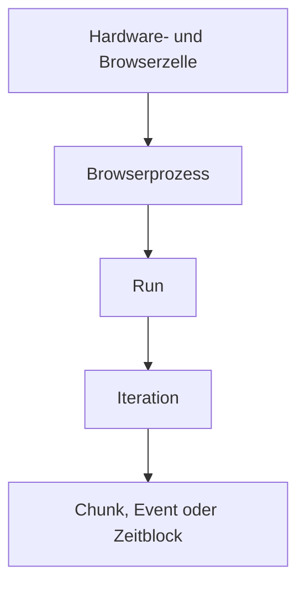

# BR-04 Benchmark-Aggregator: implementierungsreife Spezifikation

**Stand:** 2026-08-12  
**Zielrepository:** `BenjaminHornung/hestia-voxel-kernel-lab`  
**Kanonischer Planungsstand:** [`d95992df05952ac4be6221ca1809c1c9e3c0ac9d`](https://github.com/BenjaminHornung/hestia-voxel-kernel-lab/commit/d95992df05952ac4be6221ca1809c1c9e3c0ac9d)  
**Arbeitsmodus:** Cloud, read-only gegenüber GitHub, keine Implementierung, keine Tests, Builds, Browserläufe oder Benchmarks  
**Abschlussstatus:** `REQUIRES_ADDITIONAL_RESEARCH`

## 1. Ergebnis

Der BR-04-Vertrag ist statistisch und technisch vollständig spezifiziert. Er definiert:

- die zulässige Hierarchie `Hardwarezelle → Browserprozess → Run → Iteration → Chunk/Event`;
- fail-closed Inputvalidierung und eine vollständige Run-Ledger;
- nearest-rank p50, p95 und p99 mit einer harten p99-Mindestpopulation von 1.000 exakt kompatiblen Events;
- per-run Summaries, explizit gepaarte Kandidatenratios und hierarchische Bootstrap-Intervalle;
- strikt getrennte Cold-, Measurement-, Stress-, Leak- und Trace-Auswertungen;
- deterministische Kanonisierung, Seed-Bindung, Sortierung und Berichtserzeugung;
- eine versionierte Metrik-Registry;
- 37 Golden-Statistikfixtures;
- ein neutrales Markdown-Berichtsmodell ohne automatische Siegerentscheidung;
- einen Handoff-Prompt für den späteren lokalen Implementierungsagenten.

Der Status ist trotzdem nicht `READY_FOR_LATER_IMPLEMENTATION`, weil drei verpflichtende Voraussetzungen fehlen:

1. `WELTRAUM_RESEARCH_SYNTHESIS_2026-08-12.md` war nicht verfügbar.
2. `WELTRAUM_RESEARCH_DECISION_LOG_2026-08-12.md` war nicht verfügbar.
3. Es war kein fertiger BR-01-, BR-02- oder BR-03-Bericht und damit kein akzeptierter BR-03-SHA verfügbar.

Diese Lücke verhindert die verbindliche Typ-Crosswalk-Prüfung gegen die tatsächlich akzeptierten BR-01- und BR-03-Verträge. Der Bericht erfindet weder Typfelder noch einen BR-03-SHA. Die statistische Spezifikation ist abgeschlossen; vor Implementierung ist nur noch der dokumentierte Crosswalk gegen die später akzeptierten Eingabeverträge erforderlich.

## 2. Aussageklassen und normative Sprache

Dieser Bericht verwendet vier Klassen:

- **PROJEKTFAKT:** direkt aus den bereitgestellten Projektquellen oder dem verifizierten GitHub-Commit belegt.
- **EXTERNE REFERENZ:** Aussage aus einer verlinkten statistischen Primär- oder Referenzquelle.
- **PROJEKTVERTRAG V1:** bewusst gewählte BR-04-Regel. Sie ist nicht als universell einzig richtige Statistik zu verstehen.
- **UNAVAILABLE / UNKNOWN:** im Auftrag geforderte Information, die nicht belastbar vorlag.

`MUSS`, `DARF NICHT`, `SOLL` und `KANN` sind normativ zu lesen. Mathematische Designentscheidungen werden ausdrücklich als `PROJEKTVERTRAG V1` markiert.

## 3. Quellenlage und Provenienz

### 3.1 Verfügbare Projektquellen

| Quelle | Status | Nutzung |
|---|---|---|
| `WELTRAUM_PROJECT_INSTRUCTIONS_ADDENDUM.md` | vollständig gelesen | Sicherheits-, Wahrheits- und Berichtsregeln |
| `WELTRAUM_PROJECT_MEMORY.md` | vollständig gelesen | akzeptierter Projektstand und Source-of-Truth-Hierarchie |
| `WELTRAUM_RESEARCH_REGISTER.md` | vollständig gelesen | Researchstatus `PROPOSED` und Abhängigkeiten |
| `07_benchmark_test_methodology_audit_report.md` | vollständig gelesen | Benchmark Protocol v1, Rohschema, Metriken, Bootstrap- und Gatevorschläge |
| `wp05_worker_scheduler_abschlussbericht.md` | relevante Telemetrieabschnitte geprüft | Queue-, Worker-, Adoption-, stale- und drop-Semantik, weiterhin `PROPOSED` |
| GitHub-Commit `d95992df...` | read-only verifiziert | kanonischer WP03-Stand, keine BR-Infrastruktur an diesem Commit |

### 3.2 Nicht verfügbare Pflichtquellen

| Quelle | Suchergebnis | Konsequenz |
|---|---|---|
| `WELTRAUM_RESEARCH_SYNTHESIS_2026-08-12.md` | weder bereitgestellt noch unter exaktem oder breitem Titel auffindbar | spätere Widerspruchsprüfung erforderlich |
| `WELTRAUM_RESEARCH_DECISION_LOG_2026-08-12.md` | weder bereitgestellt noch unter exaktem oder breitem Titel auffindbar | Akzeptanzstatus vorgeschlagener Statistikregeln unbekannt |
| fertiger BR-01-Bericht | nicht auffindbar | exakte Validation-Receipt- und Run-Schema-Namen unbekannt |
| fertiger BR-02-Bericht | nicht auffindbar | exakte Telemetrie-Namen unbekannt; Registry bleibt semantisch, nicht dateipfadgebunden |
| fertiger BR-03-Bericht und akzeptierter SHA | nicht auffindbar | Handoff muss einen nicht erratenen Platzhalter verwenden |

### 3.3 Externe Statistik- und Determinismusquellen

| Quelle | Relevanz | Verwendung im Vertrag |
|---|---|---|
| Hyndman und Fan, [Sample Quantiles in Statistical Packages](https://doi.org/10.1080/00031305.1996.10473566), 1996 | mehrere legitime Sample-Quantildefinitionen | Begründet, warum die konkrete Definition versioniert werden muss |
| R Core, [`quantile`, Type 1](https://stat.ethz.ch/R-manual/R-devel/library/stats/html/quantile.html) | Inverse der empirischen Verteilungsfunktion | Referenz für die diskontinuierliche, nicht interpolierende Definition |
| NIST, [Percentiles](https://www.itl.nist.gov/div898/handbook/prc/section2/prc262.htm) | Order-Statistik und Perzentilbegriff | ergänzende Referenz |
| Efron, [Bootstrap Methods: Another Look at the Jackknife](https://doi.org/10.1214/aos/1176344552), 1979 | grundlegendes Bootstrapverfahren | Basis für Resampling-CIs |
| Field und Welsh, [Bootstrapping Clustered Data](https://doi.org/10.1111/j.1467-9868.2007.00593.x), 2007 | Cluster- und mehrstufiges Resampling | Begründung für Prozess-/Run-Cluster statt Event-IID |
| Kalibera und Jones, [Rigorous Benchmarking in Reasonable Time](https://doi.org/10.1145/2555670.2464160), 2013 | hierarchische Performanceexperimente | Performance-spezifische Hierarchie und Wiederholung |
| Kalibera und Jones, [Quantifying Performance Changes with Effect Size Confidence Intervals](https://arxiv.org/abs/2007.10899) | Ratios und Unsicherheit bei Performanceänderungen | gepaarte Effekte und CI-Bericht |
| Hurlbert, [Pseudoreplication and the Design of Ecological Field Experiments](https://doi.org/10.2307/1942661), 1984 | Unabhängigkeit experimenteller Einheiten | begriffliche Referenz gegen Pseudoreplikation |
| Lakens, Scheel und Isager, [Equivalence Testing for Psychological Research](https://doi.org/10.1177/2515245918770963), 2018 | kleinste praktisch relevante Effektgröße | praktische Schwelle muss fachlich vorab begründet sein |
| ASA, [Statement on p-Values](https://doi.org/10.1080/00031305.2016.1154108), 2016 | Effektgröße und praktische Bedeutung sind nicht statistische Signifikanz | Trennung von Effekt, Unsicherheit und Entscheidung |
| IETF, [RFC 8785 JSON Canonicalization Scheme](https://www.rfc-editor.org/rfc/rfc8785) | deterministische JSON-Repräsentation | kanonische Digests |
| NIST, [FIPS 180-4 Secure Hash Standard](https://csrc.nist.gov/pubs/fips/180-4/upd1/final) | SHA-256 | Bundle-, Input- und Claim-Digests |
| Blackman und Vigna, [xoshiro128** reference](https://prng.di.unimi.it/xoshiro128starstar.c) | deterministischer 32-Bit-PRNG, Referenzcode Public Domain | Algorithmus-ID und Testvektoren; kein Code wurde in diesen Bericht kopiert |

Die externen Quellen legen nicht automatisch die konkrete BR-04-Mathematik fest. Quantiltyp, Resamplezahl, CI-Methode, PRNG, Mindestcluster und praktische Schwellen bleiben versionierte Projektentscheidungen.

## 4. Nichtziele

BR-04:

- steuert keinen Browser;
- instrumentiert keine Telemetrie;
- misst keine Zeit und keinen Speicher;
- erzeugt keine GPU- oder Heapdaten;
- startet keine Retries;
- repariert keine Raw Runs;
- entscheidet keine Technologie;
- definiert keine absoluten Produktbudgets;
- implementiert keinen WP05-Code;
- erklärt keinen Kandidaten zum Sieger;
- löscht keine gültigen Ausreißer.

## 5. Statistische Einheit und Hierarchie

### 5.1 Kanonische Hierarchie



**PROJEKTVERTRAG V1:** Eine Hardware-/Browserzelle ist ein Stratum. Zellen werden niemals statistisch zusammengelegt. Der Browserprozess ist die höchste innerhalb einer Zelle beobachtete Clusterstufe. Runs, Iterationen und Events desselben Prozesses sind nicht automatisch unabhängig.

### 5.2 Begriffe

`EnvironmentCell`
: Exakt gleiche Source-, Build-, Fixture-, Scenario-, Hardware-, Browser-, Display-, Power-, Phase- und Capability-Dimensionen. Schon eine abweichende Browser-Vollversion, GPU, DPR oder Phase erzeugt eine andere Zelle.

`BrowserProcess`
: Ein von BR-03 gestarteter Browserprozess mit stabiler Prozess-ID und Environment-Fingerprint. Mehrere Runs in demselben Prozess teilen JIT-, Cache-, GPU- und Prozesszustand.

`Run`
: Eine planmäßig adressierbare Kandidatenausführung. Ein Run besitzt genau einen BR-03-Slot, eine Run-ID, einen Kandidaten, eine Phase und eine BR-01-Validation-Receipt.

`Iteration`
: Eine wiederholte Szenarioausführung innerhalb eines Runs. Iterationen teilen weiterhin den Prozess- und Runzustand.

`Event`
: Unterste Messung, zum Beispiel Chunk-Meshing, Queue-Wartezeit, Adoption, rAF-Intervall oder Long Task. Viele Events desselben Runs erhöhen die Auflösung der Eventverteilung, aber nicht die Zahl unabhängiger Browserprozesse.

### 5.3 Verhinderung von Pseudoreplikation

1. `nEvents` wird nie als Zahl unabhängiger Replikate ausgegeben.
2. Absolute Konfidenzintervalle resamplen zuerst Browserprozesse, dann Runs und erst danach die im Metrikvertrag erlaubten unteren Ebenen.
3. Gepaarte Konfidenzintervalle resamplen zuerst BR-03-Order-/Bootstrapcluster und halten Referenz und Kandidat gemeinsam.
4. Feste Chunks einer Golden-Welt sind Arbeitsobjekte, keine zufällige Stichprobe unabhängiger Welten. Bei `fixed-workload` werden sie nicht einzeln resampled.
5. Zeitreihen wie rAF-Intervalle werden nur in vordefinierten Blöcken resampled, niemals als unabhängige Einzelintervalle.
6. Pooled Event Quantiles sind deskriptiv. Inferenz und Kandidatenvergleich beruhen auf vordefinierten per-run Scalars und Clusterresampling.

## 6. Exakte Gruppierungs- und Pairing-Schlüssel

### 6.1 `EnvironmentCellKeyV1`

Der kanonische Zellenkey ist der SHA-256 über die nach RFC 8785 kanonisierte Projektion aus:

```text
repository
sourceTreeSha
buildSha256
fixtureContractId + fixtureContractVersion + fixtureDigest
scenarioId + scenarioVersion + workloadSeed
backend + mesher + chunkEdge + workerCount
hardwareProfile + immutableHardwareFingerprint
osBuild
cpuModel
gpuVendor + gpuDevice + driver + graphicsBackend
browserProduct + fullBrowserVersion + channel + sortedFlags
headed/headless
cssWidth + cssHeight + dpr + refreshHz + vsyncContract
powerSource + powerProfile
phase
capabilityFingerprint
```

`createdUtc`, Dateipfad, Dateireihenfolge und Berichtslocale gehören nicht in den Zellenkey.

### 6.2 `PairCellKeyV1`

BR-04 paart niemals heuristisch. BR-03 MUSS für jeden geplanten Vergleich folgende IDs liefern:

```text
bootstrapClusterId
pairCellId
referenceCandidateId
candidateId
referenceSlotId
candidateSlotId
environmentCellId
scenarioId + scenarioVersion
phase
workloadSeed
pairOrdinal
```

Der Aggregator darf nicht nach Zeitnähe, gleicher Iterationsnummer oder Dateinamen nachpaaren. ABBA/BAAB oder ein Latin Square werden im BR-03-Plan in explizite Pair Cells zerlegt. Ohne explizite Pair Cell gibt es nur unpaired descriptive summaries.

### 6.3 Metrikspezifischer Pairing-Suffix

| Population | zusätzlicher Suffix |
|---|---|
| Weltiteration | `iterationOrdinal` |
| Chunk-Operation | `iterationOrdinal + chunkKey` |
| Scheduleroperation | `operationOrdinal + operationSemanticKey` |
| Input/Revision | `inputOrdinal + expectedWorldRevision` |
| Frame-/Long-Task-Serie | `timeBlockOrdinal`; Einzelereignisse werden nicht direkt gepaart |
| Memory | `memoryKind + checkpointId` |
| GPU | `renderPassId + frameBlockOrdinal` |
| Drain | `burstOrdinal` |
| Counter | `counterKind + observationWindowId` |

## 7. Aggregierbare und nicht aggregierbare Rohdaten

### 7.1 Strukturell zulässiger Input

Ein Run darf BR-04 nur erreichen, wenn:

1. eine BR-01-Validation-Receipt mit `schema-and-integrity-valid` vorliegt;
2. Raw-Byte-SHA-256 und kanonischer Content-SHA-256 zur Receipt passen;
3. der Run exakt einem BR-03-Slot zugeordnet ist;
4. Run-ID, Slot-ID und Plan-Digest eindeutig sind;
5. alle Zahlen valide JSON-Zahlen, endlich und nicht `-0` sind;
6. Einheiten, Tags, Phase und Capability mit einer versionierten `MetricDefinitionV1` übereinstimmen;
7. keine unbekannte Metrik still angenommen wird.

`validated` bedeutet hier Schema- und Integritätsvalidität. Ein solcher Run kann trotzdem als `source-dirty`, `trace-only`, `capability-unsupported`, `infrastructure-invalid` oder `candidate-failure` klassifiziert und damit für bestimmte Aggregate nicht messberechtigt sein.

### 7.2 Messberechtigtes Sample

Ein Sample fließt nur in ein numerisches Aggregat ein, wenn gleichzeitig gilt:

- Run und Sample sind für die konkrete Metrik `valid`;
- `measurementEligible = true`;
- die Phase ist im Metrikvertrag erlaubt;
- die Capability ist `supported`;
- Einheit und semantische Population stimmen exakt;
- alle Pflicht-Tags sind vorhanden;
- der Wert erfüllt die metrikspezifische Domain;
- Source-, Build-, Fixture-, Scenario- und Environment-Provenienz stimmen;
- das Sample wird genau einer Gruppe zugeordnet.

### 7.3 Numerische Domains

| Domain | zulässig | unzulässig |
|---|---|---|
| `positive-duration` | endlich und `> 0` | `0`, negativ, NaN, ±Infinity, `-0` |
| `non-negative-bytes` | sichere Ganzzahl `>= 0` | negativ, nicht ganzzahlig, nicht endlich |
| `non-negative-count` | sichere Ganzzahl `>= 0` | negativ, nicht ganzzahlig, nicht endlich |
| `positive-ratio-component` | endlich und `> 0` | `<= 0`, nicht endlich |
| `revision` | sichere Ganzzahl `>= 0` | negativ, nicht ganzzahlig |

Null ist für stale-/drop-Counter zulässig. Null ist für Dauerwerte und als Referenznenner eines Ratios unzulässig. JSON-Text mit `NaN` oder `Infinity` scheitert bereits beim Parser.

### 7.4 Niemals gemeinsam aggregieren

- unterschiedliche Units, auch wenn eine Umrechnung möglich wäre;
- Cold, Warm-up, Measurement, Stress, Leak und Trace;
- verschiedene Browser-Vollversionen oder Flags;
- verschiedene Hardware-/GPU-/Treiberzellen;
- unterschiedliche DPR, Auflösung oder Refresh-Verträge;
- unterschiedliche Fixture-, Scenario-, Protocol- oder Metric-Versionen;
- verschiedene Memory-Kinds oder Counter-Semantiken;
- supported und unsupported;
- gültige und invalide Runs;
- Trace- und Gate-Daten.

## 8. Input-/Output-Verträge

Die folgenden TypeScript-Formen sind normativ auf Feldebene. Namen aus noch fehlenden BR-01-/BR-03-Berichten werden später über einen dünnen, expliziten Adapter auf diese Projektionen gemappt. Der Adapter darf keine Validierung abschwächen.

### 8.1 Gemeinsame Hilfstypen

```ts
type Sha256 = `sha256:${string}`;
type CommitSha = string; // exakt 40 lowercase hex
type MetricRef = `${string}@${number}`;
type Phase = 'cold' | 'warmup' | 'measurement' | 'stress' | 'trace' | 'leak';

type RunDispositionV1 =
  | 'valid'
  | 'infrastructure-invalid'
  | 'capability-unsupported'
  | 'candidate-failure'
  | 'provenance-mismatch'
  | 'source-dirty'
  | 'trace-only';

type PairDispositionV1 = 'complete' | 'incomplete-pair' | 'not-applicable';

interface ContractIssueV1 {
  readonly severity: 'error' | 'warning' | 'info';
  readonly code: string;
  readonly jsonPointer: string;
  readonly message: string;
  readonly runId: string | null;
  readonly slotId: string | null;
  readonly sourceDigest: Sha256 | null;
}
```

### 8.2 `AggregateInputBundleV1`

```ts
interface AggregateInputBundleV1 {
  readonly schemaVersion: 1;
  readonly contractVersion: 'br04-aggregate-input-v1';
  readonly bundleId: string;
  readonly reportAsOfUtc: string; // expliziter Input, niemals Date.now()

  readonly sourceContract: {
    readonly repository: 'BenjaminHornung/hestia-voxel-kernel-lab';
    readonly acceptedBr03Sha: CommitSha;
    readonly br01SchemaId: string;
    readonly br01SchemaDigest: Sha256;
    readonly br01ValidatorId: string;
    readonly br01ValidatorDigest: Sha256;
  };

  readonly runPlan: Br03RunPlanProjectionV1;
  readonly metricRegistry: readonly MetricDefinitionV1[];
  readonly bootstrapPolicy: BootstrapPolicyV1;
  readonly runs: readonly ValidatedRunEnvelopeV1[];

  readonly manifest: {
    readonly orderedRawRunDigests: readonly Sha256[];
    readonly normalizedInputDigest: Sha256;
    readonly manifestDigest: Sha256;
  };
}

interface Br03RunPlanProjectionV1 {
  readonly planId: string;
  readonly planVersion: number;
  readonly planDigest: Sha256;
  readonly acceptedBr03Sha: CommitSha;
  readonly slots: readonly PlannedRunSlotV1[];
  readonly invalidationRegistry: readonly InfrastructureInvalidationRuleV1[];
}

interface PlannedRunSlotV1 {
  readonly slotId: string;
  readonly bootstrapClusterId: string;
  readonly pairCellId: string | null;
  readonly pairOrdinal: number | null;
  readonly candidateId: string;
  readonly referenceCandidateId: string | null;
  readonly environmentCellId: string;
  readonly scenarioId: string;
  readonly scenarioVersion: number;
  readonly phase: Phase;
  readonly workloadSeed: number;
  readonly requiredCapabilities: readonly string[];
}

interface ValidatedRunEnvelopeV1 {
  readonly runId: string;
  readonly slotId: string;
  readonly rawByteDigest: Sha256;
  readonly canonicalContentDigest: Sha256;
  readonly br01ValidationReceipt: {
    readonly receiptVersion: 1;
    readonly validatorId: string;
    readonly validatorDigest: Sha256;
    readonly status: 'schema-and-integrity-valid';
    readonly validatedRawByteDigest: Sha256;
    readonly validatedCanonicalContentDigest: Sha256;
  };
  readonly run: Br01RunProjectionV1;
}

interface Br01RunProjectionV1 {
  readonly source: {
    readonly repository: string;
    readonly sourceTreeSha: CommitSha;
    readonly buildSha256: Sha256;
    readonly dirty: boolean;
    readonly fixtureContractId: string;
    readonly fixtureContractVersion: number;
    readonly fixtureDigest: Sha256;
  };
  readonly environmentCellId: string;
  readonly browserProcessId: string;
  readonly candidateId: string;
  readonly phase: Phase;
  readonly measurementEligible: boolean;
  readonly declaredDisposition: RunDispositionV1;
  readonly declaredReasonCode: string | null;
  readonly capabilities: Readonly<Record<string, 'supported' | 'unsupported' | 'error'>>;
  readonly iterations: readonly {
    readonly iterationId: string;
    readonly ordinal: number;
    readonly samples: readonly RawMetricSampleProjectionV1[];
  }[];
}

interface RawMetricSampleProjectionV1 {
  readonly sampleId: string;
  readonly metricRef: MetricRef;
  readonly value: number;
  readonly unit: string;
  readonly valid: boolean;
  readonly invalidReason: string | null;
  readonly tags: Readonly<Record<string, string | number | boolean | null>>;
}
```

### 8.3 `AggregateValidationResultV1`

```ts
interface AggregateValidationResultV1 {
  readonly schemaVersion: 1;
  readonly status: 'valid' | 'invalid';
  readonly normalizedInputDigest: Sha256 | null;
  readonly issues: readonly ContractIssueV1[];
  readonly counts: {
    readonly plannedSlots: number;
    readonly observedRuns: number;
    readonly duplicateRuns: number;
    readonly missingSlots: number;
    readonly validReceipts: number;
    readonly fatalErrors: number;
  };
  readonly runLedger: readonly RunLedgerEntryV1[];
}

interface RunLedgerEntryV1 {
  readonly runId: string | null;
  readonly slotId: string;
  readonly rawByteDigest: Sha256 | null;
  readonly baseDisposition: RunDispositionV1;
  readonly pairDisposition: PairDispositionV1;
  readonly reasonCodes: readonly string[];
  readonly metricEligibility: Readonly<Record<MetricRef, RunDispositionV1>>;
}
```

Ein bundleweiter Fehler wie doppelter `runId`, unbekannter Slot, falscher Plan-Digest, unbekannte Metrik oder Unit-Mismatch setzt `status = invalid`. Ein diagnostischer Run-Ledger wird trotzdem erzeugt, aber kein `BenchmarkAggregateV1` als veröffentlichbares Ergebnis.

### 8.4 `MetricDefinitionV1`

```ts
interface MetricDefinitionV1 {
  readonly schemaVersion: 1;
  readonly metricId: string;
  readonly metricVersion: number;
  readonly label: string;
  readonly unit: 'ms' | 'bytes' | 'count' | 'ratio' | 'revision';
  readonly numericDomain:
    | 'positive-duration'
    | 'non-negative-bytes'
    | 'non-negative-count'
    | 'positive-ratio-component'
    | 'revision';
  readonly population: string;
  readonly requiredTags: readonly string[];
  readonly groupByTags: readonly string[];
  readonly pairingKeySuffix: readonly string[];
  readonly aggregationLevel: 'run' | 'iteration' | 'event' | 'time-block';
  readonly perRunStatistic:
    | 'identity'
    | 'sum'
    | 'count'
    | 'max'
    | 'nearest-rank-p50'
    | 'nearest-rank-p95'
    | 'nearest-rank-p99';
  readonly cellEstimator: 'median' | 'arithmetic-mean' | 'geometric-mean';
  readonly allowedPhases: readonly Phase[];
  readonly capabilityRequirement: readonly string[];
  readonly direction: 'lower-is-better' | 'higher-is-better' | 'context-dependent';
  readonly lowerLevelResampling:
    | 'fixed-workload'
    | 'exchangeable-iterations'
    | 'predeclared-time-blocks'
    | 'none';
  readonly practicalEffectDelta: number | null;
  readonly automaticDecision: 'forbidden';
  readonly displaySignificantDigits: 6;
}
```

### 8.5 `QuantileResultV1`

```ts
interface QuantileResultV1 {
  readonly schemaVersion: 1;
  readonly metricRef: MetricRef;
  readonly scopeId: string;
  readonly scopeDigest: Sha256;
  readonly probability: 0.5 | 0.95 | 0.99;
  readonly method: 'inverse-ecdf-nearest-rank-v1';
  readonly status: 'ok' | 'no-samples' | 'insufficient-samples';
  readonly nMatchingValidObservations: number;
  readonly minimumRequired: number;
  readonly oneBasedRank: number | null;
  readonly value: number | null;
  readonly unit: string;
  readonly sourceRunDigests: readonly Sha256[];
}
```

### 8.6 `BootstrapIntervalV1`

```ts
interface BootstrapPolicyV1 {
  readonly method: 'hierarchical-percentile-v1';
  readonly confidenceLevel: 0.95;
  readonly resamples: 10000;
  readonly minimumTopLevelClusters: 3;
  readonly masterSeedHex: string; // exakt 64 lowercase hex
  readonly seedDerivation: 'sha256-bound-xoshiro128ss-v1';
  readonly prng: 'xoshiro128**-32-v1';
  readonly indexSampling: 'uint32-rejection-v1';
}

interface BootstrapIntervalV1 {
  readonly schemaVersion: 1;
  readonly metricRef: MetricRef;
  readonly estimatorId: string;
  readonly status: 'ok' | 'insufficient-clusters' | 'no-data' | 'not-applicable';
  readonly method: 'hierarchical-percentile-v1';
  readonly confidenceLevel: 0.95;
  readonly resamples: 10000;
  readonly lower: number | null;
  readonly upper: number | null;
  readonly unit: string;
  readonly hierarchy: readonly string[];
  readonly topLevelClusters: number;
  readonly runs: number;
  readonly iterations: number;
  readonly events: number;
  readonly masterSeedHex: string;
  readonly seedMaterialDigest: Sha256;
  readonly derivedSeedHex: string;
  readonly replicateVectorDigest: Sha256 | null;
}
```

### 8.7 `PairedComparisonV1`

```ts
interface PairedComparisonV1 {
  readonly schemaVersion: 1;
  readonly comparisonId: string;
  readonly metricRef: MetricRef;
  readonly environmentCellId: string;
  readonly phase: Phase;
  readonly referenceCandidateId: string;
  readonly candidateId: string;
  readonly direction: MetricDefinitionV1['direction'];
  readonly perRunStatistic: MetricDefinitionV1['perRunStatistic'];

  readonly pairs: {
    readonly planned: number;
    readonly complete: number;
    readonly incomplete: number;
    readonly completePairCellIds: readonly string[];
    readonly incompletePairCellIds: readonly string[];
  };

  readonly pairValues: readonly {
    readonly pairCellId: string;
    readonly bootstrapClusterId: string;
    readonly referenceValue: number;
    readonly candidateValue: number;
    readonly differenceCandidateMinusReference: number;
    readonly ratioCandidateOverReference: number | null;
    readonly ratioStatus: 'ok' | 'non-positive-reference' | 'domain-invalid';
    readonly referenceRunDigest: Sha256;
    readonly candidateRunDigest: Sha256;
  }[];

  readonly differencePointEstimate: number | null; // Median der Paardifferenzen
  readonly ratioPointEstimate: number | null; // geometrisches Mittel gültiger Paarratios
  readonly differenceInterval: BootstrapIntervalV1;
  readonly ratioInterval: BootstrapIntervalV1;

  readonly practicalEffect: {
    readonly delta: number | null;
    readonly band: readonly [number, number] | null;
    readonly pointRelation:
      | 'practical-improvement'
      | 'inside-practical-band'
      | 'practical-regression'
      | 'context-dependent'
      | 'not-configured';
    readonly intervalRelation:
      | 'entirely-improvement'
      | 'entirely-inside-band'
      | 'entirely-regression'
      | 'overlaps-boundary'
      | 'unavailable';
    readonly ciRelationToOne: 'below' | 'contains' | 'above' | 'unavailable';
  };

  readonly decision: null; // absichtlich kein winner/pass/fail
}
```

### 8.8 `InvalidRunSummaryV1`

```ts
interface InvalidRunSummaryV1 {
  readonly schemaVersion: 1;
  readonly plannedSlots: number;
  readonly observedRuns: number;
  readonly baseDispositionCounts: Readonly<Record<RunDispositionV1, number>>;
  readonly entries: readonly {
    readonly runId: string | null;
    readonly slotId: string;
    readonly baseDisposition: RunDispositionV1;
    readonly pairDisposition: PairDispositionV1;
    readonly scope: 'run' | `metric:${MetricRef}`;
    readonly reasonCodes: readonly string[];
    readonly rawRunDigest: Sha256 | null;
    readonly planSlotDigest: Sha256;
  }[];
  readonly missingSlots: readonly string[];
  readonly incompletePairs: readonly {
    readonly pairCellId: string;
    readonly presentSlotIds: readonly string[];
    readonly missingOrInvalidSlotIds: readonly string[];
    readonly reasonCodes: readonly string[];
  }[];
}
```

`baseDispositionCounts` ist exklusiv. `incompletePairs` ist eine zweite Dimension und darf nicht in die Summe der Base Dispositions addiert werden.

### 8.9 `CapabilityCoverageV1`

```ts
interface CapabilityCoverageV1 {
  readonly schemaVersion: 1;
  readonly metricRef: MetricRef;
  readonly environmentCellId: string;
  readonly candidateId: string;
  readonly requiredCapabilities: readonly string[];
  readonly status: 'supported' | 'partially-supported' | 'unsupported' | 'error';
  readonly plannedRuns: number;
  readonly observedRuns: number;
  readonly supportedRuns: number;
  readonly unsupportedRuns: number;
  readonly erroredRuns: number;
  readonly reasonCodes: readonly string[];
  readonly sourceRunDigests: readonly Sha256[];
}
```

### 8.10 `BenchmarkAggregateV1`

```ts
interface BenchmarkAggregateV1 {
  readonly schemaVersion: 1;
  readonly contractVersion: 'br04-benchmark-aggregate-v1';
  readonly reportAsOfUtc: string;
  readonly inputDigest: Sha256;
  readonly runPlanDigest: Sha256;
  readonly acceptedBr03Sha: CommitSha;
  readonly metricRegistryDigest: Sha256;
  readonly bootstrapPolicyDigest: Sha256;
  readonly aggregatorSourceDigest: Sha256;
  readonly validation: AggregateValidationResultV1;
  readonly environmentCells: readonly EnvironmentCellAggregateV1[];
  readonly pairedComparisons: readonly PairedComparisonV1[];
  readonly invalidRuns: InvalidRunSummaryV1;
  readonly capabilityCoverage: readonly CapabilityCoverageV1[];
  readonly claimIndex: readonly ClaimTraceV1[];
  readonly facts: readonly string[];
  readonly inferences: readonly string[];
  readonly unknowns: readonly string[];
  readonly aggregateDigest: Sha256;
}

interface EnvironmentCellAggregateV1 {
  readonly environmentCellId: string;
  readonly environmentFingerprintDigest: Sha256;
  readonly phase: Phase;
  readonly candidateId: string;
  readonly metricCells: readonly {
    readonly metricRef: MetricRef;
    readonly unit: string;
    readonly nProcesses: number;
    readonly nRuns: number;
    readonly nIterations: number;
    readonly nEvents: number;
    readonly perRunSummaries: readonly PerRunMetricSummaryV1[];
    readonly descriptivePooledQuantiles: readonly QuantileResultV1[];
    readonly maximum: number | null;
    readonly cellPointEstimate: number | null;
    readonly cellInterval: BootstrapIntervalV1;
  }[];
}

interface PerRunMetricSummaryV1 {
  readonly runId: string;
  readonly runDigest: Sha256;
  readonly metricRef: MetricRef;
  readonly nEvents: number;
  readonly p50: QuantileResultV1;
  readonly p95: QuantileResultV1;
  readonly p99: QuantileResultV1;
  readonly maximum: number | null;
  readonly comparisonScalar: number | null;
}

interface ClaimTraceV1 {
  readonly claimId: string;
  readonly class: 'fact' | 'inference' | 'unknown';
  readonly aggregateJsonPointers: readonly string[];
  readonly sourceRunDigests: readonly Sha256[];
  readonly planSlotIds: readonly string[];
  readonly metricDefinitionDigest: Sha256 | null;
}
```

### 8.11 `BenchmarkMarkdownReportModelV1`

```ts
interface BenchmarkMarkdownReportModelV1 {
  readonly schemaVersion: 1;
  readonly contractVersion: 'br04-markdown-report-model-v1';
  readonly aggregateDigest: Sha256;
  readonly title: string;
  readonly reportAsOfUtc: string;
  readonly statusBanner: 'neutral-evidence-no-winner';
  readonly provenanceSection: ReportSectionV1;
  readonly environmentSection: ReportSectionV1;
  readonly runLedgerSection: ReportSectionV1;
  readonly summarySection: ReportSectionV1;
  readonly comparisonSection: ReportSectionV1;
  readonly capabilitySection: ReportSectionV1;
  readonly invalidationSection: ReportSectionV1;
  readonly chartSpecifications: readonly AllowedChartSpecV1[];
  readonly factInferenceUnknownSection: ReportSectionV1;
  readonly claimIndex: readonly ClaimTraceV1[];
  readonly reportModelDigest: Sha256;
}

interface ReportSectionV1 {
  readonly heading: string;
  readonly rows: readonly Readonly<Record<string, string>>[];
  readonly aggregateJsonPointers: readonly string[];
}

interface AllowedChartSpecV1 {
  readonly chartId: string;
  readonly kind: 'ecdf' | 'run-dotplot' | 'paired-ratio' | 'ci-forest' | 'time-series';
  readonly sourceJsonPointers: readonly string[];
  readonly includesAllValidPoints: true;
  readonly showsInvalidCount: true;
  readonly truncatedAxis: false;
  readonly declaresPhase: true;
}
```

Der Markdownrenderer darf keine Statistik neu berechnen. Er rendert ausschließlich dieses Modell und übernimmt jede Zahl aus einem angegebenen JSON Pointer.

## 9. Kanonische Statistikregeln

### 9.1 Nearest-rank p50, p95 und p99

**PROJEKTVERTRAG V1:** Für eine nicht leere, aufsteigend sortierte Folge

```text
x(1) <= x(2) <= ... <= x(n)
```

und `0 < p <= 1` gilt:

```text
rank(p, n) = max(1, ceil(p * n))
Q(p)       = x(rank(p, n))
```

Es gibt keine Interpolation. Der Rückgabewert ist immer ein tatsächlich beobachteter Wert. Konkret:

```text
p50 = Q(0.50)
p95 = Q(0.95)
p99 = Q(0.99), aber nur unter der zusätzlichen Mindestpopulation
```

Für `[1, 2, 3, 4]` ist p50 daher `2`, nicht `2.5`. Die Methode wird als `inverse-ecdf-nearest-rank-v1` gespeichert. Ein bloßes Feld `p95` ohne Methoden-ID ist nicht vertragskonform.

### 9.2 p99-Mindestpopulation

**PROJEKTVERTRAG V1:** p99 ist nur zulässig, wenn die konkrete Quantilpopulation mindestens 1.000 passende gültige Beobachtungen besitzt.

```text
if nMatchingValidObservations < 1000:
    status = insufficient-samples
    value = null
    oneBasedRank = null
else:
    status = ok
    oneBasedRank = ceil(0.99 * n)
```

`n` darf nicht durch Zusammenzählen inkompatibler Populationen künstlich erhöht werden. Insbesondere werden nicht vermischt:

- Cold und Measurement;
- Kandidaten;
- Browser- oder Hardwarezellen;
- unterschiedliche Units oder Metrikversionen;
- valide und invalide Events;
- unterschiedliche `memoryKind`, `counterKind`, `chunkKey`-Populationen oder Capabilities, sofern diese laut Registry getrennt gruppiert werden.

Bei `n < 1000` werden p50, p95 und Maximum weiterhin berichtet. `p99` bleibt ausdrücklich `insufficient-samples` und wird nicht durch Maximum, p95 oder einen interpolierten Wert ersetzt.

### 9.3 Maxima

Maximum wird für jede nicht leere gültige Population immer berichtet. Es besitzt keinen Mindestumfang. Das Maximum wird zusätzlich pro Run gespeichert, damit ein hohes Zellenmaximum zum verursachenden Run zurückgeführt werden kann.

Bei leerer Population gilt `maximum = null`, nicht `0`.

### 9.4 Per-run Summary und deskriptive pooled Quantile

Für jede Metrik werden zwei Ebenen sichtbar gehalten:

1. **Per-run Summary:** `nEvents`, p50, p95, p99-Status, Maximum und der in `MetricDefinitionV1.perRunStatistic` festgelegte Vergleichsscalar.
2. **Pooled descriptive summary:** Quantile über alle gültigen passenden Events einer exakten Zelle.

Die pooled Quantile beschreiben die beobachtete Eventverteilung, behandeln Events aber nicht als unabhängige Replikate. Ihre Konfidenzintervalle werden daher nicht durch einen flachen Eventbootstrap erzeugt.

### 9.5 Zellenschätzer

Der Metrikvertrag legt den Zellenschätzer vorab fest:

- `median`: nearest-rank p50 über per-run Scalars;
- `arithmetic-mean`: Summe geteilt durch Anzahl, nur für dafür deklarierte Metriken;
- `geometric-mean`: nur für strikt positive Werte; Berechnung als `exp(mean(log(x)))`.

Perzentile verschiedener Runs werden nie gemittelt, außer die Registry bezeichnet genau den per-run Quantilwert als Scalar und den übergeordneten Zellenschätzer ausdrücklich. Der Bericht benennt dann zum Beispiel `median of per-run p95`, nicht nur `p95`.

### 9.6 Gepaarte Differenz und Ratio

**PROJEKTVERTRAG V1:** Innerhalb einer vollständigen Pair Cell werden zuerst die vordefinierten per-run Scalars berechnet:

```text
A = Referenzscalar
B = Kandidatenscalar
difference = B - A
ratio      = B / A
```

`ratio > 1` bedeutet immer: Der Kandidatenwert ist größer. Erst `direction` bestimmt, ob das wünschenswert ist.

Voraussetzungen für ein Ratio:

- Referenz und Kandidat gehören zu derselben expliziten Pair Cell;
- beide Scalars sind gültig und haben dieselbe Unit und Metrikversion;
- der Referenzscalar ist strikt positiv;
- bei `positive-duration` sind beide Werte strikt positiv;
- beide Runs erfüllen dieselbe Environment-, Scenario- und Phaseprojektion.

Die Difference wird auch bei einem zulässigen Referenzwert `0` für non-negative Counter berechnet. Das Ratio erhält dann `non-positive-reference` und bleibt `null`.

Über vollständige Pair Cells gilt:

```text
differencePointEstimate = nearest-rank median aller Paardifferenzen
ratioPointEstimate      = exp(mean(log(gueltige Paarratios)))
```

Das geometrische Mittel der Paarratios ist eine Projektentscheidung, weil es den multiplikativen Vergleich symmetrischer behandelt als ein arithmetisches Mittel. Einzelratios und der Median der Ratios bleiben im Detailbericht sichtbar.

### 9.7 Fehlende und invalide Paare

1. Eine Pair Cell ist nur `complete`, wenn beide im BR-03-Plan genannten Slots mit für die konkrete Metrik gültigen Runs belegt sind.
2. Fehlt ein Run oder ist einer der beiden Runs invalid, wird die Pair Cell `incomplete-pair`.
3. Eine unvollständige Pair Cell erzeugt kein Ratio und keine Paardifferenz.
4. Der gültige Gegenlauf bleibt in seinem unpaired descriptive candidate summary enthalten.
5. Es gibt kein Nachpaaren mit einem anderen Block, Prozess, Timestamp oder Wiederholungsindex.
6. Fehlende Slots, invalide Slots und unvollständige Pair Cells werden separat gezählt und mit IDs berichtet.
7. Der Bericht zeigt `planned`, `complete` und `incomplete`. Eine Ratio ohne diese drei Zahlen ist nicht zulässig.

### 9.8 Hierarchischer Bootstrap für absolute Zellenschätzer

**PROJEKTVERTRAG V1:** Das Verfahren ist ein nichtparametrischer hierarchischer Percentile Bootstrap mit:

```text
confidenceLevel = 0.95
resamples       = 10000
minimumTopLevelClusters = 3
```

Für jeden Bootstrap-Replicate einer absoluten Zelle:

1. Ziehe `P` Browserprozesscluster mit Zurücklegen aus den `P` beobachteten Prozessclustern.
2. Für jede gezogene Prozesskopie ziehe so viele Runs mit Zurücklegen, wie dieser Prozess gültige Runs in der Zelle besitzt.
3. Wende pro gezogener Runkopie die in der Metrik definierte Lower-Level-Policy an:
   - `none`: verwende den vorhandenen per-run Scalar;
   - `fixed-workload`: behalte alle festen Chunks/Events der Iteration zusammen;
   - `exchangeable-iterations`: resample vollständige Iterationen, nicht einzelne Chunk-Events;
   - `predeclared-time-blocks`: resample die im BR-03-Plan festgelegten Zeitblöcke.
4. Berechne den per-run Scalar und danach denselben Zellenschätzer wie im Originaldatensatz.

Das Verfahren resampled niemals ausschließlich Chunk-Events. Für feste Golden-World-Chunks ist ein Eventbootstrap verboten, weil die 51 Chunks keine zufällige Stichprobe unabhängiger Welten sind.

Bei weniger als drei Top-Level-Clustern wird der Punktwert berichtet, aber das Intervall erhält `insufficient-clusters`. BR-06 kann später eine höhere Mindestzahl fordern, ohne BR-04 zu ändern.

### 9.9 Hierarchischer gepaarter Bootstrap

Für Kandidatenvergleiche ist die äußere Einheit `bootstrapClusterId` aus dem BR-03-Plan, typischerweise ein gegenbalancierter Order Block. Pro Replicate:

1. Ziehe die beobachteten Bootstrapcluster mit Zurücklegen.
2. Ziehe innerhalb jeder Clusterkopie vollständige Pair Cells mit Zurücklegen.
3. Referenz und Kandidat jeder Pair Cell bleiben gemeinsam. Die Arme werden niemals unabhängig resampled.
4. Wende innerhalb beider Runs dieselbe metrikspezifische Lower-Level-Policy an.
5. Berechne die Paardifferenzen und Paarratios erneut.
6. Berechne Median-Difference und geometrisches Ratio-Mittel erneut.

Eine Pair Cell mit ungültigem Ratio kann zur Difference-Auswertung beitragen, sofern beide Werte domain-valid sind. Sie trägt nicht zur Ratio-Auswertung bei. Die jeweiligen `nPairsUsed` müssen aus den Detaildaten ableitbar sein.

### 9.10 Percentile-CI-Endpunkte

Die 10.000 gültigen Bootstrap-Schätzer werden aufsteigend sortiert. Die CI-Endpunkte verwenden dieselbe nearest-rank-Funktion:

```text
lower = Q(0.025) = replicate(ceil(0.025 * 10000)) = replicate(250)
upper = Q(0.975) = replicate(ceil(0.975 * 10000)) = replicate(9750)
```

Diese Wahl ist ein einfacher Percentile Bootstrap, nicht BCa und nicht die universell beste CI-Methode. Die Methode ist für BR-04 v1 gewählt, weil sie deterministisch, auditierbar und für beliebige Registry-Schätzer einheitlich implementierbar ist. Ein späterer Methodenwechsel benötigt eine neue Contract-Version und neue Golden-Fixtures.

### 9.11 Praktische Effektgrenze und Unsicherheit

Praktische Relevanz und statistische Unsicherheit sind zwei unabhängige Achsen.

**PROJEKTVERTRAG V1:** Wenn eine Metrik `practicalEffectDelta = 0.10` trägt, ist die referenzrelative Bandbreite:

```text
[1 - delta, 1 + delta] = [0.90, 1.10]
```

Für `lower-is-better`:

- `ratio <= 0.90`: Punktwert zeigt praktische Verbesserung;
- `0.90 < ratio < 1.10`: Punktwert liegt in der praktischen Bandbreite;
- `ratio >= 1.10`: Punktwert zeigt praktische Regression.

Für `higher-is-better` sind Verbesserung und Regression vertauscht. Bei `context-dependent` gibt es keine automatische Richtungsinterpretation.

Separat wird das 95-Prozent-CI klassifiziert:

- Lage relativ zu `1.0`;
- Lage relativ zur praktischen Band;
- Überlappung einer oder beider Grenzen.

Es gibt weder p-Wert noch das Wort `signifikant` im v1-Ausgabevertrag. Ein CI, das `1.0` nicht enthält, ist noch keine Produktentscheidung. Ein Punktwert außerhalb der praktischen Band ist ohne hinreichend enges CI ebenfalls keine belastbare Entscheidung. BR-06 kombiniert später Effekt, Unsicherheit, Guardrails und Capability-Abdeckung.

Die 10-Prozent-Band stammt als Vorschlag aus dem R07-Bericht und ist noch keine universelle oder akzeptierte Produktschwelle. Registry und Gatekonfiguration sind versioniert, damit BR-06 pro Metrik andere Grenzen setzen kann.

### 9.12 Keine automatische Outlier-Deletion

Folgende Operationen sind verboten:

- IQR-, z-score-, MAD- oder Grubbs-basierte Löschung;
- Winsorizing oder Trimming;
- Löschen des langsamsten oder speichergrößten gültigen Runs;
- adaptive Auswahl eines stabil aussehenden Zeitfensters nach Sichtung der Ergebnisse;
- Wiederholung bis zum gewünschten Resultat;
- Entfernen einer unbequemen Hardwarezelle;
- Umklassifikation eines langsamen gültigen Runs als Infrastrukturfehler;
- Mittelung bereits aggregierter Perzentile ohne expliziten Registry-Schätzer.

Ein ungewöhnlicher gültiger Wert darf markiert und diagnostisch untersucht werden. Er bleibt in Quantilen, Maxima, Bootstrap und Rohdaten erhalten. Eine Sensitivitätsanalyse darf zusätzlich gezeigt werden, aber niemals das kanonische Aggregate ersetzen.

## 10. Determinismusvertrag

### 10.1 Kanonisierung und Digests

1. Raw Runs behalten einen SHA-256 über die exakten UTF-8-Bytes.
2. Nach Schema-Validierung wird eine normalisierte Projektion erzeugt.
3. IDs sind ASCII und werden bytelexikographisch sortiert.
4. Runs werden nach `slotId`, `runId`, `rawByteDigest` sortiert.
5. Metriken werden nach `metricId`, dann `metricVersion` sortiert.
6. Zellen werden nach `environmentCellId`, `phase`, `candidateId`, `metricRef` sortiert.
7. Pair Cells werden nach `bootstrapClusterId`, `pairOrdinal`, `pairCellId` sortiert.
8. Die normalisierte Projektion wird nach RFC 8785 kanonisiert und mit SHA-256 gebunden.
9. Arrays mit semantischer Reihenfolge behalten ihre Reihenfolge. Semantische Mengen werden vor der Kanonisierung explizit sortiert.

Duplicate JSON Object Keys, NaN, Infinity, `-0` und Zahlen außerhalb der jeweiligen sicheren Domain sind fatal. Eine Library darf diese Fälle nicht still normalisieren.

### 10.2 Bootstrap-Seed-Bindung

Der Master Seed ist ein expliziter 256-Bit-Hexwert im Input. Für jeden Schätzer wird ein unabhängiger Seed abgeleitet:

```text
seedMaterial = UTF8(
  "BR04/bootstrap/v1\0" +
  masterSeedHex + "\0" +
  normalizedInputDigest + "\0" +
  metricRef + "\0" +
  canonicalGroupKey + "\0" +
  estimatorId
)

seedMaterialDigest = SHA256(seedMaterial)
derivedState = first 16 digest bytes as four little-endian uint32 words
```

Ist der 128-Bit-State vollständig null, wird `state[0] = 0x9e3779b9` gesetzt. Der PRNG ist `xoshiro128**-32-v1`. `Math.random()` ist verboten. Jump-Funktionen werden nicht verwendet.

Ein Index aus `[0, n)` wird ohne Modulo-Bias gezogen:

```text
limit = floor(2^32 / n) * n
draw uint32 u until u < limit
index = u mod n
```

Master Seed, Seed-Material-Digest, abgeleiteter Seed und Digest des vollständigen Replicate-Vektors werden gespeichert. Gleiche Inputs und gleiche Aggregatorversion müssen byteidentische Aggregate erzeugen.

### 10.3 Zeit und Zufalls-IDs

- `Date.now()`, aktuelle Locale, Zeitzone, Dateisystemreihenfolge und zufällige UUIDs dürfen den Output nicht beeinflussen.
- `reportAsOfUtc` ist Input und Teil des Input-Digests.
- Der Aggregator erzeugt keine aktuelle Ausführungszeit im kanonischen JSON oder Markdown.
- Diagnose-Logs dürfen Laufzeitstempel besitzen, gehören aber nicht zum Aggregate-Digest.

### 10.4 Zahlenformat

Das JSON enthält ungerundete endliche IEEE-754-Werte und wird durch RFC 8785 serialisiert. Markdown zeigt:

- sichere Ganzzahlen ohne Dezimalpunkt;
- sonst sechs signifikante Stellen über die ECMAScript-`toPrecision(6)`-Semantik;
- entfernte nicht notwendige nachlaufende Nullen;
- keine localeabhängigen Tausender- oder Dezimaltrennzeichen im maschinenlesbaren Teil.

Rundung ist nur Darstellung. Claim Trace verweist immer auf den ungerundeten JSON-Wert.

## 11. Invalidierungs- und Vollständigkeitsvertrag

### 11.1 Zwei Berichtsdimensionen

Jeder geplante Slot erscheint genau einmal in einer exklusiven Base Disposition:

1. `valid`
2. `infrastructure-invalid`
3. `capability-unsupported`
4. `candidate-failure`
5. `provenance-mismatch`
6. `source-dirty`
7. `trace-only`

Zusätzlich besitzt er `complete`, `incomplete-pair` oder `not-applicable` als Pair Disposition. Dadurch bleibt klar, warum Base-Counts additiv sind, Pair-Counts aber eine andere Dimension darstellen.

### 11.2 Base-Dispositions

| Disposition | Bedeutung | numerisch aggregierbar? | Berichtspflicht |
|---|---|---:|---|
| `valid` | alle Verträge erfüllt | ja, je metrikspezifischer Eligibility | vollständiger Run und Digest |
| `infrastructure-invalid` | vorab definierter externer Infrastrukturvertrag verletzt | nein im betroffenen Scope | Regel-ID, Detection Evidence, Zeitpunkt vor Werteinspektion |
| `capability-unsupported` | optionale benötigte API fehlt | nein für diese Metrik; andere Metriken können gültig bleiben | Capabilitymatrix, niemals `0` |
| `candidate-failure` | Kandidat crashte, hing, lieferte falsche Daten oder verletzte Appvertrag | nein | Fehlerklasse und letzter terminaler Zustand |
| `provenance-mismatch` | Source, Build, Fixture, Plan oder Environment stimmt nicht | nein | erwartete und beobachtete Digests |
| `source-dirty` | Source-Receipt meldet dirty | nein | Source-Digest und Dirty-Nachweis |
| `trace-only` | Diagnosephase, `measurementEligible = false` | nein für Gateaggregate | separat als Diagnose sichtbar |

### 11.3 Zulässige Infrastrukturinvalidierungen

Eine Infrastrukturinvalidierung ist nur zulässig, wenn die Regel vollständig im BR-03-Runplan und damit vor der Messung festgelegt ist. Jede Regel benötigt:

```ts
interface InfrastructureInvalidationRuleV1 {
  readonly ruleId: string;
  readonly version: number;
  readonly scope: 'whole-run' | `metric:${MetricRef}`;
  readonly detectionStage: 'pre-run' | 'during-run-independent-monitor' | 'post-run-integrity';
  readonly machineCheckablePredicateId: string;
  readonly candidateIndependent: true;
  readonly valueBlind: true;
  readonly retryAllowed: boolean;
  readonly maxRetries: 0 | 1;
}
```

Zulässige Regelklassen:

| Regelklasse | Scope | Bedingung |
|---|---|---|
| Browser-/Build-Version driftet vom Plan | whole-run | vor Kandidatenausführung erkannt |
| Environment-/CDP-Provenienz unvollständig | whole-run | erforderliche Felder fehlen unabhängig von Messwerten |
| Host suspend/resume oder monotone Clock-Epoch wechselt | whole-run | externer Monitorbeleg |
| Tab unsichtbar oder unfokussiert entgegen Plan | whole-run | Observerbeleg, keine Kandidatenwertprüfung |
| Powerprofil oder Stromquelle driftet | whole-run | vorab definierter Vertrag und Sensorbeleg |
| vorab definierter Thermal-Throttling-Indikator aktiv | whole-run | Schwelle und Sensor bereits im Plan |
| CDP-/Runnertransport bricht vor Appstart ab | whole-run | kein Kandidatencode lief |
| Raw-Bundle kann nicht atomar geschrieben oder gehasht werden | whole-run | post-run Integrity Failure |
| WebGL GPU Disjoint | nur `gpu.time.ms@1` | Queryflag, andere CPU-Metriken bleiben auswertbar |
| optionale GPU Timestamp Capability fehlt | `capability-unsupported`, nicht infrastructure-invalid | Capabilityprüfung |

Die konkrete Liste im BR-03-Plan darf enger, aber nicht nachträglich weiter sein.

### 11.4 Ereignisse, die standardmäßig Candidate Failure sind

- Page Error oder unhandled rejection nach Appstart;
- falscher World-, Coverage- oder Revision-Hash;
- Workerhang, Workercrash oder erschöpftes Restartbudget;
- Kandidatentimeout im planmäßigen Szenario;
- WebGL/WebGPU Context Loss, solange keine unabhängige externe Ursache bewiesen ist;
- invalides Telemetrieprotokoll;
- fehlender terminaler Schedulerzustand;
- App-Crash oder Browserprozesscrash während Kandidatencode lief;
- Nichtleeren der Queue oder falsche stale-/drop-Semantik.

Ambige Fälle werden nicht zugunsten des Kandidaten als Infrastrukturfehler erraten. Sie bleiben `candidate-failure` oder blockieren als `UNKNOWN`, bis ein unabhängiger Beleg vorliegt.

### 11.5 Retries

BR-04 startet keine Retries. Es prüft nur den BR-03-Plan:

- Performance-Gate-Runs haben grundsätzlich `maxRetries = 0`.
- Genau ein Retry ist nur für eine vorab definierte, eindeutig externe Infrastrukturregel zulässig.
- Original und Retry bleiben beide in der Run-Ledger.
- Ein Retry ersetzt oder löscht den ursprünglichen Run nicht.
- Eine Regel, die erst nach Sichtung eines langsamen Werts gewählt wurde, ist fataler Protocol Drift.

### 11.6 Fehlende Runs

Ein geplanter, aber nicht beobachteter Slot wird als `missingSlot` mit `runId = null` berichtet. Er wird nicht automatisch zu `infrastructure-invalid`. Nur BR-03-Evidence kann ihm eine vorab definierte Ursache zuordnen. Er macht jede betroffene Pair Cell unvollständig.

## 12. Versionierte Metrik-Registry v1

### 12.1 Abkürzungen

`PC`
: vollständiger expliziter `PairCellKeyV1`.

`C`
: `cold`.

`M`
: `measurement`.

`S`
: `stress`.

`L`
: `leak`.

`T`
: `trace`; immer report-only und nie Gate-eligible.

Warm-up ist für alle v1-Metriken nicht aggregierbar. Warm-up-Runs bleiben in der Ledger, erhalten aber kein Gateaggregate. `measurement` bezeichnet hier ausschließlich die stabilisierte Warm-Measurement-Phase nach erfolgreichem Warm-up. Sie bleibt strikt von `cold` getrennt.

### 12.2 Registry

| MetricRef | Unit | Population | Pairing Key | Aggregation Level und per-run Scalar | Allowed Phases | Capability Requirement | Richtung | praktische Δ | automatische Entscheidung? |
|---|---|---|---|---|---|---|---|---:|---|
| `world.mesh.total.ms@1` | ms | ein nicht überlappender End-to-End-Welt-Mesh-Critical-Path pro Iteration | `PC + iterationOrdinal` | Iteration; Median je Run | C, M | High Resolution Time; vollständiger World-Span | lower | 0.10 | verboten |
| `chunk.mesh.cpu.ms@1` | ms | reine Mesher-CPU-Dauer eines identifizierten Chunks | `PC + iterationOrdinal + chunkKey` | Event; per-run p95; `fixed-workload` | C, M, S | Mesher-Span im selben Realm | lower | 0.10 | verboten |
| `snapshot.halo.build.ms@1` | ms | Aufbau eines identifizierten immutable Snapshot/Halo | `PC + iterationOrdinal + chunkKey` | Event; per-run p95; `fixed-workload` | C, M, S | Snapshot-Span im selben Realm | lower | 0.10 | verboten |
| `scheduler.queue.wait.ms@1` | ms | Main-Thread Admission bis Dispatch einer Scheduleroperation | `PC + operationOrdinal + operationSemanticKey` | Event; per-run p95; Iterationen resamplen | M, S | Scheduler Telemetry v1, gleiche Main-Clock | lower | 0.10 | verboten |
| `worker.total.ms@1` | ms | Worker Receive/Validation/Compute/Serialize bis Worker Post derselben Operation | `PC + operationOrdinal + operationSemanticKey` | Event; per-run p95; Iterationen resamplen | M, S | Worker Telemetry v1, gleiche Worker-Clock | lower | 0.10 | verboten |
| `adoption.cpu.ms@1` | ms | Main Receive/Validate/Stale-Check/Buffer-Adoption einer Operation | `PC + operationOrdinal + operationSemanticKey` | Event; per-run p95; Iterationen resamplen | M, S | Adoption Telemetry v1, gleiche Main-Clock | lower | 0.10 | verboten |
| `input.revision.submit.ms@1` | ms | Trusted Input Start bis Draw Submit der erwarteten Weltrevision | `PC + inputOrdinal + expectedWorldRevision` | Event; per-run p95; Iterationen resamplen | M, S | Input-/Revision-Korrelation v1 | lower | 0.10 | verboten |
| `raf.interval.ms@1` | ms | Abstand zweier aufeinanderfolgender rAF-Callbacks in einem Messblock | `PC + timeBlockOrdinal` | Time block; per-run p95; Blockbootstrap | M, S | rAF Observer v1, sichtbarer fokussierter Tab | context-dependent | null | verboten |
| `longtask.duration.ms@1` | ms | Dauer jedes von der Long Tasks API gemeldeten Tasks ab 50 ms | `PC + timeBlockOrdinal` | Time block; per-run max; Blockbootstrap | M, S, L | Long Tasks API | lower | 0.10 | verboten |
| `longtask.count@1` | count | Anzahl Long Tasks in einem vordefinierten Messfenster | `PC + observationWindowId` | Run/Window; Summe | M, S, L | Long Tasks API | lower | null | verboten |
| `memory.bytes@1` | bytes | ein bestimmter `memoryKind` an einem bestimmten Checkpoint; Kinds nie mischen | `PC + memoryKind + checkpointId` | Run/Checkpoint; Maximum | C, M, L | Capability pro `memoryKind` | lower | 0.10 | verboten |
| `gpu.time.ms@1` | ms | asynchron gemessene GPU-Dauer eines deklarierten Renderpasses/Frameblocks | `PC + renderPassId + frameBlockOrdinal` | Time block; per-run p95; Blockbootstrap | M | WebGL disjoint timer oder WebGPU timestamp-query | lower | 0.10 | verboten |
| `scheduler.drain.ms@1` | ms | Ende des deterministischen Bursts bis Queue leer und alle Operationen terminal | `PC + burstOrdinal` | Burst; per-run max | S | Scheduler Drain Signal v1 | lower | 0.10 | verboten |
| `scheduler.stale.count@1` | count | stale Results pro vorab definiertem Messfenster und `staleReason` | `PC + observationWindowId + staleReason` | Window; Summe | M, S | Scheduler Outcome Telemetry v1 | context-dependent | null | verboten |
| `scheduler.drop.count@1` | count | Drops pro Fenster und `dropKind`, etwa superseded, rejected oder evicted | `PC + observationWindowId + dropKind` | Window; Summe | M, S | Scheduler Outcome Telemetry v1 | context-dependent | null | verboten |

### 12.3 Semantische Präzisierungen

#### World Mesh Total

Die Metrik ist kein blindes Addieren überlappender Workerphasen. Sie misst einen instrumentierten Critical Path mit explizitem Start und terminalem Mesh-Ready-/Submit-Marker. Stage-Summen werden nur zusätzlich gezeigt, wenn Nichtüberlappung bewiesen ist.

#### Chunk Mesh CPU, Snapshot/Halo und Worker Total

Die drei Metriken bleiben getrennt. `worker.total.ms@1` ersetzt weder `chunk.mesh.cpu.ms@1` noch `snapshot.halo.build.ms@1`. Eine spätere Implementierung darf `dispatchToReceiveMs` nicht als Worker CPU bezeichnen.

#### Queue Wait

Queue Wait wird auf dem Main Thread von Admission/Enqueue bis tatsächlichem Dispatch gemessen. Dadurch ist keine Subtraktion unkalibrierter Main-/Worker-Time-Origins nötig. Ein zusätzlicher `mainEnqueue → workerReceive`-Span benötigt eine eigene Metrikversion und Clock-Normalisierung.

#### rAF

`raf.interval.ms@1` ist Präsentations-/Scheduling-Pacing. Es ist weder App-CPU- noch GPU-Dauer. Deshalb ist die Richtung `context-dependent` und es gibt keine 10-Prozent-Gewinnerinterpretation.

#### Long Tasks

Hat ein Run keine Long Tasks, ist `longtask.count@1 = 0` gültig. Für `longtask.duration.ms@1` lautet der Status `no-samples`; es wird kein künstlicher Dauerwert `0 ms` eingefügt.

#### Memory

`memoryKind` ist Pflicht, zum Beispiel `known-neutral-mesh`, `js-used-heap`, `array-buffer-backing-store`, `process-private`, `dom-nodes` oder `known-gpu-upload`. Gleiche Unit `bytes` erlaubt keine Mischung dieser Populationen. Portable GPU-Memory bleibt `unsupported`, solange keine belastbare Capability existiert.

#### GPU Time

Diese Metrik wird erst durch BR-05 befüllt. Fehlende Timestamp-Unterstützung ist `capability-unsupported`, niemals `0 ms`. WebGL-Samples mit Disjoint-Flag sind metrikspezifisch `infrastructure-invalid`. CPU Submit oder rAF dürfen GPU Time nicht ersetzen.

#### stale und drop

Hohe oder niedrige stale-/drop-Zahlen sind ohne Workload- und Revisionssemantik nicht automatisch gut oder schlecht. Erwartete Supersession kann stale Drops erzeugen, während ein verlorenes newest-revision Resultat ein Candidate Failure wäre. Deshalb sind Reason-Tags Teil der Population und die Richtung bleibt `context-dependent`.

## 13. Markdownbericht und Rückverfolgbarkeit

### 13.1 Feste Abschnittsreihenfolge

Jeder BR-04-Markdownbericht enthält genau diese Hauptabschnitte:

1. Scope, Contract-Versionen und Aussageklasse
2. Source-/Build-/Fixture-/Runplan-Provenienz
3. Environment Cells
4. vollständige Run-Ledger
5. Capability Coverage
6. per-run und pooled descriptive summaries
7. hierarchische Bootstrap-CIs
8. gepaarte Differenzen und Ratios
9. praktische Effektbandbreiten getrennt von CI-Lage
10. Maxima
11. infrastructure-invalid, capability-unsupported, candidate-failure, provenance mismatch, source dirty und trace-only
12. Missing Slots und incomplete pairs
13. Raw-Run-, Bundle-, Registry-, Aggregator- und Aggregate-Digests
14. Facts, Inference, Unknown
15. neutrale Schlusszeile: `No winner is declared by BR-04.`

### 13.2 Claim Trace

Jede numerische oder kategorische Aussage erhält eine stabile `claimId`. Beispiel:

```text
claimId: cmp:H1:measurement:chunk.mesh.cpu.ms@1:greedy-vs-visible:ratio
aggregate pointers:
  /pairedComparisons/3/ratioPointEstimate
  /pairedComparisons/3/ratioInterval
source run digests:
  sha256:...
plan slots:
  block-004-visible
  block-004-greedy
metric definition digest:
  sha256:...
```

Der Markdowntext muss vom Claim Index aus zum ungerundeten Aggregatewert, zur Pair Cell, zu den Run-Digests und zum Plan zurückverfolgbar sein. Tabellenzeilen ohne Claim Trace sind nur Beschriftung, keine Ergebnisbehauptung.

### 13.3 Rohdaten- und Bundle-Digests

Der Bericht zeigt mindestens:

- `acceptedBr03Sha`;
- BR-01-Schema- und Validator-Digest;
- BR-03-Runplan-Digest;
- sortierte Raw-Run-Digests;
- normalisierten Input-Digest;
- Metrik-Registry-Digest;
- Bootstrap-Policy-Digest;
- Aggregator-Source-Digest;
- Aggregate-Digest;
- Markdown-Report-Model-Digest.

Der Markdown-Dateidigest kann in einem äußeren Bundlemanifest stehen, damit keine Selbstreferenz entsteht.

### 13.4 Facts, Inference und Unknown

Beispiele:

- **Fact:** `30 of 32 planned runs were observed; 28 were measurement-eligible.`
- **Fact:** `p99 is unavailable because nMatchingValidObservations = 842.`
- **Inference:** `The observed tail may be associated with one browser process; causality is not established.`
- **Unknown:** `GPU time is unsupported in this environment cell.`

Interpretative Sätze dürfen keine neue Zahl enthalten, die nicht im Claim Index steht.

## 14. Zulässige und unzulässige Diagramme

### 14.1 Zulässig

| Diagramm | Pflichtbedingungen |
|---|---|
| ECDF | alle gültigen Events, Phase und n sichtbar; keine Vermischung inkompatibler Zellen |
| Run-Dotplot / Strip Plot | jeder per-run Scalar sichtbar; Prozesscluster durch Form oder Facet erkennbar |
| Paired-Ratio-Plot | jede vollständige Pair Cell sichtbar; Linie bei 1.0 und praktische Band; incomplete count daneben |
| CI-Forest-Plot | Punktwert, 95-Prozent-CI, Richtung und Capability Coverage; kein Siegerbadge |
| Zeitreihe | alle Messpunkte und Missing-Bereiche; geeignet für Drain-/Leak-Verläufe |

### 14.2 Unzulässig

- Balkendiagramm nur mit Mittelwert ohne Rohpunkte und CI;
- Achsenverkürzung ohne sichtbare Kennzeichnung;
- duale y-Achsen zur visuellen Übertreibung;
- geglättete Kurve, die Rohpunkte verdeckt;
- Box-/Violinplot ohne sichtbare Maxima oder Rohpunkte;
- Zusammenfassen von Cold und Warm in einer Linie oder einem Balken;
- Unsupported als Nullpunkt;
- Entfernen invalidierter Runs aus Legende oder Fußnote;
- grün/rot eingefärbter Gewinner ohne BR-06-Gate;
- unterschiedliche Achsenskalierung für Referenz und Kandidat innerhalb desselben Vergleichs.

Ein Boxplot darf ergänzend verwendet werden, wenn alle Rohpunkte, n, Maximum, Quantilmethode und Phase sichtbar bleiben. Er ist kein Ersatz für den Run-Ledger.

## 15. BR-06-Kompatibilität ohne BR-04-Umschreibung

BR-04 liefert neutrale, stabile Fakten. BR-06 erhält später eine separate versionierte Gatekonfiguration:

```ts
interface Br06GatePolicyProjectionV1 {
  readonly gatePolicyId: string;
  readonly gatePolicyVersion: number;
  readonly acceptedAggregateContract: 'br04-benchmark-aggregate-v1';
  readonly rules: readonly {
    readonly metricRef: MetricRef;
    readonly environmentSelector: string;
    readonly phase: Phase;
    readonly requiredCapabilityCoverage: number;
    readonly minimumCompletePairs: number;
    readonly effectRule: string;
    readonly guardrailRefs: readonly MetricRef[];
  }[];
}
```

BR-06 liest nur stabile Felder aus `BenchmarkAggregateV1`:

- Punktwert und CI;
- Direction;
- praktische Delta-Konfiguration;
- planned/complete/incomplete pairs;
- Cluster-/Run-/Eventzahlen;
- Capability Coverage;
- Invalidierungs- und Candidate-Failure-Counts;
- Provenienz- und Aggregate-Digests.

BR-06 darf daraus `pass`, `fail`, `inconclusive` oder `unsupported` ableiten. BR-04 selbst enthält `decision: null`. Neue Budgets oder Guardrails ändern die Gate Policy, nicht den Aggregator.

## 16. Golden-Statistikfixtures

### 16.1 Fixture-Konventionen

Die Fixtures sind kleine, vollständig deterministische Datenverträge. Kompakte Generatornotation ist erlaubt:

```text
range(1, 999)   = [1, 2, ..., 999]
repeat(1, 100)  = 100 Werte mit Wert 1
seed00          = 64 Hexzeichen "0"
seed01          = 63 Hexzeichen "0" gefolgt von "1"
```

Jedes Fixture bindet:

- Input JSON;
- erwarteten Validation-Status;
- erwartete Base- und Pair-Disposition;
- erwartete exakte Werte oder relationale Invarianten;
- erwarteten Aggregate-Digest als Golden Snapshot nach der ersten akzeptierten Implementierung.

Golden-Snapshots dürfen nicht gemeinsam mit einer Algorithmusänderung still aktualisiert werden.

### 16.2 Fixture-Katalog

| ID | deterministischer Datensatz | erwartetes Ergebnis |
|---|---|---|
| `Q01-odd-nearest-rank` | gültige ms-Events `[1,2,3,4,5]` | p50 rank 3 = 3; p95 rank 5 = 5; max 5; p99 `insufficient-samples` |
| `Q02-even-no-interpolation` | `[1,2,3,4]` | p50 rank 2 = 2, ausdrücklich nicht 2.5; p95 rank 4 = 4; max 4 |
| `Q03-unsorted-duplicates` | Input `[5,1,1,9,5]` | sortierte Population `[1,1,5,5,9]`; p50 = 5; p95 = 9; max = 9 |
| `Q04-p99-refusal-999` | `range(1,999)` in einer exakten Eventpopulation | p99 status `insufficient-samples`; `n=999`; value/rank null; max 999 |
| `Q05-p99-accepted-1000` | `range(1,1000)` | p99 status `ok`; rank `ceil(990)=990`; value 990; max 1000 |
| `Q06-p99-counts-only-valid` | 1.000 Events, davon 999 valid und das Event 1000 invalid | p99 `insufficient-samples`, `n=999`; invalides Event bleibt in Ledger; max nur über gültige Events = 999 |
| `O01-no-outlier-deletion` | `[1,2,3,1000]` | p50 = 2; p95 = 1000; max = 1000; n = 4; kein Trim/Winsorizing |
| `P01-single-paired-ratio` | Pair Cell: A=10 ms, B=12 ms | difference = 2 ms; ratio = 1.2; complete=1; CI `insufficient-clusters`; kein winner |
| `P02-multi-pair-geomean` | drei Clusterpaare `(10,12)`, `(20,18)`, `(40,44)` | Ratios `[1.2,0.9,1.1]`; ratio point `1.059104500597819`; Differences `[2,-2,4]`; median Difference 2 |
| `P03-missing-candidate` | geplanter A-Slot vorhanden, B-Slot fehlt | complete=0; incomplete=1; kein Ratio/CI; A bleibt im unpaired Summary; Missing Slot gelistet |
| `P04-invalid-candidate` | A valid, B `candidate-failure` | Pair incomplete; B als Candidate Failure; A descriptiv enthalten; kein Nachpaaren |
| `P05-no-cross-cell-repair` | Pair Cell 1 enthält nur A; Pair Cell 2 nur B | zwei incomplete pairs, null complete pairs; kein Cross-Cell-Match trotz gleicher Scenario-ID |
| `N01-zero-duration-rejected` | `chunk.mesh.cpu.ms@1 = 0` | fataler Sample-Domain-Fehler `NON_POSITIVE_DURATION`; kein numerisches Aggregate |
| `N02-zero-counter-valid` | `scheduler.stale.count@1 = 0` | gültiger Counter; Summe 0; kein Event wird erfunden |
| `N03-zero-reference-ratio` | Counterpaar A=0, B=1 | Difference = 1; Ratio null mit `non-positive-reference`; Pair bleibt für Difference vollständig |
| `N04-negative-rejected` | Duration `-1` oder Count `-1` | Validation invalid; Domainfehler; Wert nicht still absolut gesetzt oder geklemmt |
| `N05-nan-and-infinity-rejected` | Raw JSON enthält `NaN` beziehungsweise `Infinity`; zusätzlicher in-memory Mutationstest mit `Number.NaN` | JSON Parse Failure beziehungsweise `NON_FINITE_NUMBER`; kein Aggregate |
| `N06-negative-zero-rejected` | in-memory Wert `-0` | `NEGATIVE_ZERO_FORBIDDEN`; kanonische Receipt darf ihn nicht zu 0 umdeuten |
| `U01-units-not-mixed` | dieselbe MetricRef einmal `ms`, einmal `bytes` | bundleweiter `METRIC_UNIT_MISMATCH`; keine Konversion und keine getrennte spontane Ersatzmetrik |
| `PH01-cold-warm-not-mixed` | Cold `[100]`, Measurement `[10]`, sonst gleiche Dimensionen | zwei Environment/Phase Cells; keine Summary 55; Cold max 100, Measurement max 10 |
| `PH02-p99-not-cross-phase` | 600 Cold- und 600 Measurement-Events | beide p99 `insufficient-samples`; niemals zu n=1.200 kombiniert |
| `C01-capability-unsupported` | `gpu.time.ms@1`, Capability `timestamp-query=unsupported`, kein Sample | Coverage `unsupported`; value/max/CI null; ausdrücklich kein 0 ms und kein Candidate Failure |
| `I01-infrastructure-invalid-retained` | zwei geplante Runs, einer valid 10 ms, einer mit vorab registriertem `host-suspend-resume` | valid Summary nRuns=1; invalid run vollständig im Ledger; planned=2, observed=2 |
| `I02-undeclared-invalidation-fails-closed` | Run meldet `slow-outlier` als Infrastrukturgrund, Regel nicht im Plan | Bundle Validation invalid mit `UNDECLARED_INVALIDATION_CODE`; kein veröffentlichbares Aggregate |
| `I03-candidate-failure-not-infrastructure` | Page Error nach Appstart, obwohl Runner `infra` deklariert | Cross-validation klassifiziert Candidate Failure oder fatalen Disposition Conflict; kein Infra-Retry-Trick |
| `I04-source-dirty-retained` | BR-01-strukturell valider Run mit `source.dirty=true` | Base Disposition `source-dirty`; nicht numerisch enthalten; Digest und Slot sichtbar |
| `I05-provenance-mismatch-retained` | Run Build-Digest weicht vom Slot ab | `provenance-mismatch`; erwarteter und beobachteter Digest im Report; Pair incomplete |
| `I06-trace-only-retained` | Phase `trace`, `measurementEligible=false`, gültige Samples | Base Disposition `trace-only`; Diagnoseabschnitt ja; Gateaggregate nein |
| `H01-hierarchy-not-flat-events` | P1: ein Run mit `repeat(1,100)`; P2: ein Run `[10]`; P3: ein Run `[100]`; per-run p50, Zellmedian, `fixed-workload`, seed00 | per-run Scalars `[1,10,100]`; Zellpunkt 10; topLevelClusters=3; Bootstrap-Support nur `{1,10,100}` und 95%-CI `[1,100]`; niemals eventgewichteter Punkt 1 |
| `H02-same-seed-byte-identical` | H01 zweimal, identische Inputreihenfolge-normalisierte Daten und seed00 | derived seed, Replicate-Vektor, Aggregate-JSON und Markdown byteidentisch |
| `H03-input-order-independent` | H01 mit umgekehrter Run-, Metric- und Cell-Dateireihenfolge | normalisierter Input-Digest und gesamtes Aggregate identisch zu H01 |
| `H04-different-seed-same-point` | H01 einmal seed00, einmal seed01 | Punktwert beides 10; derived seed und Replicate-Vector-Digest verschieden; kein ungekennzeichneter Seedwechsel |
| `E01-ci-below-one-not-practical` | lower-is-better Ratio point 0.97, CI `[0.95,0.99]`, Δ=0.10 | CI `below` 1, Punkt und Intervall aber innerhalb praktischer Band; keine praktische Verbesserung, kein winner |
| `E02-practical-improvement-with-ci` | lower-is-better Ratio 0.85, CI `[0.82,0.88]`, Δ=0.10 | point `practical-improvement`; interval `entirely-improvement`; `decision=null` |
| `E03-uncertain-boundary` | lower-is-better Ratio 0.95, CI `[0.85,1.05]`, Δ=0.10 | point inside band; interval overlaps boundary und enthält 1; keine eindeutige Effektklassifikation |
| `D01-no-automatic-winner` | Kandidat ist in Primärmetrik schneller, aber Memory-Capability unsupported und ein Guardrail fehlt | alle Fakten werden ausgegeben; `decision=null`; Schlusszeile `No winner is declared by BR-04.` |
| `D02-duplicate-run-id-fatal` | zwei Envelopes mit gleicher Run-ID oder gleicher Slotbelegung | bundleweiter Validation Error; beide Digests im Issue; kein willkürliches First/Last Wins |

Damit deckt der Katalog Quantile, p99 refusal, Paarratios, Missing Pairs, hierarchische CIs, deterministischen Bootstrap, keine Outlier-Deletion, Retention invalidierter Runs, unsupported Capabilities, Null/Negativ/NaN, Unittrennung sowie Cold/Warm-Trennung ab.

### 16.3 Zusätzliche Property-Verträge

Neben den Golden-Fixtures MUSS die spätere Implementierung folgende Properties prüfen:

1. Quantile sind monoton in `p`.
2. Quantile und Maximum sind Elemente der Eingabepopulation.
3. Permutation einer Population ändert die Quantile nicht.
4. Vertauschung der Dateireihenfolge ändert keinen Digest.
5. Hinzufügen eines invaliden Runs ändert gültige numerische Werte nicht, aber Ledger- und Invalid-Counts sehr wohl.
6. Ratio `B/A` und die als Diagnose berechnete inverse Ratio `A/B` sind reziprok, sofern beide positiv sind.
7. Kein Bootstrap-Replicate trennt ein gepaartes A/B-Duo.
8. `fixed-workload` dupliziert oder entfernt nur vollständige Cluster, nie einzelne Chunks.
9. Unsupported kann keinen numerischen Nullwert erzeugen.
10. Jede Markdown-Zahl besitzt mindestens einen Aggregate-JSON-Pointer.

## 17. Akzeptanzkriterien für BR-04

Eine spätere Implementierung ist nur akzeptabel, wenn:

- alle in Abschnitt 8 definierten Artefakte versioniert vorhanden sind;
- BR-01-Validation-Receipts und BR-03-Slots fail-closed geprüft werden;
- jede geplante Slot-ID im Run-Ledger erscheint;
- jede Metrik nur exakt kompatible Populationen aggregiert;
- p50/p95/p99 exakt Abschnitt 9 folgen;
- p99 unter 1.000 passenden Events verweigert wird;
- Maximum immer berichtet wird;
- per-run, pooled descriptive und inferential estimates klar getrennt sind;
- Pairing ausschließlich über explizite BR-03-IDs erfolgt;
- Missing/Invalid Pairs nie durch andere Runs ersetzt werden;
- der Bootstrap Prozesse/Cluster und Runs respektiert;
- Seed, PRNG, 10.000 Resamples und Replicate-Digest gebunden sind;
- gültige Ausreißer nie automatisch entfernt werden;
- alle Invalidierungs- und Capabilitykategorien sichtbar bleiben;
- Cold, Measurement, Stress, Leak und Trace getrennt bleiben;
- das Markdownmodell keine Statistik neu berechnet;
- gleiche Inputs byteidentische Aggregate und Reports erzeugen;
- kein `winner`, `pass` oder `fail` in BR-04 erzeugt wird;
- BR-06 die stabilen Aggregatefelder ohne Aggregatoränderung konsumieren kann.

## 18. Offene Owner-Entscheidungen

### O1. Fehlende verpflichtende Projektquellen

Der Owner muss die Research Synthesis und den Decision Log bereitstellen oder ausdrücklich bestätigen, dass sie nicht existieren und der vorliegende Vertrag ohne sie reviewed werden soll.

### O2. Akzeptierter BR-03-SHA

Der spätere Implementierungsauftrag benötigt den tatsächlich akzeptierten und integrierten BR-03-SHA. Er darf nicht aus Branchname, Datum oder Chatverlauf erraten werden.

### O3. Exakter Schema-Crosswalk

Nach Abschluss BR-01 bis BR-03 muss entschieden werden, ob deren reale Feldnamen direkt den Projektionen in Abschnitt 8 entsprechen oder ob ein versionierter Adapter nötig ist. Semantik und Fail-Closed-Regeln dürfen nicht gelockert werden.

### O4. Praktische 10-Prozent-Band

Für BR-04 kann die Band als reine Berichtskonfiguration implementiert werden. Vor einer BR-06-Gatewirkung muss der Owner bestätigen, ob `Δ = 0.10` allgemein, nur für bestimmte Metriken oder gar nicht gilt.

### O5. Mindestzahl unabhängiger Cluster

BR-04 v1 setzt drei Top-Level-Cluster als technisches Minimum für ein CI. Der Owner sollte vor dem BR-03-Freeze entscheiden, ob Performance-Gates fünf oder mehr Browserprozesse verlangen. BR-06 kann strenger sein, aber BR-03 muss genügend Cluster erzeugen.

Keine dieser Entscheidungen rechtfertigt eine Änderung der in diesem Bericht festgelegten Quantil-, Pairing-, Invalidierungs- oder Determinismusregeln ohne neue Contract-Version.

## 19. Abschlussstatus und Exit-Kriterien

**Status:** `REQUIRES_ADDITIONAL_RESEARCH`

Die Statistik-, Hierarchie-, Determinismus-, Missing-Pair- und Invalidierungsregeln sind vollständig. Der Status ist ausschließlich wegen fehlender verpflichtender Projektquellen und des noch nicht existierenden akzeptierten BR-03-SHAs blockiert.

Der Status kann auf `READY_FOR_LATER_IMPLEMENTATION` wechseln, sobald alle folgenden Punkte erfüllt sind:

1. Research Synthesis und Decision Log wurden gelesen oder vom Owner ausdrücklich als nicht existent bestätigt.
2. Fertige BR-01-, BR-02- und BR-03-Berichte wurden auf Widersprüche geprüft.
3. Der akzeptierte BR-03-SHA wurde eingetragen und read-only verifiziert.
4. Der Feld-Crosswalk von BR-01-/BR-03-Input zu `AggregateInputBundleV1` ist dokumentiert.
5. Offene Widersprüche wurden als Owner Decision gelöst.

Es ist keine weitere allgemeine Statistikrecherche nötig, sofern die fehlenden Dokumente keine widersprechende akzeptierte Entscheidung enthalten.

## 20. Copy-and-paste-Handoff-Prompt für den späteren lokalen Implementierungsagenten

> Diesen Prompt erst verwenden, wenn WP04 akzeptiert und integriert ist, BR-01 bis BR-03 akzeptiert und integriert sind und der Platzhalter durch den echten akzeptierten BR-03-SHA ersetzt wurde.

```text
Du arbeitest lokal im Repository:

BenjaminHornung/hestia-voxel-kernel-lab

Aufgabe:

Implementiere ausschließlich BR-04, den deterministischen Benchmark-Aggregator und Markdownbericht.

Verbindliche Basis:

<ACCEPTED_BR03_SHA_HERE>

STOP-REGEL:

- Wenn der Platzhalter nicht durch exakt eine verifizierte 40-stellige Commit-SHA ersetzt wurde, beginne nicht.
- Prüfe read-only, dass HEAD und Remote-Basis exakt dieser akzeptierten BR-03-SHA entsprechen.
- Wenn WP04 oder BR-01 bis BR-03 nicht akzeptiert und integriert sind, beginne nicht.
- Wenn ein anderer Write-Agent im Repository aktiv ist, beginne nicht.
- Bei Dirty Worktree oder Provenienzabweichung stoppe und berichte.

Lies vollständig und in dieser Reihenfolge:

1. Repository-AGENTS.md und alle einschlägigen Unterordneranweisungen
2. WELTRAUM_PROJECT_MEMORY.md
3. WELTRAUM_RESEARCH_DECISION_LOG_2026-08-12.md
4. WELTRAUM_RESEARCH_SYNTHESIS_2026-08-12.md
5. akzeptierte BR-01-Spezifikation und Implementierungsdokumentation
6. akzeptierte BR-02-Spezifikation und Implementierungsdokumentation
7. akzeptierte BR-03-Spezifikation und Implementierungsdokumentation
8. BR04_Benchmark_Aggregator_Abschlussbericht_2026-08-12.md

Scope:

- Inputvalidierung und Adapter von akzeptierten BR-01-Validation-Receipts sowie BR-03-Runplänen
- versionierte Metrik-Registry
- per-run Summaries
- nearest-rank p50, p95 und p99
- p99 nur bei mindestens 1.000 passenden gültigen Events
- Maximum immer für nicht leere Populationen
- explizit gepaarte Differenzen und B/A-Ratios
- hierarchischer gepaarter und ungepaarter Percentile Bootstrap
- 95-Prozent-CI, exakt 10.000 Resamples
- deterministische Seed-Ableitung und xoshiro128**-32-v1
- vollständige Run-, Invalidierungs-, Capability- und Missing-Pair-Ledger
- kanonisches BenchmarkAggregateV1
- reiner Renderer für BenchmarkMarkdownReportModelV1
- Claim Trace von Markdown zu Aggregate-JSON, Run-Digests und Planslots
- Golden-Statistikfixtures und deterministische Snapshot-/Property-Tests

Harte Verbote:

- keine Browsersteuerung
- keine neue Browser- oder Worker-Telemetrie
- keine GPU-/Heap-Erfassung
- keine WP05-Produktänderung
- keine absoluten Produktbudgets
- keine Technologieentscheidung
- keine automatische Outlier-Deletion, kein Winsorizing, kein Trimming
- keine heuristische Paarung oder Ersatzpaarung
- keine Vermischung von Cold, Warm-up, Measurement, Stress, Leak oder Trace
- kein Math.random(), Date.now(), localeabhängiges Formatting oder Dateisystemreihenfolge im kanonischen Output
- kein Sieger, pass oder fail in BR-04
- kein automatischer Retry
- keine Änderung akzeptierter BR-01-/BR-03-Verträge ohne separate Versionierungsentscheidung
- keine fremden Statistikimplementierungen kopieren

Vertragskern:

1. Aggregiere nur BR-01-schema- und integrity-validierte Runs, die exakt einem BR-03-Slot zugeordnet sind.
2. Behalte jeden geplanten Slot in der Ledger, einschließlich missing, infrastructure-invalid, capability-unsupported, candidate-failure, provenance-mismatch, source-dirty und trace-only.
3. Behandle incomplete-pair als separate Pair-Dimension.
4. Quantile: sortiere aufsteigend und verwende x(ceil(p*n)), ohne Interpolation.
5. p99: n >= 1000 oder status=insufficient-samples mit value=null.
6. Ratios: candidate B / reference A innerhalb derselben expliziten Pair Cell.
7. Point Ratio über vollständige positive Paare: geometrisches Mittel der Paarratios.
8. Point Difference: nearest-rank Median der Paardifferenzen B-A.
9. Bootstrap: Prozesse beziehungsweise BR-03-Bootstrapcluster zuerst, dann Runs/Pair Cells; feste Chunks nie als unabhängige Top-Level-Replikate.
10. Prozentile-CI aus Bootstrapvektor mit derselben nearest-rank-Methode bei 0.025 und 0.975.
11. Bei weniger als drei Top-Level-Clustern Punktwert, aber CI status=insufficient-clusters.
12. Praktische Effektbandbreite, CI-Lage und spätere Gateentscheidung bleiben getrennte Felder.
13. Markdown berechnet keine Statistik neu.

Implementierungsreihenfolge:

1. Erstelle einen dokumentierten Crosswalk von den tatsächlich akzeptierten BR-01-/BR-03-Typen auf die Projektionen aus dem BR-04-Bericht. Stoppe bei semantischem Widerspruch.
2. Implementiere kanonische Validierung, Sortierung, RFC-8785-kompatible Kanonisierung und SHA-256-Digests.
3. Implementiere MetricDefinitionV1 und die Registry aus Abschnitt 12.
4. Implementiere nearest-rank Quantile, Domains, per-run Summaries und Maxima.
5. Implementiere Run-Ledger, Capability Coverage und Missing-/Incomplete-Pair-Erkennung.
6. Implementiere explizite Pairingauswertung, Difference und B/A-Ratio.
7. Implementiere deterministische Seed-Ableitung, xoshiro128**-32-v1 und unbiased Index Sampling.
8. Implementiere den hierarchischen Percentile Bootstrap.
9. Implementiere BenchmarkAggregateV1 und ClaimTraceV1.
10. Implementiere BenchmarkMarkdownReportModelV1 und einen reinen Markdownrenderer.
11. Implementiere alle Golden-Fixtures Q01 bis D02 sowie die Property-Verträge.
12. Führe nur die repositoryüblichen fokussierten Tests und danach die vorgeschriebenen vollständigen Gates aus.

Akzeptanz:

- alle Typen aus Abschnitt 8 sind versioniert implementiert
- alle Golden-Fixtures bestehen
- gleiche semantische Inputs in anderer Reihenfolge erzeugen byteidentische Aggregate und Markdownberichte
- p99 verweigert n=999 und akzeptiert n=1000 exakt
- gültige Extremwerte bleiben in p95/max/Bootstrap
- fehlende oder invalide Paare werden nie ersetzt
- Unsupported wird nie 0
- Cold und Measurement werden nie vermischt
- alle Runs und Slots sind im Bericht sichtbar
- Bootstrap-Seed, Replicate-Vector-Digest, Input-, Registry-, Aggregator- und Aggregate-Digest sind gebunden
- jede Markdown-Ergebniszahl ist über JSON Pointer und Raw-Run-Digests rückverfolgbar
- BR-04 erzeugt keine winner/pass/fail-Aussage
- keine Produkt-, Browser-, Telemetrie-, GPU-, Memory- oder WP05-Änderungen

Arbeits- und Gitregeln:

- genau ein enges BR-04-Arbeitspaket
- isolierter Branch/Worktree gemäß Repositoryregeln
- ändere keine fremden oder uncommitteten Dateien
- dokumentiere exakte Testbefehle und Ergebnisse wahrheitsgemäß
- erzeuge genau einen Commit und pushe nur, wenn der konkrete lokale Auftrag das ausdrücklich autorisiert
- kein Merge
- beginne kein BR-05 oder BR-06
- stoppe nach Übergabe des finalen Branch- und Commitstands

Abschlussbericht des Implementierungsagenten:

- verifizierter Basis-SHA und finaler SHA
- geänderte Dateien
- implementierter BR-01-/BR-03-Crosswalk
- Statistik- und Determinismusentscheidungen
- Testbefehle und Ergebnisse
- Golden-Fixture-Abdeckung
- bekannte Abweichungen oder offene Widersprüche
- Bestätigung: keine Outlier-Deletion, keine automatische Siegerentscheidung, kein Scope Creep
```

## 21. Quellen- und Lizenzhinweise

- Dieser Bericht übernimmt keinen fremden Programmcode.
- Mathematische Formeln und Methoden werden mit Quellen belegt und als Projektvertrag konkretisiert.
- Der später vorgeschlagene xoshiro128**-Referenzcode ist laut Autoren soweit rechtlich möglich Public Domain beziehungsweise frei nutzbar. Die Implementierung soll trotzdem aus der dokumentierten Algorithmusspezifikation neu geschrieben und mit eigenen Testvektoren geprüft werden.
- RFC 8785 und FIPS 180-4 werden als Standards referenziert, nicht als kopierter Code.
- Am verifizierten Projektcommit `d95992df...` war laut vorhandener Projektaudit-Evidence keine Repository-Lizenzdatei vorhanden. Das betrifft die externe Wiederverwendung des Repositorycodes, nicht die interne Eigentümerarbeit. Vor Veröffentlichung oder Fremdbeitrag bleibt eine separate Lizenzentscheidung nötig.

## 22. Enderklärung

Dieser Auftrag hat keine Implementierung begonnen. Es wurden keine Repositories verändert, keine Commits, Pushes, Merges oder Pull Requests ausgeführt und keine Tests, Builds, Browserläufe oder Benchmarks behauptet. Der vorliegende Bericht ist eine implementierungsreife, aber wegen fehlender vorgelagerter Pflichtquellen noch nicht freigegebene Spezifikation.
